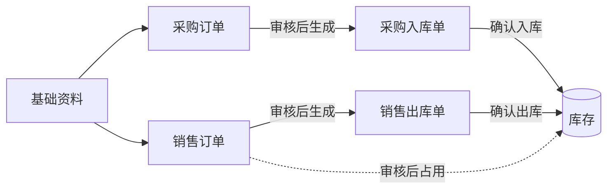

# 系统模块与边界

## 模块总览

| 模块 | 管什么 | 主要单据/资料 | 一期 |
| --- | --- | --- | --- |
| 基础资料 | 系统里反复用到的"名单" | 商品、客户、供应商、仓库、员工 | 做 |
| 采购管理 | 从供应商买货、退货 | 采购订单、采购入库单、采购退货单、采购退货出库单 | 做（退货两张单二期） |
| 销售管理 | 卖货给门店、门店退货 | 销售订单、销售出库单、销售退货单、销售退货入库单 | 做 |
| 库存管理 | 仓库里有多少货 | 即时库存、库存流水、盘点单、其他出入库单 | 做 |

## 模块之间怎么接力

## 边界规则

1. **库存只由"入库单/出库单"改变**。采购订单、销售订单本身不改现存量；销售订单审核后只"占用"库存
2. **销售管单据，仓库管实物**。销售订单回答"卖给谁、卖什么、卖多少钱"；销售出库单回答"实际发了多少"
3. **基础资料被单据引用后不能删除**，只能停用。停用的商品、客户、供应商不能再被新单据选用；已经在单据里的不受影响
4. **金额只记录不结算**。单据上的金额供对账参考，收付款在财务软件里做
5. 一期只有 1 个仓库，但所有单据都保留"仓库"字段，方便以后扩展
6. **一张单据只对应一个往来对象**：一张采购订单只能选一个供应商，一张销售订单只能选一个客户
7. **商品的"参考进价"**在商品资料里维护；每次采购入库确认后，系统记录"该供应商该商品的上次进价"，供采购下单参考

## 库存口径

| 名称 | 含义 |
| --- | --- |
| 现存量 | 仓库里实际有的数量 |
| 占用量 | 已审核、还没出库的销售订单数量 |
| 可用量 | 现存量 − 占用量，销售下单时看这个数 |
