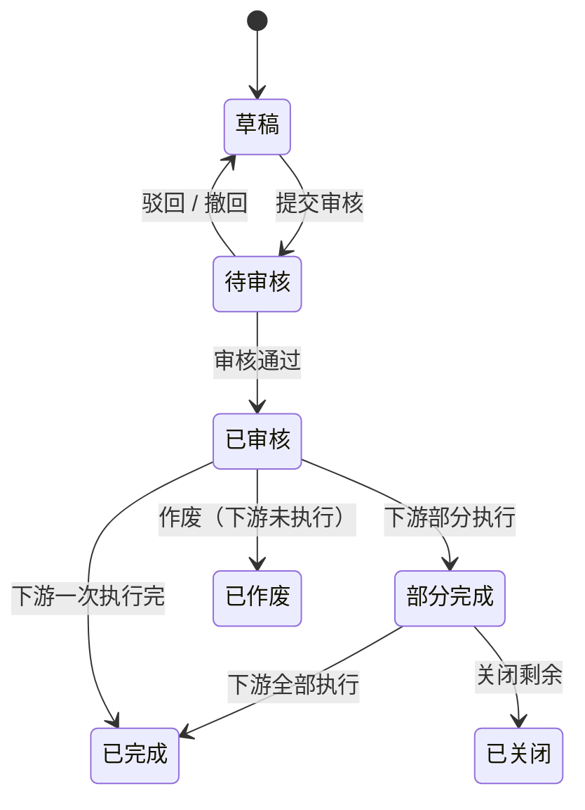

# 单据目录与通用状态

## 单据目录

| 单据 | 单号前缀 | 由谁创建 | 上游 | 下游 | 是否改库存 |
| --- | --- | --- | --- | --- | --- |
| 采购订单 | CGDD | 采购员、采购组长 | 无 | 采购入库单（审核通过后系统自动生成） | 否 |
| 采购入库单 | CGRK | 系统生成，仓管员确认 | 采购订单 | 无 | 确认后增加现存量 |
| 销售订单 | XSDD | 销售内勤 | 无 | 销售出库单（审核通过后系统自动生成） | 否（审核后占用） |
| 销售出库单 | XSCK | 系统生成，仓管员确认 | 销售订单 | 无 | 确认后减少现存量 |
| 销售退货单 | XSTH | 销售内勤 | 销售出库单 | 销售退货入库单 | 否 |
| 销售退货入库单 | THRK | 系统生成，仓管员确认 | 销售退货单 | 无 | 确认后增加现存量 |
| 盘点单 | PDD | 仓管员 | 无 | 无 | 审核后按盘盈盘亏调整 |

单号格式：`前缀-年月日-4位流水`，例如 `CGDD-20261020-0001`，每天从 0001 开始，系统生成，不可修改。

## 业务单据通用状态（订单类）

| 状态 | 含义 | 可做的动作 |
| --- | --- | --- |
| 草稿 | 刚保存，还没提交 | 编辑、提交审核、删除 |
| 待审核 | 已提交，等审核人处理 | 审核通过、驳回；创建人可撤回 |
| 已审核 | 审核通过，已生成下游单据 | 作废（仅下游单据还没有任何执行时） |
| 部分完成 | 下游单据执行了一部分 | 关闭 |
| 已完成 | 下游单据全部执行完 | 查看 |
| 已关闭 | 部分完成后，剩余数量不再执行 | 查看 |
| 已作废 | 作废后不再生效 | 查看 |

各单据是否用到"部分完成""已关闭"，以该单据主PRD 为准。

## 执行类单据通用状态（出入库单）

| 状态 | 含义 |
| --- | --- |
| 待执行 | 系统生成，等仓管员确认 |
| 已执行 | 仓管员确认，库存已变化 |
| 已取消 | 上游作废或关闭导致取消 |

## 通用规则

1. 只有"草稿"能删除，删除是真删除；其他状态只能作废或关闭
2. 驳回必须填写驳回原因，驳回后回到草稿，创建人修改后可再次提交
3. 审核人不能审核自己创建的单据
4. 已审核及之后的单据，主要信息不可修改；要改只能作废后重新建单
5. 作废、关闭都需二次确认并填写原因
6. 上游作废或关闭时，下游还没执行的单据自动变为"已取消"
7. 所有审核、驳回、作废、关闭动作都记录操作人、时间和原因，详情页可查看操作记录
