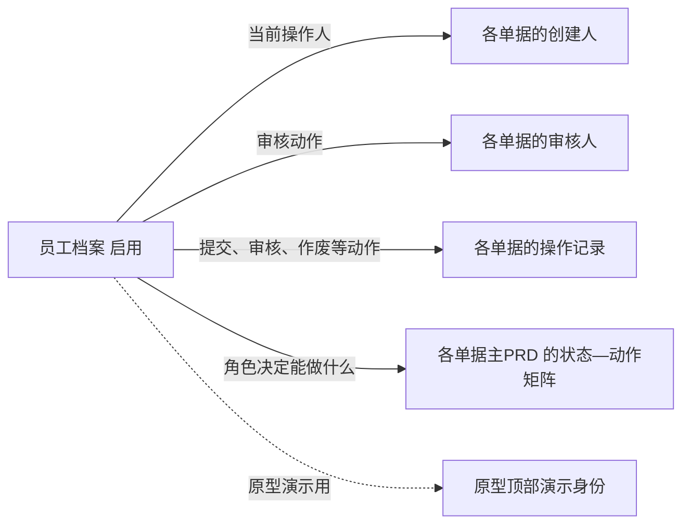

# 员工档案-主PRD

产出步骤：参照 05-提示词合集/06-主PRD.md 的要求产出（基础资料没有单独的提示词，本次按指挥官五段式指令执行）
依据：员工档案-字段清单-详细稿.tsv、01-全局背景信息/10、30、40、50、99-产品原型/前端工程/src/mock/seed/基础资料.js（与 03-产品设计/采购管理/采购订单/采购订单-演示数据.md 一致）、04-常用模版/主PRD模版.md

> 本文件是员工档案业务规则的唯一来源。字段定义见 [员工档案-字段清单-详细稿.tsv](员工档案-字段清单-详细稿.tsv)，页面交互见 [员工档案_Demo_列表页.md](员工档案_Demo_列表页.md)、[员工档案_Demo_新增编辑页.md](员工档案_Demo_新增编辑页.md)、[员工档案_Demo_详情页.md](员工档案_Demo_详情页.md)，本文件不重复。文中带书名号的字段名与字段清单一致。

## 修改记录

| 日期 | 版本 | 修改人 | 修改内容 |
| --- | --- | --- | --- |
| 2026-10-06 | V1.0 | AI 起草，产品负责人审 | 初稿 |
| 2026-10-06 | V1.1 | 山治 | 确认维护角色为老板；确认停用后可以重新启用；删除"不能停用、删除自己"规则及对应异常、验收、待确认；关闭对应待确认并重新编号；字段清单改名为详细稿，Demo PRD 拆为三份 |

## 一、业务背景与本期范围

- 要解决的问题：各单据要记录"谁建的、谁审的、谁操作的"（01-全局背景信息/40 通用规则 3、7），各单据的"谁能做"按角色区分（如采购组长审日常采购单、老板审大额采购单，见 01-全局背景信息/10 主要角色）。员工档案为单据上的创建人、审核人、操作人和角色判断提供唯一来源；原型顶部的"演示身份"也从这里取人
- 本期做：员工的新增、编辑、停用、启用、删除（仅限没被单据记录的）、按姓名和角色查询、详情查看
- 本期不做：登录账号与密码（一期登录方式未定义，原型不做登录，见"九、待确认"第 3 条）；按人逐项配置权限（能做什么按角色在各单据主PRD 中规定）；部门、组织架构；考勤、薪资

演示数据中的员工（共 4 人）：

| 姓名 | 角色 | 状态 | 说明 |
| --- | --- | --- | --- |
| 小李 | 采购员 | 启用 | 原型演示身份 |
| 老赵 | 采购组长 | 启用 | 原型演示身份 |
| 王总 | 老板 | 启用 | 原型演示身份 |
| 小孙 | 采购员 | 启用 | 只作为部分采购订单的创建人出现，不在演示身份里 |

"演示身份"是原型顶部的身份切换，只用于原型演示，不属于系统功能，也不是员工档案的字段。

## 二、功能清单

| 序号 | 功能 | 一句话说明 | 本期 |
| --- | --- | --- | --- |
| 1 | 列表查询 | 按状态页签和姓名、角色查询员工 | 是 |
| 2 | 新增员工 | 填写姓名、选择角色，保存后状态为启用 | 是 |
| 3 | 编辑 | 修改姓名、角色、备注 | 是 |
| 4 | 停用 | 离职或不再使用系统的员工停用 | 是 |
| 5 | 启用 | 已停用的员工恢复使用 | 是 |
| 6 | 删除 | 没被任何单据记录过的员工可以真删除 | 是 |
| 7 | 查看详情 | 查看员工全部信息和创建、更新记录 | 是 |

## 三、单据关系

- 员工档案不是单据，没有上游；不会被单据"选择"，而是在员工操作单据时被系统自动记录为创建人、审核人、操作人
- 每个角色能做哪些动作，以各单据主PRD 为准（如采购订单的审核分级），员工档案只维护"这个人是什么角色"

## 四、状态流转

基础资料不走 01-全局背景信息/40 的订单类通用状态，只用两个状态：启用、停用（依据 30-系统模块与边界 边界规则 3"被单据引用后不能删除，只能停用"）。

| 序号 | 当前状态 | 动作 | 下一状态 | 谁能做 | 条件 |
| --- | --- | --- | --- | --- | --- |
| 1 | （无） | 新增保存 | 启用 | 老板 | 通过保存校验 |
| 2 | 启用 | 编辑保存 | 启用 | 老板 | 通过保存校验 |
| 3 | 停用 | 编辑保存 | 停用 | 老板 | 通过保存校验 |
| 4 | 启用 | 停用 | 停用 | 老板 | 二次确认 |
| 5 | 停用 | 启用 | 启用 | 老板 | 二次确认 |
| 6 | 启用、停用 | 删除 | （记录删除） | 老板 | 没被任何单据记录过；二次确认 |

### 状态—动作矩阵

"可"表示该状态下有这个动作，括号内是能做的人。维护角色为老板（2026-10-06 确认）。

| 动作 \ 状态 | 启用 | 停用 |
| --- | --- | --- |
| 查看 | 可（全部角色） | 可（全部角色） |
| 编辑 | 可（老板） | 可（老板） |
| 停用 | 可（老板） | - |
| 启用 | - | 可（老板） |
| 删除 | 可（老板；没被单据记录过） | 可（老板；没被单据记录过） |

全部角色 = 本档案《角色》的全部取值。新增员工只有老板可以做。

## 五、业务规则

### 5.1 新增与编辑

| 序号 | 什么情况下 | 结果 |
| --- | --- | --- |
| 1 | 新增员工 | 只有老板可以新增；《创建人》记为当前登录人 |
| 2 | 点保存 | 校验：《姓名》必填、1～50 字；《角色》必选，只能从 7 个角色中选一个；《备注》不超过 200 字；不通过不能保存 |
| 3 | 首次保存成功 | 《状态》为启用，记录《创建时间》 |
| 4 | 《姓名》与已有员工相同 | 本稿暂允许重名，保存时不拦截；重名如何区分【待确认】，见"九、待确认"第 2 条 |
| 5 | 修改《角色》 | 保存后立即按新角色判断该员工能做的动作；已经记录在单据上的创建人、审核人、操作记录不变 |
| 6 | 已被单据记录的员工修改《姓名》 | 历史单据上显示新姓名还是当时的姓名【待确认】，见"九、待确认"第 5 条 |
| 7 | 每次保存、停用、启用 | 更新《更新时间》 |

### 5.2 停用与启用

| 序号 | 什么情况下 | 结果 |
| --- | --- | --- |
| 1 | 停用 | 二次确认后《状态》变为停用；停用的员工不能再新建、提交、审核任何单据 |
| 2 | 停用之后 | 已经记录在单据上的创建人、审核人、操作记录不受影响，历史单据照常查看 |
| 3 | 启用 | 二次确认后《状态》变为启用，可以重新办理业务 |

### 5.3 删除

| 序号 | 什么情况下 | 结果 |
| --- | --- | --- |
| 1 | 删除没被任何单据记录过（创建人、审核人、操作记录中都没有）的员工 | 二次确认后真删除，不能恢复 |
| 2 | 删除已被单据记录过的员工 | 不能删除，只能停用（01-全局背景信息/30 边界规则 3） |

### 5.4 查看范围

| 序号 | 什么情况下 | 结果 |
| --- | --- | --- |
| 1 | 任何角色查看列表和详情 | 都能看到全部员工，包括已停用的 |

## 六、异常处理

| 序号 | 异常情况 | 系统怎么处理 |
| --- | --- | --- |
| 1 | 删除已被单据记录过的员工 | 阻止删除，提示"该员工已有单据记录，不能删除，可停用" |
| 2 | 停用、启用、删除时状态已被他人改变 | 阻止操作，提示"状态已变化，请刷新后重试" |
| 3 | 编辑或查看时该员工已被删除 | 提示"员工不存在或已删除"，返回列表 |
| 4 | 已停用的员工尝试新建或审核单据 | 阻止操作，提示"当前账号已停用"【登录方式待确认】 |

## 七、对下游的影响

| 时点 | 对各单据 | 对库存 |
| --- | --- | --- |
| 新增（启用） | 该员工可以按角色新建、审核单据，并被记录为创建人、审核人、操作人 | 不变 |
| 修改角色 | 之后按新角色判断能做的动作；已有记录不变 | 不变 |
| 停用 | 不能再新建、提交、审核单据；已有记录不变 | 不变 |
| 启用 | 恢复按角色办理业务 | 不变 |
| 删除 | 只有没被单据记录过才能删，对已有单据没有影响 | 不变 |

员工档案的任何操作都不改变库存。

## 八、验收标准

| 序号 | 输入条件 | 预期结果 |
| --- | --- | --- |
| 1 | 以老板身份新增员工：填写《姓名》，《角色》选仓管员 | 保存成功，《状态》为启用 |
| 2 | 《姓名》为空时保存 | 提示"请输入姓名"，不能保存 |
| 3 | 《角色》未选时保存 | 提示"请选择角色"，不能保存 |
| 4 | 打开《角色》下拉 | 显示老板、销售员、销售内勤、采购组长、采购员、仓管员、财务共 7 项 |
| 5 | 以采购员或采购组长身份进入列表 | 看不到新增、编辑、停用、启用、删除按钮，只能查看 |
| 6 | 老板停用"小孙" | 《状态》变为停用；小孙创建的历史采购订单上创建人仍显示"小孙" |
| 7 | 删除"小李"（已是采购订单创建人） | 提示"该员工已有单据记录，不能删除，可停用" |
| 8 | 删除刚新增、没有任何单据记录的员工 | 二次确认后删除，列表不再显示 |
| 9 | 启用已停用的员工 | 《状态》变为启用 |
| 10 | 把"小李"的《角色》改为采购组长 | 保存时弹出确认；保存后按采购组长判断小李能做的动作 |
| 11 | 查询区《角色》选"采购员" | 只显示小李、小孙 |

## 九、待确认

| 序号 | 问题 | 来源 |
| --- | --- | --- |
| 1 | 一个员工能否同时兼多个角色（如采购组长兼采购员）？本稿暂按一人一个角色写 | 演示数据每人一个角色，01 未规定 |
| 2 | 员工重名时怎么区分？是否需要员工编号或手机号 | 演示数据只有姓名、角色，01 未规定 |
| 3 | 一期员工怎么登录系统（账号、密码）？停用的员工如何拦截 | 01 未定义登录；原型不做登录，用"演示身份"代替 |
| 4 | 原型"演示身份"名单（小李、老赵、王总）目前只写在原型演示数据里，是否需要在员工档案上体现；本稿按"不属于系统功能"处理，不加字段 | 原型演示数据（基础资料.js）中的演示身份标识 |
| 5 | 已被单据记录的员工改姓名后，历史单据显示新姓名还是当时的姓名 | 01 未规定 |
