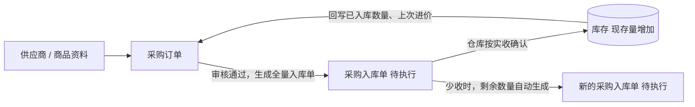

# 采购订单-主PRD

产出步骤：05-提示词合集/06-主PRD.md
依据：采购订单-拍板记录.md、采购订单-字段清单-详细稿.tsv、02-需求调研/20-采购需求调研.md、01-全局背景信息/30、40、50

> 本文件是采购订单业务规则的唯一来源。字段定义见《采购订单-字段清单-详细稿》，页面交互见三份 Demo PRD，本文件不重复。文中带书名号的字段名与详细稿一致。

## 修改记录

| 日期 | 版本 | 修改人 | 修改内容 |
| --- | --- | --- | --- |
| 2026-10-04 | V1.0 | AI 起草，产品负责人审 | 初稿 |

## 一、业务背景与本期范围

- 要解决的问题：下单没有正式单据、进价靠翻聊天记录、大额采购没管住、分批到货追不清、剩余不送的单一直挂着、选到停用的供应商和商品（对应采购需求调研痛点 2～9）
- 本期做：采购订单的新建、编辑、删除、提交审核、撤回、分级审核、驳回、作废、关闭、列表查询、详情查看；审核通过后自动生成采购入库单
- 本期不做：安全库存提醒、采购退货、采购订单导入导出和打印、含税与不含税拆分、采购入库单本身的页面（属于库存模块，本文只写它对采购订单的影响）

## 二、功能清单

| 序号 | 功能 | 一句话说明 | 本期 |
| --- | --- | --- | --- |
| 1 | 列表查询 | 按状态页签和条件查询采购订单 | 是 |
| 2 | 新建采购订单 | 采购员或采购组长选供应商、选商品、填数量和单价 | 是 |
| 3 | 编辑 | 草稿状态的订单由创建人修改 | 是 |
| 4 | 删除 | 草稿状态的订单由创建人删除 | 是 |
| 5 | 提交审核 | 草稿提交后进入待审核，系统确定审核层级 | 是 |
| 6 | 撤回 | 创建人把待审核的订单撤回为草稿 | 是 |
| 7 | 审核通过 | 对应层级的审核人通过，系统生成采购入库单 | 是 |
| 8 | 驳回 | 对应层级的审核人填写原因退回草稿 | 是 |
| 9 | 作废 | 已审核且还没有入库的订单作废 | 是 |
| 10 | 关闭 | 部分完成的订单不再收剩余数量 | 是 |
| 11 | 查看详情 | 查看订单信息、入库进度、关联入库单和操作记录 | 是 |

## 三、单据关系

- 一张采购订单可以对应多张采购入库单（分批到货），一张入库单只属于一张采购订单
- 采购订单本身不改变库存

## 四、状态流转

本单据使用全部 7 个订单类通用状态：草稿、待审核、已审核、部分完成、已完成、已关闭、已作废。

| 序号 | 当前状态 | 动作 | 下一状态 | 谁能做 | 条件 |
| --- | --- | --- | --- | --- | --- |
| 1 | （无） | 保存草稿 | 草稿 | 采购员、采购组长 | 通过格式校验 |
| 2 | 草稿 | 提交审核 | 待审核 | 创建人 | 通过全量校验 |
| 3 | 草稿 | 删除 | （记录删除） | 创建人 | 二次确认 |
| 4 | 待审核 | 撤回 | 草稿 | 创建人 | — |
| 5 | 待审核 | 驳回 | 草稿 | 与《审核层级》一致的角色，且不是创建人 | 填写驳回原因 |
| 6 | 待审核 | 审核通过 | 已审核 | 与《审核层级》一致的角色，且不是创建人 | — |
| 7 | 已审核 | 作废 | 已作废 | 创建人、采购组长 | 关联入库单都没有执行过；填写作废原因 |
| 8 | 已审核 | 仓库确认入库（全部收完） | 已完成 | 仓管员（在入库单上操作） | 每行《已入库数量》等于《采购数量》 |
| 9 | 已审核 | 仓库确认入库（部分收货） | 部分完成 | 仓管员（在入库单上操作） | 至少一行《未入库数量》大于 0 |
| 10 | 部分完成 | 仓库确认剩余入库单（收完） | 已完成 | 仓管员（在入库单上操作） | 每行《未入库数量》为 0 |
| 11 | 部分完成 | 关闭 | 已关闭 | 创建人、采购组长 | 填写关闭原因 |

### 状态—动作矩阵

"可"表示该状态下有这个动作，括号内是能做的人。

| 动作 \ 状态 | 草稿 | 待审核 | 已审核 | 部分完成 | 已完成 | 已关闭 | 已作废 |
| --- | --- | --- | --- | --- | --- | --- | --- |
| 查看 | 可（全部角色） | 可（全部角色） | 可（全部角色） | 可（全部角色） | 可（全部角色） | 可（全部角色） | 可（全部角色） |
| 编辑 | 可（创建人） | - | - | - | - | - | - |
| 删除 | 可（创建人） | - | - | - | - | - | - |
| 提交审核 | 可（创建人） | - | - | - | - | - | - |
| 撤回 | - | 可（创建人） | - | - | - | - | - |
| 审核通过 | - | 可（审核层级对应角色，非创建人） | - | - | - | - | - |
| 驳回 | - | 可（审核层级对应角色，非创建人） | - | - | - | - | - |
| 作废 | - | - | 可（创建人、采购组长；无已执行入库单） | - | - | - | - |
| 关闭 | - | - | - | 可（创建人、采购组长） | - | - | - |

全部角色 = 采购员、采购组长、老板。新建只有采购员、采购组长可以做，老板不新建采购订单。

## 五、业务规则

### 5.1 新建与编辑

| 序号 | 什么情况下 | 结果 |
| --- | --- | --- |
| 1 | 新建采购订单 | 只有采购员、采购组长可以新建；《创建人》记为当前登录人 |
| 2 | 选择《供应商》 | 只能选启用状态的供应商；一张单只能选一个供应商 |
| 3 | 已有明细时更换《供应商》 | 各行《上次进价》按新供应商重新取值，《采购单价》按 5.1 第 6 条重新带出 |
| 4 | 选择《商品名称》 | 只能选启用状态的商品；同一张单里已选过的商品不能再选 |
| 5 | 选好商品 | 自动带出《商品编码》《规格》《单位》《上次进价》 |
| 6 | 带出《采购单价》 | 有该供应商该商品的《上次进价》时带出上次进价；没有时带出商品资料里的参考进价；用户可以手改 |
| 7 | 填写《期望到货日期》 | 不能早于《下单日期》 |
| 8 | 保存草稿 | 只校验已填内容的格式，不校验必填；首次保存时生成《采购订单号》，状态为草稿 |
| 9 | 被驳回的订单 | 回到草稿，创建人可以修改后再次提交；编辑页顶部显示最近一次《驳回原因》 |
| 10 | 订单已审核及之后 | 主要信息不能修改；要改只能作废后重新建单 |

### 5.2 提交与审核

| 序号 | 什么情况下 | 结果 |
| --- | --- | --- |
| 1 | 点提交审核 | 全量校验：必填齐全、明细至少 1 行、《采购数量》为大于 0 的整数、《采购单价》大于等于 0、日期先后正确；不通过不能提交 |
| 2 | 提交时供应商或商品已被停用 | 不能提交，提示更换已停用的供应商或商品 |
| 3 | 提交时有明细行《涨价标记》为"涨价" | 弹出提醒，列出涨价的商品；用户可以选择继续提交或返回修改 |
| 4 | 计算《审核层级》 | 《订单金额合计》超过 20000 元，或《创建人》是采购组长时，为"老板"；否则为"采购组长" |
| 5 | 提交成功 | 状态变为待审核，《审核层级》按提交时的金额固定；之后如被驳回再提交，重新计算 |
| 6 | 审核待审核的订单 | 只有与《审核层级》一致的角色可以审核通过或驳回；任何人都不能审核自己建的单 |
| 7 | 审核时查看明细 | 《涨价标记》为"涨价"的行醒目显示 |
| 8 | 驳回 | 必须填写《驳回原因》；状态回到草稿；记录《审核人》《审核时间》 |
| 9 | 撤回 | 只有创建人能在待审核时撤回；状态回到草稿 |
| 10 | 审核通过 | 状态变为已审核；记录《审核人》《审核时间》；系统自动生成一张采购入库单，包含全部明细和数量，状态为待执行 |

### 5.3 入库与完成

| 序号 | 什么情况下 | 结果 |
| --- | --- | --- |
| 1 | 仓库确认采购入库单 | 按实收数量确认；每行累计入库不能超过《采购数量》，不允许超收 |
| 2 | 确认后 | 更新各行《已入库数量》《未入库数量》；库存现存量增加；该供应商该商品的《上次进价》更新为本单《采购单价》 |
| 3 | 本次实收少于入库单数量 | 剩余数量自动生成一张新的待执行采购入库单；采购订单变为部分完成 |
| 4 | 所有行《未入库数量》为 0 | 采购订单变为已完成 |

### 5.4 作废、关闭与删除

| 序号 | 什么情况下 | 结果 |
| --- | --- | --- |
| 1 | 作废 | 只能在已审核、且关联入库单都没有执行过时进行；由创建人或采购组长操作；必须填写《作废原因》并二次确认 |
| 2 | 作废成功 | 状态变为已作废；待执行的关联入库单自动变为已取消 |
| 3 | 关闭 | 只能在部分完成时进行；由创建人或采购组长操作；必须填写《关闭原因》并二次确认 |
| 4 | 关闭成功 | 状态变为已关闭；待执行的关联入库单自动变为已取消；已入库的数量保留不变 |
| 5 | 删除 | 只有草稿能删除，由创建人操作，二次确认后真删除 |
| 6 | 提交、撤回、审核通过、驳回、作废、关闭 | 每次都写一条《操作记录》：操作、操作人、时间、原因 |

### 5.5 查看范围

| 序号 | 什么情况下 | 结果 |
| --- | --- | --- |
| 1 | 采购员、采购组长、老板查看列表和详情 | 一期都能看到全部采购订单 |

## 六、异常处理

| 序号 | 异常情况 | 系统怎么处理 |
| --- | --- | --- |
| 1 | 提交时供应商或商品已停用 | 阻止提交，提示"供应商（或商品）已停用，请更换" |
| 2 | 审核时订单已被创建人撤回 | 阻止操作，提示"单据状态已变化，请刷新后重试" |
| 3 | 作废时关联入库单已有执行 | 阻止作废，提示"已有入库记录，不能作废；如剩余不再到货，请使用关闭" |
| 4 | 删除非草稿订单 | 不提供删除入口 |
| 5 | 没有任何启用的供应商或商品 | 选择框为空并提示"没有可选的供应商（或商品）" |

## 七、对下游的影响

| 时点 | 对采购订单 | 对采购入库单 | 对库存 |
| --- | --- | --- | --- |
| 审核通过 | 已审核 | 生成一张全量入库单，待执行 | 不变 |
| 仓库部分确认 | 部分完成，更新已入库、未入库数量 | 本单已执行；剩余数量生成新的待执行入库单 | 现存量增加实收数量 |
| 仓库全部确认 | 已完成 | 本单已执行 | 现存量增加实收数量 |
| 作废 | 已作废 | 待执行的变为已取消 | 不变 |
| 关闭 | 已关闭 | 待执行的变为已取消 | 不变 |

## 八、验收标准

| 序号 | 输入条件 | 预期结果 |
| --- | --- | --- |
| 1 | 以老板身份进入列表 | 看不到"新建"按钮 |
| 2 | 新建时打开供应商选择 | 停用的供应商不出现 |
| 3 | 新建时打开商品选择 | 停用的商品不出现；本单已选过的商品不出现 |
| 4 | 选择有上次进价的商品 | 《采购单价》带出上次进价 |
| 5 | 选择没有上次进价的商品 | 《采购单价》带出参考进价，《上次进价》显示"-" |
| 6 | 把《采购单价》改到比上次进价高 5% 以上 | 该行显示"涨价"；提交时弹出涨价提醒，可继续提交 |
| 7 | 《期望到货日期》早于《下单日期》后提交 | 提示错误，不能提交 |
| 8 | 没有明细行时提交 | 提示至少添加 1 个商品，不能提交 |
| 9 | 采购员提交金额合计 20000 元的订单 | 《审核层级》为采购组长 |
| 10 | 采购员提交金额合计 20000.01 元的订单 | 《审核层级》为老板 |
| 11 | 采购组长提交金额 5000 元的订单 | 《审核层级》为老板；采购组长看这张单没有审核按钮 |
| 12 | 采购组长打开审核层级为老板的待审核单 | 没有"审核通过""驳回"按钮 |
| 13 | 审核人驳回时不填原因 | 不能驳回 |
| 14 | 驳回后 | 订单回到草稿，编辑页顶部显示驳回原因 |
| 15 | 审核通过后 | 状态为已审核，详情页关联入库单出现一张待执行入库单 |
| 16 | 已审核且没有入库的订单作废 | 状态为已作废，关联入库单变为已取消 |
| 17 | 部分完成的订单 | 没有"作废"，有"关闭"；关闭需填原因，关闭后待执行入库单变为已取消 |
| 18 | 已完成、已关闭、已作废的订单 | 只有查看，没有任何操作按钮 |
| 19 | 草稿订单由非创建人打开 | 没有编辑、删除、提交审核按钮 |

## 九、待确认

| 序号 | 问题 | 来源 |
| --- | --- | --- |
| 1 | 《上次进价》取最近一次已执行入库单上的采购单价，口径待业务确认 | 拍板记录"仍待确认" |
| 2 | 采购入库单页面（仓库确认实收）属于库存模块，需另出 PRD | 本文范围 |
