# 采购订单评审PRD

> 本件为评审用完整档：覆盖采购订单本期全部需求，评审通过后可直接作为开发依据，无需再查其他文档。

<!-- 产出步骤：05-提示词合集/10-评审PRD.md -->

## 修改记录

| 日期 | 版本 | 修改人 | 修改内容 |
| --- | --- | --- | --- |
| 2026-10-04 | V1.0 | 产品负责人 | 首次评审 |

## 一、业务总览

- 这个功能解决什么问题：现在采购靠微信下单、翻聊天记录找进价、大额采购没人把关、分批到货说不清还差多少、剩余不送的单一直挂着。采购订单让下单、审核、收货进度都有据可查
- 本期做：新建、编辑、删除草稿、提交审核、撤回、按金额分级审核、驳回、作废、关闭、列表查询、详情查看；审核通过后自动生成采购入库单
- 本期不做：安全库存提醒、采购退货、导入导出和打印、含税与不含税拆分、采购入库单本身的页面

## 二、功能清单

| 序号 | 功能 | 一句话说清 | 本期 |
| --- | --- | --- | --- |
| 1 | 采购订单列表-状态页签 | 按订单状态切换查看 | 是 |
| 2 | 采购订单列表-查询区 | 可按采购订单号（模糊查询）、供应商、下单日期起止、审核层级、创建人查询 | 是 |
| 3 | 采购订单列表-新建采购订单 | 只有采购员、采购组长能看到这个按钮；老板看不到 | 是 |
| 4 | 采购订单列表-列表表格 | 显示采购订单号、供应商、下单日期、期望到货日期、订单金额合计、审核层级、订单状态、创建人 | 是 |
| 5 | 采购订单列表-行操作 | "查看"始终显示；"编辑""删除"只在草稿状态、且当前用户是创建人时显示 | 是 |
| 6 | 采购订单列表-本页规则 | 采购员、采购组长、老板都能看到全部采购订单 | 是 |
| 7 | 新建/编辑采购订单-驳回提示条 | 黄色提示条，显示最近一次驳回原因、审核人和时间，提醒创建人按意见修改 | 是 |
| 8 | 新建/编辑采购订单-基本信息 | 填写供应商、下单日期、期望到货日期、仓库、备注 | 是 |
| 9 | 新建/编辑采购订单-商品明细 | 点"添加商品"新增一行 | 是 |
| 10 | 新建/编辑采购订单-进价带出与涨价标记 | 选商品后单价自动填好：有这家供应商的上次进价就用上次进价，没有就用商品的参考进价 | 是 |
| 11 | 新建/编辑采购订单-金额汇总与审核层级 | 实时显示商品种类数、采购总数量、订单金额合计，并提前告诉你这张单会由谁审核 | 是 |
| 12 | 新建/编辑采购订单-底部按钮 | "保存草稿"只检查已填内容的格式，不检查必填；"提交审核"检查全部必填和格式，有涨价行时先弹出提醒；"取消"在有未保存修改时会先确认 | 是 |
| 13 | 新建/编辑采购订单-本页规则 | 有未保存的修改时离开页面要确认；保存、提交按钮点击后在处理完成前不能重复点击 | 是 |
| 14 | 采购订单详情-基本信息 | 只读展示供应商、下单日期、期望到货日期、仓库、备注、创建人、创建时间、最后修改时间；采购订单号和状态标签显示在页面顶部 | 是 |
| 15 | 采购订单详情-审核信息 | 显示审核层级、审核人、审核时间，以及驳回、作废、关闭的原因，没有的显示"-" | 是 |
| 16 | 采购订单详情-商品明细与入库进度 | 除了商品、单价、数量、金额，还显示每行已入库多少、还差多少 | 是 |
| 17 | 采购订单详情-关联入库单 | 审核通过前显示"审核通过后自动生成" | 是 |
| 18 | 采购订单详情-操作按钮 | 按订单状态和当前身份显示，不能做的按钮直接不显示：草稿（创建人）可编辑、删除、提交审核；待审核（创建人）可撤回，（对应审核人）可审核通过、驳回；已审核且还没入库时（创建人或采购组长）可作废；部分完成时（创建人或采购组长）可关闭；已完成、已关闭、已作废只能返回列表 | 是 |
| 19 | 采购订单详情-操作记录 | 按时间从新到旧列出提交、撤回、审核通过、驳回、作废、关闭，每条有操作人、时间、原因 | 是 |
| 20 | 采购订单详情-原因弹窗 | 必须填写原因（1～200 字）才能确认 | 是 |

## 三、主要流程

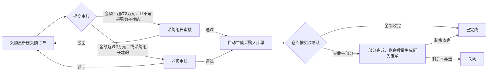
```mermaid
flowchart LR
  A[采购员新建采购订单] --> B{提交审核}
  B -->|金额不超过2万元，且不是采购组长建的| C[采购组长审核]
  B -->|金额超过2万元，或采购组长建的| D[老板审核]
  C -->|驳回| A
  D -->|驳回| A
  C -->|通过| E[自动生成采购入库单]
  D -->|通过| E
  E --> F{仓库按实收确认}
  F -->|全部收完| G[已完成]
  F -->|只收一部分| H[部分完成，剩余数量生成新入库单]
  H -->|剩余收完| G
  H -->|剩余不再送| I[关闭]
```

## 四、状态流转

采购订单有 7 个状态：草稿、待审核、已审核、部分完成、已完成、已关闭、已作废。

| 序号 | 当前状态 | 做什么 | 变成什么 | 谁能做 |
| --- | --- | --- | --- | --- |
| 1 | （无） | 保存草稿（通过格式校验） | 草稿 | 采购员、采购组长 |
| 2 | 草稿 | 提交审核（通过全量校验） | 待审核 | 创建人 |
| 3 | 草稿 | 删除（二次确认） | （记录删除） | 创建人 |
| 4 | 待审核 | 撤回 | 草稿 | 创建人 |
| 5 | 待审核 | 驳回（填写驳回原因） | 草稿 | 与审核层级一致的角色，且不是创建人 |
| 6 | 待审核 | 审核通过 | 已审核 | 与审核层级一致的角色，且不是创建人 |
| 7 | 已审核 | 作废（关联入库单都没有执行过；填写作废原因） | 已作废 | 创建人、采购组长 |
| 8 | 已审核 | 仓库确认入库（全部收完）（每行已入库数量等于采购数量） | 已完成 | 仓管员（在入库单上操作） |
| 9 | 已审核 | 仓库确认入库（部分收货）（至少一行未入库数量大于 0） | 部分完成 | 仓管员（在入库单上操作） |
| 10 | 部分完成 | 仓库确认剩余入库单（收完）（每行未入库数量为 0） | 已完成 | 仓管员（在入库单上操作） |
| 11 | 部分完成 | 关闭（填写关闭原因） | 已关闭 | 创建人、采购组长 |

## 五、业务规则

### 5.1 新建与编辑

| 序号 | 什么情况下 | 结果 |
| --- | --- | --- |
| 1 | 新建采购订单 | 只有采购员、采购组长可以新建；创建人记为当前登录人 |
| 2 | 选择供应商 | 只能选启用状态的供应商；一张单只能选一个供应商 |
| 3 | 已有明细时更换供应商 | 各行上次进价按新供应商重新取值，采购单价按本节第 6 条重新带出 |
| 4 | 选择商品名称 | 只能选启用状态的商品；同一张单里已选过的商品不能再选 |
| 5 | 选好商品 | 自动带出商品编码、规格、单位、上次进价 |
| 6 | 带出采购单价 | 有该供应商该商品的上次进价时带出上次进价；没有时带出商品资料里的参考进价；用户可以手改 |
| 7 | 填写期望到货日期 | 不能早于下单日期 |
| 8 | 保存草稿 | 只校验已填内容的格式，不校验必填；首次保存时生成采购订单号，状态为草稿 |
| 9 | 被驳回的订单 | 回到草稿，创建人可以修改后再次提交；编辑页顶部显示最近一次驳回原因 |
| 10 | 订单已审核及之后 | 主要信息不能修改；要改只能作废后重新建单 |

### 5.2 提交与审核

| 序号 | 什么情况下 | 结果 |
| --- | --- | --- |
| 1 | 点提交审核 | 全量校验：必填齐全、明细至少 1 行、采购数量为大于 0 的整数、采购单价大于等于 0、日期先后正确；不通过不能提交 |
| 2 | 提交时供应商或商品已被停用 | 不能提交，提示更换已停用的供应商或商品 |
| 3 | 提交时有明细行涨价标记为"涨价" | 弹出提醒，列出涨价的商品；用户可以选择继续提交或返回修改 |
| 4 | 计算审核层级 | 订单金额合计超过 20000 元，或创建人是采购组长时，为"老板"；否则为"采购组长" |
| 5 | 提交成功 | 状态变为待审核，审核层级按提交时的金额固定；之后如被驳回再提交，重新计算 |
| 6 | 审核待审核的订单 | 只有与审核层级一致的角色可以审核通过或驳回；任何人都不能审核自己建的单 |
| 7 | 审核时查看明细 | 涨价标记为"涨价"的行醒目显示 |
| 8 | 驳回 | 必须填写驳回原因；状态回到草稿；记录审核人、审核时间 |
| 9 | 撤回 | 只有创建人能在待审核时撤回；状态回到草稿 |
| 10 | 审核通过 | 状态变为已审核；记录审核人、审核时间；系统自动生成一张采购入库单，包含全部明细和数量，状态为待执行 |

### 5.3 入库与完成

| 序号 | 什么情况下 | 结果 |
| --- | --- | --- |
| 1 | 仓库确认采购入库单 | 按实收数量确认；每行累计入库不能超过采购数量，不允许超收 |
| 2 | 确认后 | 更新各行已入库数量、未入库数量；库存现存量增加；该供应商该商品的上次进价更新为本单采购单价 |
| 3 | 本次实收少于入库单数量 | 剩余数量自动生成一张新的待执行采购入库单；采购订单变为部分完成 |
| 4 | 所有行未入库数量为 0 | 采购订单变为已完成 |

### 5.4 作废、关闭与删除

| 序号 | 什么情况下 | 结果 |
| --- | --- | --- |
| 1 | 作废 | 只能在已审核、且关联入库单都没有执行过时进行；由创建人或采购组长操作；必须填写作废原因并二次确认 |
| 2 | 作废成功 | 状态变为已作废；待执行的关联入库单自动变为已取消 |
| 3 | 关闭 | 只能在部分完成时进行；由创建人或采购组长操作；必须填写关闭原因并二次确认 |
| 4 | 关闭成功 | 状态变为已关闭；待执行的关联入库单自动变为已取消；已入库的数量保留不变 |
| 5 | 删除 | 只有草稿能删除，由创建人操作，二次确认后真删除 |
| 6 | 提交、撤回、审核通过、驳回、作废、关闭 | 每次都写一条操作记录：操作、操作人、时间、原因 |

### 5.5 查看范围

| 序号 | 什么情况下 | 结果 |
| --- | --- | --- |
| 1 | 采购员、采购组长、老板查看列表和详情 | 一期都能看到全部采购订单 |

### 5.6 异常情况

| 序号 | 异常情况 | 系统怎么处理 |
| --- | --- | --- |
| 1 | 提交时供应商或商品已停用 | 阻止提交，提示"供应商（或商品）已停用，请更换" |
| 2 | 审核时订单已被创建人撤回 | 阻止操作，提示"单据状态已变化，请刷新后重试" |
| 3 | 作废时关联入库单已有执行 | 阻止作废，提示"已有入库记录，不能作废；如剩余不再到货，请使用关闭" |
| 4 | 删除非草稿订单 | 不提供删除入口 |
| 5 | 没有任何启用的供应商或商品 | 选择框为空并提示"没有可选的供应商（或商品）" |

## 六、页面和操作

### 6.1 采购订单列表页

| 序号 | 操作路径/功能点 | 原型页面 | 页面说明 | 备注 |
| --- | --- | --- | --- | --- |
| 1 | 采购管理/采购订单列表-状态页签 | 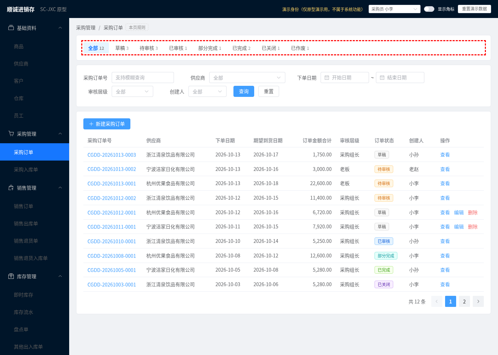 | 按订单状态切换查看。共"全部、草稿、待审核、已审核、部分完成、已完成、已关闭、已作废"8 个页签，每个页签后面显示数量。切换页签时保留查询条件 | |
| 2 | 采购管理/采购订单列表-查询区 | 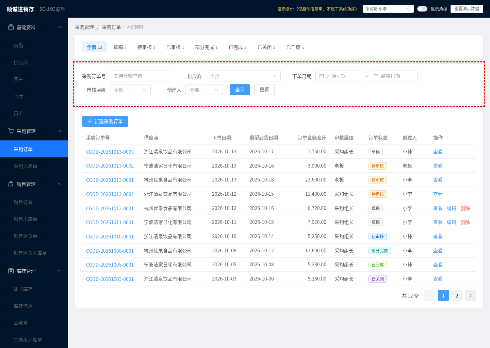 | 可按采购订单号（模糊查询）、供应商、下单日期起止、审核层级、创建人查询。供应商下拉包含已停用的供应商，方便查历史单。结束日期不能早于开始日期 | |
| 3 | 采购管理/采购订单列表-新建采购订单 | 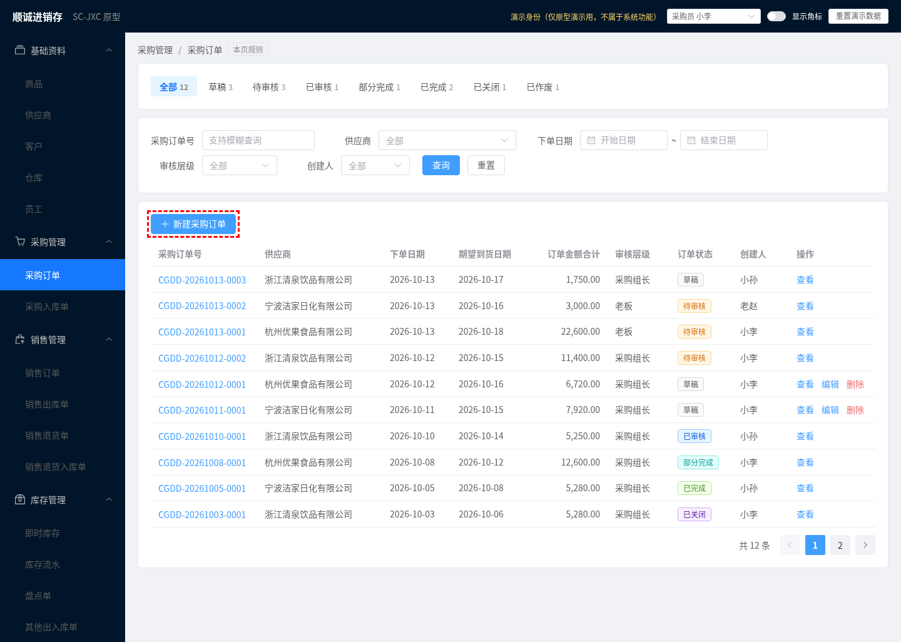 | 只有采购员、采购组长能看到这个按钮；老板看不到 | |
| 4 | 采购管理/采购订单列表-列表表格 | 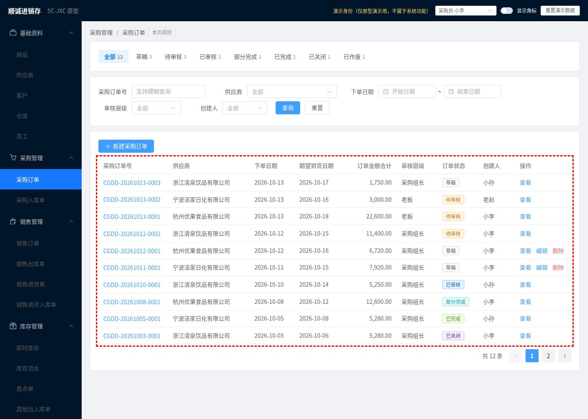 | 显示采购订单号、供应商、下单日期、期望到货日期、订单金额合计、审核层级、订单状态、创建人。点采购订单号进入详情。按创建时间从新到旧排列，每页 10 条 | |
| 5 | 采购管理/采购订单列表-行操作 |  | "查看"始终显示；"编辑""删除"只在草稿状态、且当前用户是创建人时显示。删除前要二次确认，删除后不能恢复 | |
| 6 | 采购管理/采购订单列表-本页规则 | 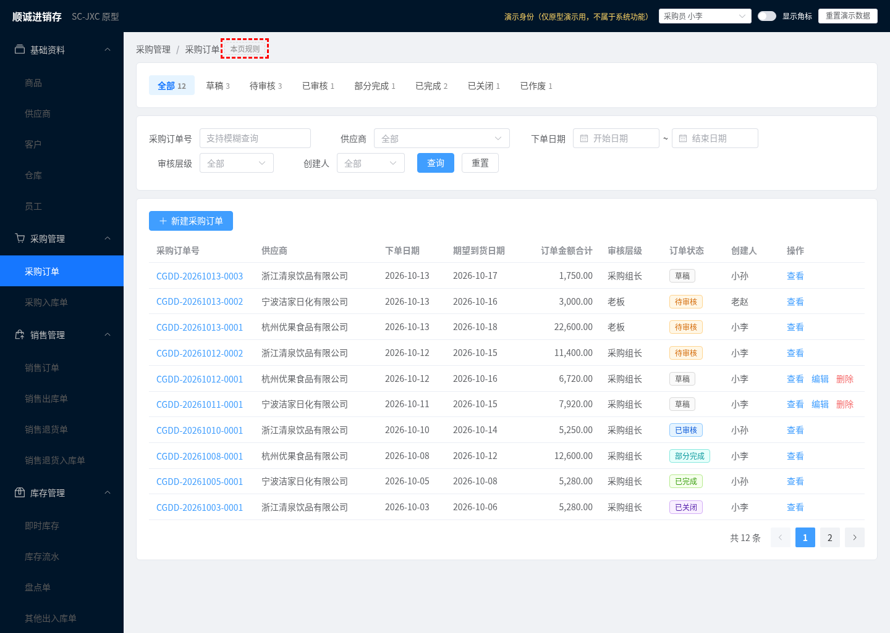 | 采购员、采购组长、老板都能看到全部采购订单 | |

### 6.2 新建/编辑采购订单页

| 序号 | 操作路径/功能点 | 原型页面 | 页面说明 | 备注 |
| --- | --- | --- | --- | --- |
| 1 | 采购管理/新建/编辑采购订单-驳回提示条 | 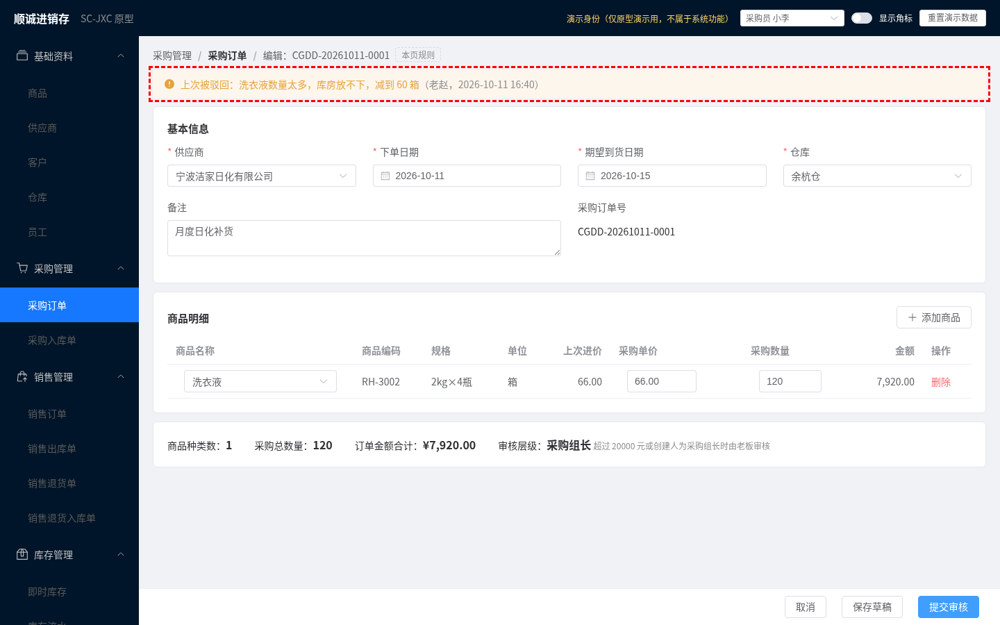 | 黄色提示条，显示最近一次驳回原因、审核人和时间，提醒创建人按意见修改 | |
| 2 | 采购管理/新建/编辑采购订单-基本信息 | 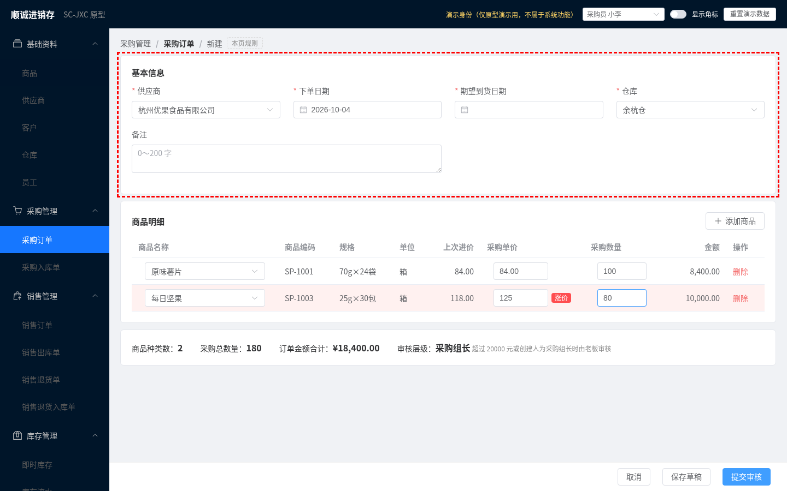 | 填写供应商、下单日期、期望到货日期、仓库、备注。供应商只能从启用的供应商里选；下单日期默认当天；仓库默认"余杭仓"；已有商品时更换供应商会先弹出确认 | |
| 3 | 采购管理/新建/编辑采购订单-商品明细 | 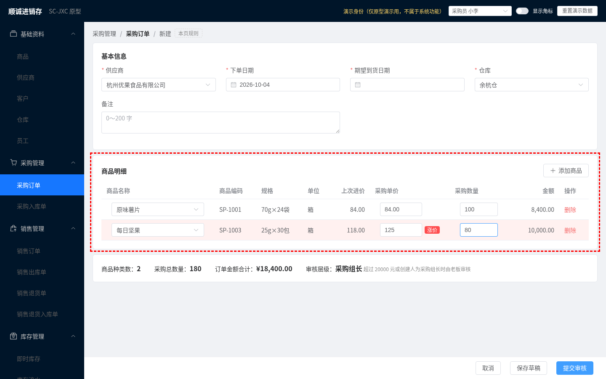 | 点"添加商品"新增一行。商品只能从启用的商品里选，本单已经选过的商品不会再出现。选好后自动带出商品编码、规格、单位、上次进价。每行可以删除 | |
| 4 | 采购管理/新建/编辑采购订单-进价带出与涨价标记 | 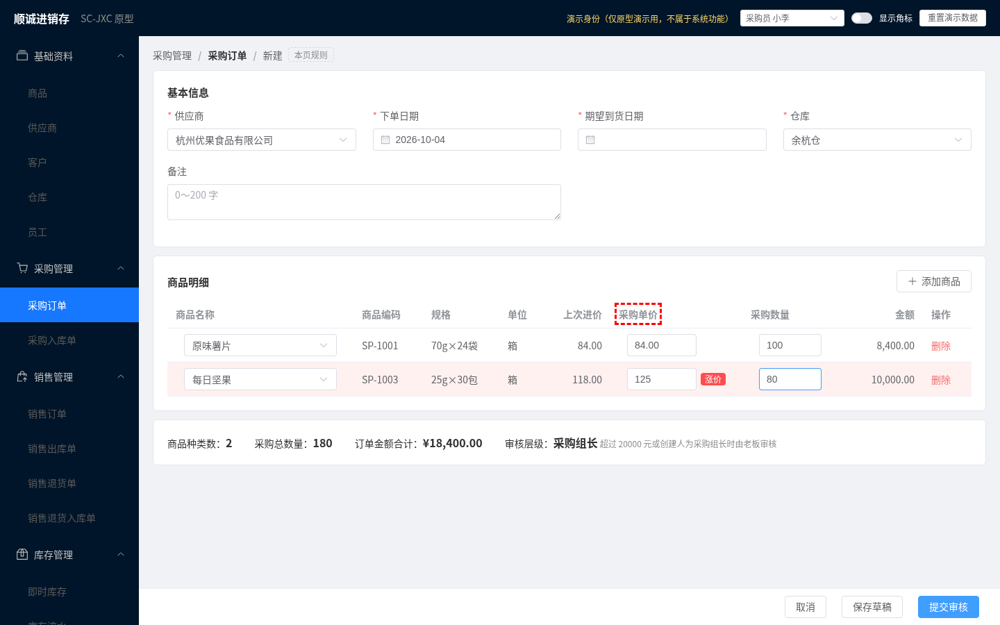 | 选商品后单价自动填好：有这家供应商的上次进价就用上次进价，没有就用商品的参考进价。可以手改。改到比上次进价高 5% 以上，单价后面出现红色"涨价"标签 | |
| 5 | 采购管理/新建/编辑采购订单-金额汇总与审核层级 | 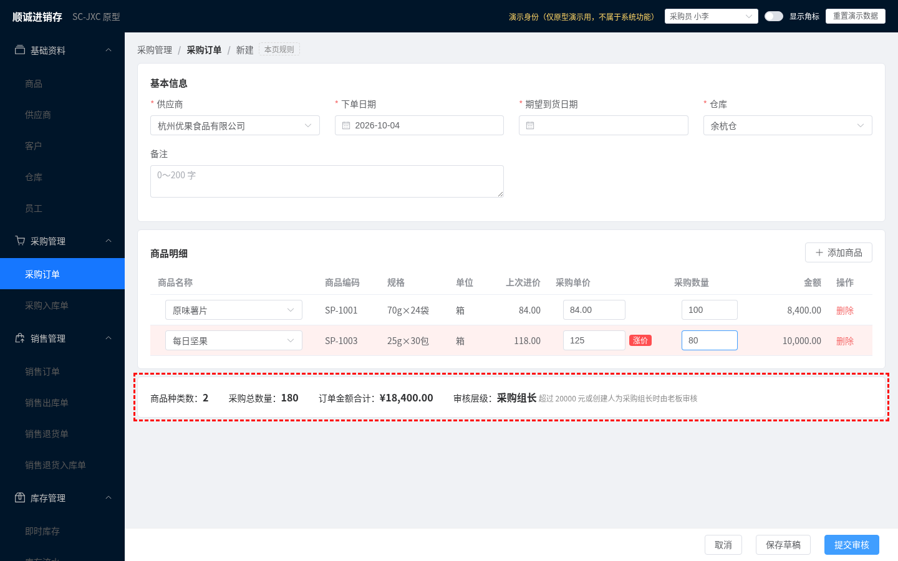 | 实时显示商品种类数、采购总数量、订单金额合计，并提前告诉你这张单会由谁审核 | |
| 6 | 采购管理/新建/编辑采购订单-底部按钮 |  | "保存草稿"只检查已填内容的格式，不检查必填；"提交审核"检查全部必填和格式，有涨价行时先弹出提醒；"取消"在有未保存修改时会先确认 | |
| 7 | 采购管理/新建/编辑采购订单-本页规则 | 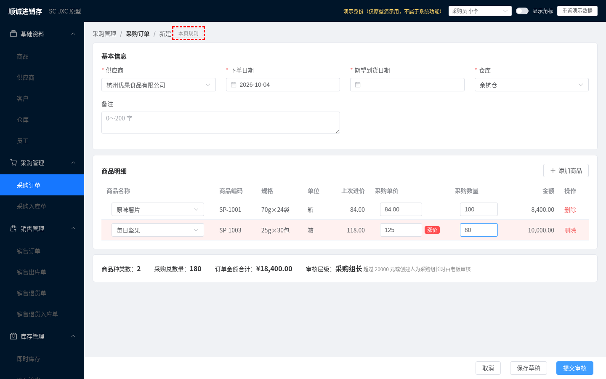 | 有未保存的修改时离开页面要确认；保存、提交按钮点击后在处理完成前不能重复点击 | |

### 6.3 采购订单详情页

| 序号 | 操作路径/功能点 | 原型页面 | 页面说明 | 备注 |
| --- | --- | --- | --- | --- |
| 1 | 采购管理/采购订单详情-基本信息 | 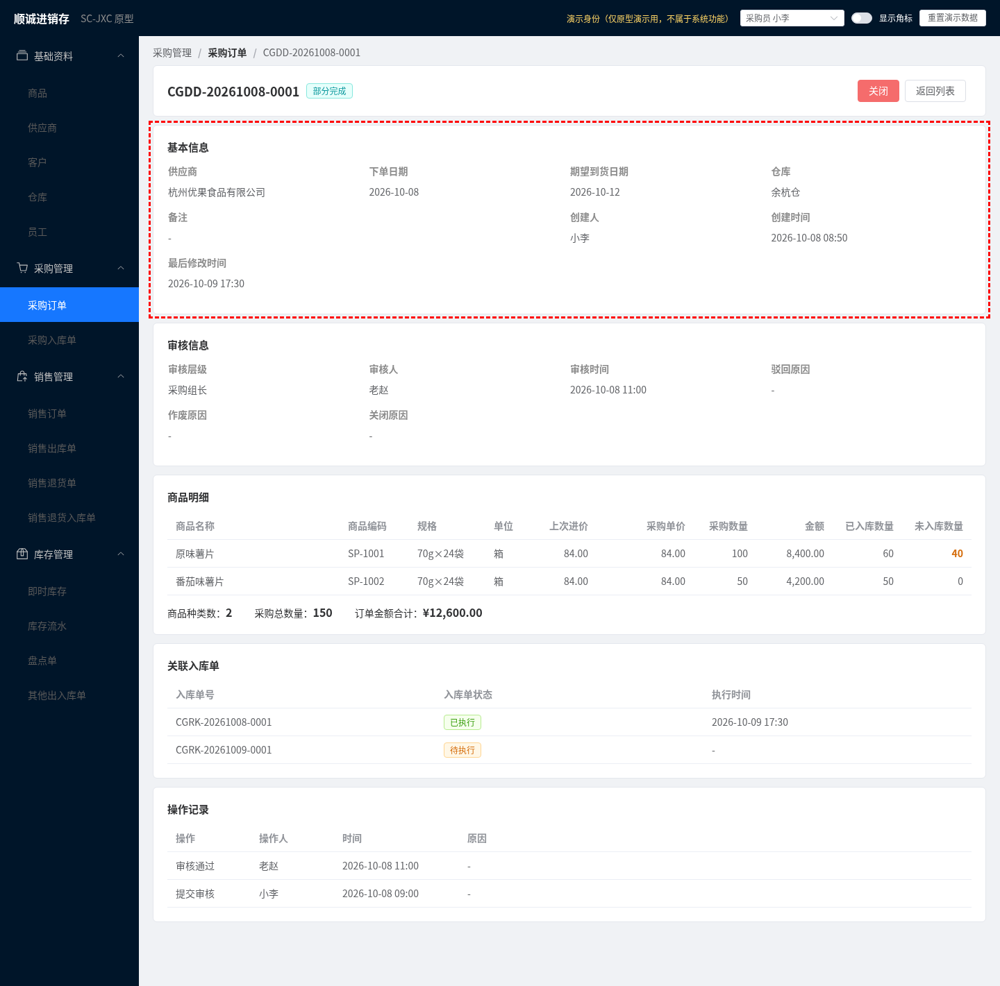 | 只读展示供应商、下单日期、期望到货日期、仓库、备注、创建人、创建时间、最后修改时间；采购订单号和状态标签显示在页面顶部 | |
| 2 | 采购管理/采购订单详情-审核信息 |  | 显示审核层级、审核人、审核时间，以及驳回、作废、关闭的原因，没有的显示"-"。待审核时如果你不能审核这张单，会提示"本单由【采购组长/老板】审核" | |
| 3 | 采购管理/采购订单详情-商品明细与入库进度 | 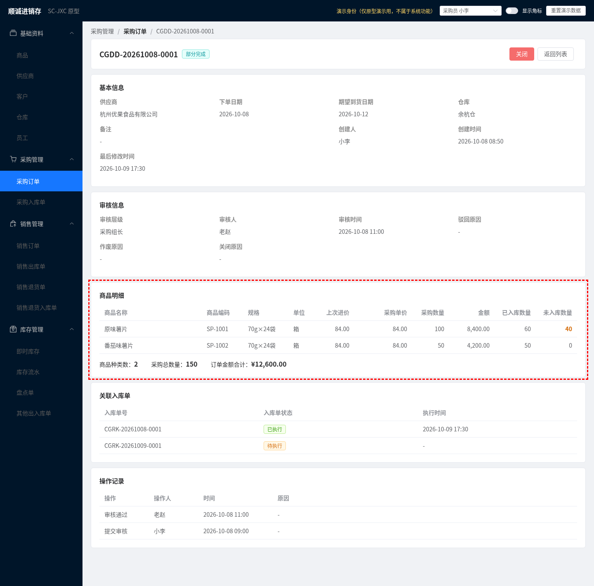 | 除了商品、单价、数量、金额，还显示每行已入库多少、还差多少。涨价的行整行浅红，单价后有"涨价"标签；还没收完的数量用橙色显示 | |
| 4 | 采购管理/采购订单详情-关联入库单 | 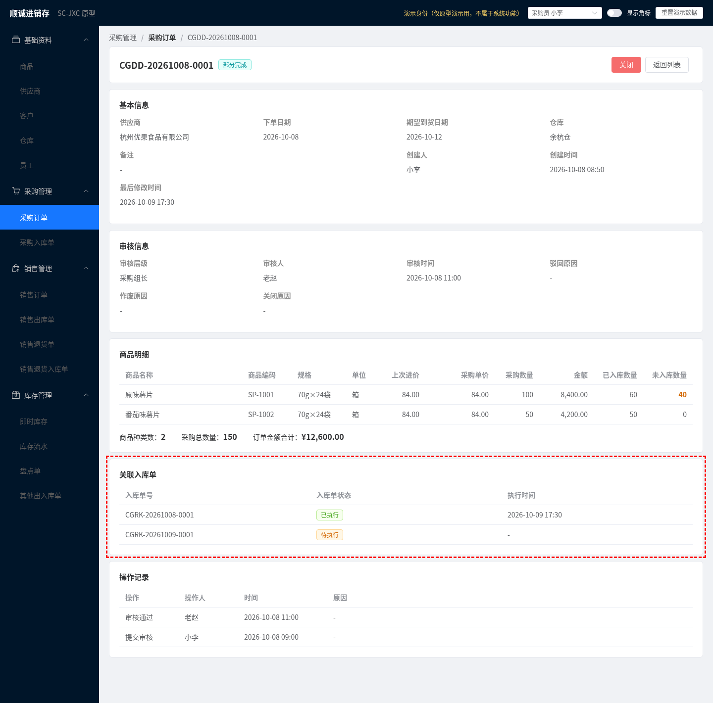 | 审核通过前显示"审核通过后自动生成"。审核通过后出现一张包含全部数量的入库单；仓库只收了一部分时，剩余数量会再生成一张新的入库单 | |
| 5 | 采购管理/采购订单详情-操作按钮 | 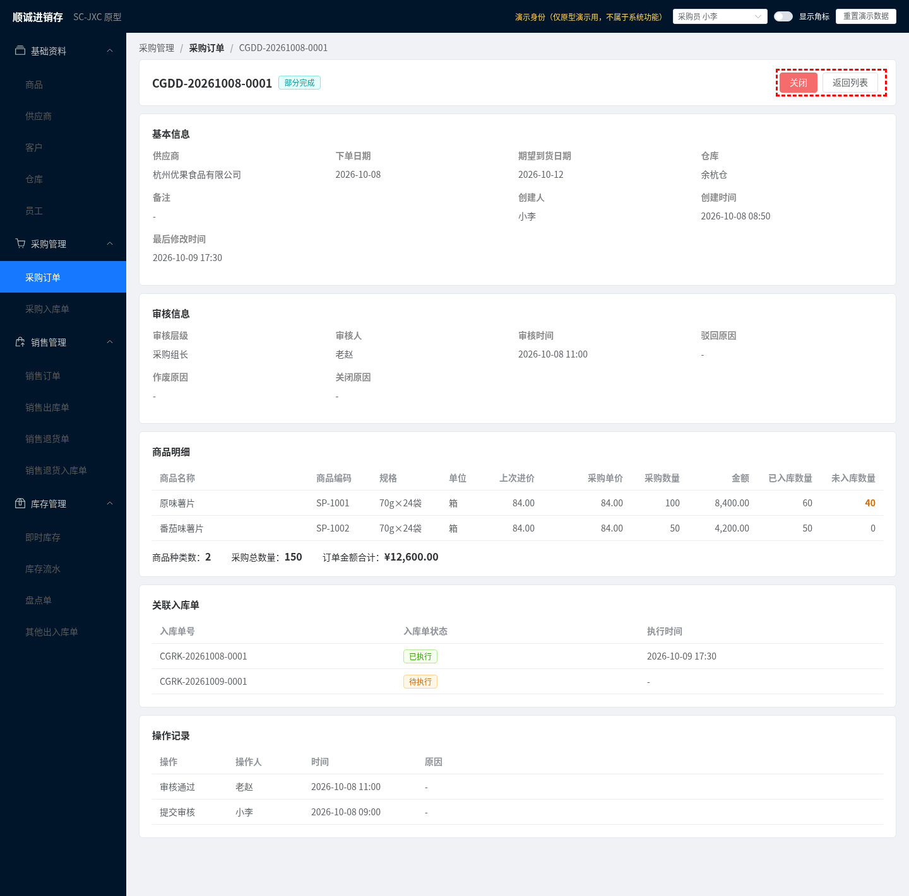 | 按订单状态和当前身份显示，不能做的按钮直接不显示：草稿（创建人）可编辑、删除、提交审核；待审核（创建人）可撤回，（对应审核人）可审核通过、驳回；已审核且还没入库时（创建人或采购组长）可作废；部分完成时（创建人或采购组长）可关闭；已完成、已关闭、已作废只能返回列表 | |
| 6 | 采购管理/采购订单详情-操作记录 | 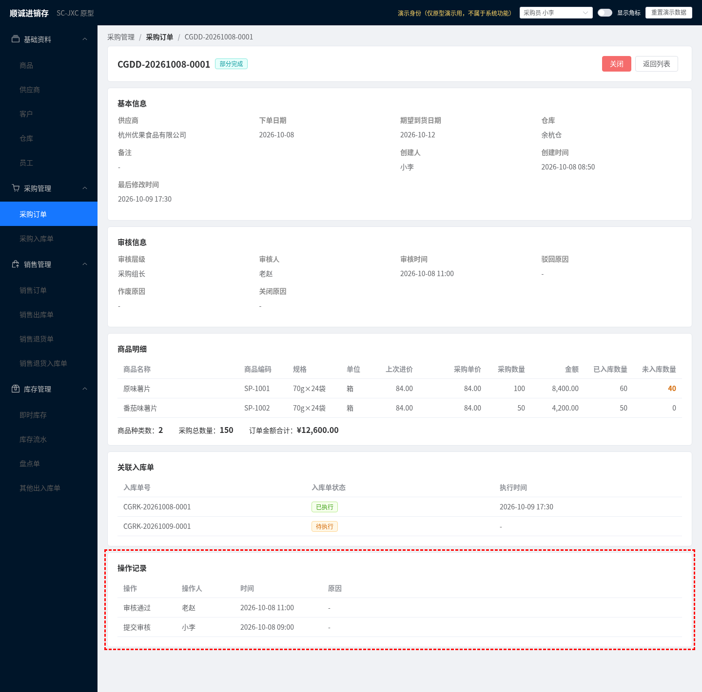 | 按时间从新到旧列出提交、撤回、审核通过、驳回、作废、关闭，每条有操作人、时间、原因 | |
| 7 | 采购管理/采购订单详情-原因弹窗 | 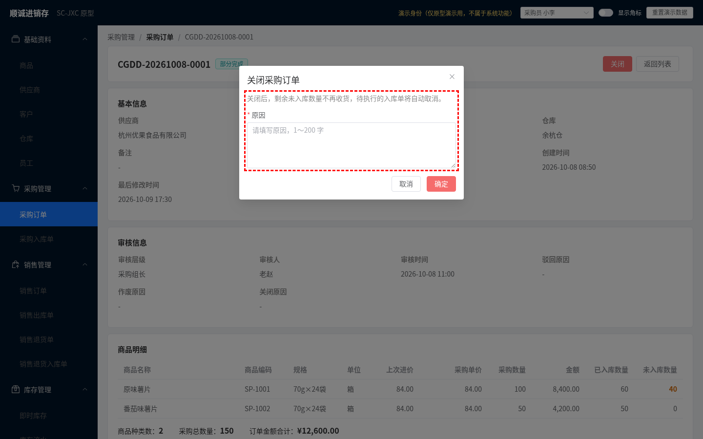 | 必须填写原因（1～200 字）才能确认。作废和关闭弹窗里会说明后果：待执行的入库单将自动取消 | |

## 七、字段清单

**采购订单列表页-字段清单**

| 字段名称 | 填写格式 | 是否必填 | 字段来源 | 能不能改 | 字段说明 |
| --- | --- | --- | --- | --- | --- |
| 采购订单号 | 文本 | 系统自动 | 系统生成 | 不能改 | 采购订单的唯一编号；CGDD-年月日-4位流水，首次保存时生成，不可修改 |
| 供应商 | 关联选择 | 必填 | 用户选择 | 仅草稿时在编辑页改 | 本单的供应商，一张单只能选一个；只能选启用状态的供应商；已选商品后更换供应商，需重新带出单价 |
| 下单日期 | 日期 | 必填 | 用户填写 | 仅草稿时在编辑页改 | 下采购单的日期；年-月-日，默认当天 |
| 期望到货日期 | 日期 | 必填 | 用户填写 | 仅草稿时在编辑页改 | 希望供应商送达的日期；年-月-日，不早于下单日期 |
| 订单状态 | 单选 | 系统自动 | 系统生成 | 不能改 | 采购订单当前所处状态；草稿 / 待审核 / 已审核 / 部分完成 / 已完成 / 已关闭 / 已作废；新建保存后为草稿 |
| 审核层级 | 单选 | 系统自动 | 系统计算 | 不能改 | 这张单应由谁审核；采购组长 / 老板；订单金额合计超过20000元，或创建人是采购组长时为老板，否则为采购组长；随明细实时计算，提交时固定 |
| 订单金额合计 | 金额 | 系统自动 | 系统计算 | 不能改 | 各行金额之和，审核分级以此为准；各行金额相加，两位小数 |
| 创建人 | 文本 | 系统自动 | 系统生成 | 不能改 | 新建这张单的人；当前登录人；用于判断审核层级和"不能审自己的单" |

**新建/编辑采购订单页-字段清单**

| 字段名称 | 填写格式 | 是否必填 | 字段来源 | 能不能改 | 字段说明 |
| --- | --- | --- | --- | --- | --- |
| 采购订单号 | 文本 | 系统自动 | 系统生成 | 不能改 | 采购订单的唯一编号；CGDD-年月日-4位流水，首次保存时生成，不可修改 |
| 供应商 | 关联选择 | 必填 | 用户选择 | 草稿时可以改 | 本单的供应商，一张单只能选一个；只能选启用状态的供应商；已选商品后更换供应商，需重新带出单价 |
| 下单日期 | 日期 | 必填 | 用户填写 | 草稿时可以改 | 下采购单的日期；年-月-日，默认当天 |
| 期望到货日期 | 日期 | 必填 | 用户填写 | 草稿时可以改 | 希望供应商送达的日期；年-月-日，不早于下单日期 |
| 仓库 | 关联选择 | 必填 | 用户选择 | 草稿时可以改 | 收货仓库；默认唯一仓库"余杭仓"；只能选启用的仓库 |
| 备注 | 长文本 | 选填 | 用户填写 | 草稿时可以改 | 订单补充说明；0～200字 |
| 订单状态 | 单选 | 系统自动 | 系统生成 | 不能改 | 采购订单当前所处状态；草稿 / 待审核 / 已审核 / 部分完成 / 已完成 / 已关闭 / 已作废；新建保存后为草稿 |
| 审核层级 | 单选 | 系统自动 | 系统计算 | 不能改 | 这张单应由谁审核；采购组长 / 老板；订单金额合计超过20000元，或创建人是采购组长时为老板，否则为采购组长；随明细实时计算，提交时固定 |
| 驳回原因 | 长文本 | 条件必填 | 用户填写 | 不能改 | 审核人驳回时填写的原因；驳回时必填，1～200字；最近一次驳回原因在编辑页顶部显示 |
| 商品名称 | 关联选择 | 必填 | 用户选择 | 草稿时可以改 | 本行采购的商品；只能选启用状态的商品；同一张单内不能重复 |
| 商品编码 | 文本 | 系统自动 | 系统带出 | 不能改 | 商品资料中的编码；选商品后自动带出 |
| 规格 | 文本 | 系统自动 | 系统带出 | 不能改 | 商品规格；选商品后自动带出 |
| 单位 | 文本 | 系统自动 | 系统带出 | 不能改 | 采购单位；选商品后自动带出 |
| 上次进价 | 金额 | 系统自动 | 系统计算 | 不能改 | 该供应商该商品最近一次已执行入库单上的采购单价；两位小数；没有记录时显示"-" |
| 采购单价 | 金额 | 必填 | 用户填写 | 草稿时可以改 | 本次采购单价；大于等于0，两位小数；默认带出上次进价，没有上次进价时带出商品参考进价；可手改；一期不区分含税与不含税 |
| 涨价标记 | 标记 | 系统自动 | 系统计算 | 不能改 | 采购单价比上次进价高5%以上时显示；涨价 / 空；采购单价 > 上次进价 × 1.05 时为涨价；没有上次进价时不比较 |
| 采购数量 | 整数 | 必填 | 用户填写 | 草稿时可以改 | 本行采购数量；大于0的整数 |
| 金额 | 金额 | 系统自动 | 系统计算 | 不能改 | 本行金额；采购数量 × 采购单价，两位小数，四舍五入 |
| 商品种类数 | 整数 | 系统自动 | 系统计算 | 不能改 | 明细行数；明细行的条数 |
| 采购总数量 | 整数 | 系统自动 | 系统计算 | 不能改 | 各行采购数量之和；各行采购数量相加 |
| 订单金额合计 | 金额 | 系统自动 | 系统计算 | 不能改 | 各行金额之和，审核分级以此为准；各行金额相加，两位小数 |
| 创建人 | 文本 | 系统自动 | 系统生成 | 不能改 | 新建这张单的人；当前登录人；用于判断审核层级和"不能审自己的单" |

**采购订单详情页-字段清单**

| 字段名称 | 填写格式 | 是否必填 | 字段来源 | 能不能改 | 字段说明 |
| --- | --- | --- | --- | --- | --- |
| 采购订单号 | 文本 | 系统自动 | 系统生成 | 不能改 | 采购订单的唯一编号；CGDD-年月日-4位流水，首次保存时生成，不可修改 |
| 供应商 | 关联选择 | 必填 | 用户选择 | 仅草稿时在编辑页改 | 本单的供应商，一张单只能选一个；只能选启用状态的供应商；已选商品后更换供应商，需重新带出单价 |
| 下单日期 | 日期 | 必填 | 用户填写 | 仅草稿时在编辑页改 | 下采购单的日期；年-月-日，默认当天 |
| 期望到货日期 | 日期 | 必填 | 用户填写 | 仅草稿时在编辑页改 | 希望供应商送达的日期；年-月-日，不早于下单日期 |
| 仓库 | 关联选择 | 必填 | 用户选择 | 仅草稿时在编辑页改 | 收货仓库；默认唯一仓库"余杭仓"；只能选启用的仓库 |
| 备注 | 长文本 | 选填 | 用户填写 | 仅草稿时在编辑页改 | 订单补充说明；0～200字 |
| 订单状态 | 单选 | 系统自动 | 系统生成 | 不能改 | 采购订单当前所处状态；草稿 / 待审核 / 已审核 / 部分完成 / 已完成 / 已关闭 / 已作废；新建保存后为草稿 |
| 审核层级 | 单选 | 系统自动 | 系统计算 | 不能改 | 这张单应由谁审核；采购组长 / 老板；订单金额合计超过20000元，或创建人是采购组长时为老板，否则为采购组长；随明细实时计算，提交时固定 |
| 审核人 | 文本 | 系统自动 | 系统生成 | 不能改 | 实际做审核通过或驳回的人；审核通过或驳回时记录 |
| 审核时间 | 日期时间 | 系统自动 | 系统生成 | 不能改 | 审核通过或驳回的时间；年-月-日 时:分 |
| 驳回原因 | 长文本 | 条件必填 | 用户填写 | 仅草稿时在编辑页改 | 审核人驳回时填写的原因；驳回时必填，1～200字；最近一次驳回原因在编辑页顶部显示 |
| 作废原因 | 长文本 | 条件必填 | 用户填写 | 仅草稿时在编辑页改 | 作废时填写的原因；作废时必填，1～200字 |
| 关闭原因 | 长文本 | 条件必填 | 用户填写 | 仅草稿时在编辑页改 | 关闭时填写的原因；关闭时必填，1～200字 |
| 商品名称 | 关联选择 | 必填 | 用户选择 | 仅草稿时在编辑页改 | 本行采购的商品；只能选启用状态的商品；同一张单内不能重复 |
| 商品编码 | 文本 | 系统自动 | 系统带出 | 不能改 | 商品资料中的编码；选商品后自动带出 |
| 规格 | 文本 | 系统自动 | 系统带出 | 不能改 | 商品规格；选商品后自动带出 |
| 单位 | 文本 | 系统自动 | 系统带出 | 不能改 | 采购单位；选商品后自动带出 |
| 上次进价 | 金额 | 系统自动 | 系统计算 | 不能改 | 该供应商该商品最近一次已执行入库单上的采购单价；两位小数；没有记录时显示"-" |
| 采购单价 | 金额 | 必填 | 用户填写 | 仅草稿时在编辑页改 | 本次采购单价；大于等于0，两位小数；默认带出上次进价，没有上次进价时带出商品参考进价；可手改；一期不区分含税与不含税 |
| 涨价标记 | 标记 | 系统自动 | 系统计算 | 不能改 | 采购单价比上次进价高5%以上时显示；涨价 / 空；采购单价 > 上次进价 × 1.05 时为涨价；没有上次进价时不比较 |
| 采购数量 | 整数 | 必填 | 用户填写 | 仅草稿时在编辑页改 | 本行采购数量；大于0的整数 |
| 金额 | 金额 | 系统自动 | 系统计算 | 不能改 | 本行金额；采购数量 × 采购单价，两位小数，四舍五入 |
| 已入库数量 | 整数 | 系统自动 | 系统计算 | 不能改 | 已执行入库单累计实收数量；不超过采购数量 |
| 未入库数量 | 整数 | 系统自动 | 系统计算 | 不能改 | 还没收到的数量；采购数量 − 已入库数量 |
| 商品种类数 | 整数 | 系统自动 | 系统计算 | 不能改 | 明细行数；明细行的条数 |
| 采购总数量 | 整数 | 系统自动 | 系统计算 | 不能改 | 各行采购数量之和；各行采购数量相加 |
| 订单金额合计 | 金额 | 系统自动 | 系统计算 | 不能改 | 各行金额之和，审核分级以此为准；各行金额相加，两位小数 |
| 创建人 | 文本 | 系统自动 | 系统生成 | 不能改 | 新建这张单的人；当前登录人；用于判断审核层级和"不能审自己的单" |
| 创建时间 | 日期时间 | 系统自动 | 系统生成 | 不能改 | 首次保存的时间；年-月-日 时:分 |
| 最后修改时间 | 日期时间 | 系统自动 | 系统生成 | 不能改 | 最近一次保存或状态变化的时间；年-月-日 时:分 |
| 关联入库单 | 文本列表 | 系统自动 | 系统生成 | 不能改 | 审核通过后生成的采购入库单，可能有多张；每条显示：入库单号（CGRK-年月日-4位流水）、入库单状态（待执行 / 已执行 / 已取消）、执行时间 |
| 操作记录 | 文本列表 | 系统自动 | 系统生成 | 不能改 | 提交、撤回、审核通过、驳回、作废、关闭的记录；每条显示：操作、操作人、时间、原因 |

## 八、验收标准

| 序号 | 输入条件 | 预期结果 |
| --- | --- | --- |
| 1 | 以老板身份进入列表 | 看不到"新建"按钮 |
| 2 | 新建时打开供应商选择 | 停用的供应商不出现 |
| 3 | 新建时打开商品选择 | 停用的商品不出现；本单已选过的商品不出现 |
| 4 | 选择有上次进价的商品 | 采购单价带出上次进价 |
| 5 | 选择没有上次进价的商品 | 采购单价带出参考进价，上次进价显示"-" |
| 6 | 把采购单价改到比上次进价高 5% 以上 | 该行显示"涨价"；提交时弹出涨价提醒，可继续提交 |
| 7 | 期望到货日期早于下单日期后提交 | 提示错误，不能提交 |
| 8 | 没有明细行时提交 | 提示至少添加 1 个商品，不能提交 |
| 9 | 采购员提交金额合计 20000 元的订单 | 审核层级为采购组长 |
| 10 | 采购员提交金额合计 20000.01 元的订单 | 审核层级为老板 |
| 11 | 采购组长提交金额 5000 元的订单 | 审核层级为老板；采购组长看这张单没有审核按钮 |
| 12 | 采购组长打开审核层级为老板的待审核单 | 没有"审核通过""驳回"按钮 |
| 13 | 审核人驳回时不填原因 | 不能驳回 |
| 14 | 驳回后 | 订单回到草稿，编辑页顶部显示驳回原因 |
| 15 | 审核通过后 | 状态为已审核，详情页关联入库单出现一张待执行入库单 |
| 16 | 已审核且没有入库的订单作废 | 状态为已作废，关联入库单变为已取消 |
| 17 | 部分完成的订单 | 没有"作废"，有"关闭"；关闭需填原因，关闭后待执行入库单变为已取消 |
| 18 | 已完成、已关闭、已作废的订单 | 只有查看，没有任何操作按钮 |
| 19 | 草稿订单由非创建人打开 | 没有编辑、删除、提交审核按钮 |

## 九、会上需拍板

| 序号 | 问题 | 建议 |
| --- | --- | --- |
| 1 | 上次进价取哪一次的单价 | 取这家供应商这个商品最近一次已入库的采购单价 |
| 2 | 采购入库单页面（仓库确认实收）另出需求 | 放在库存模块，下一轮评审 |
