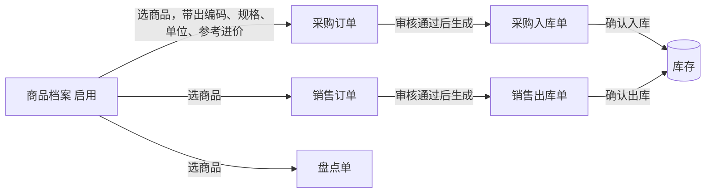

# 商品档案-主PRD

产出步骤：参照 05-提示词合集/06-主PRD.md 的要求产出（基础资料没有单独的提示词，本次按指挥官五段式指令执行）
依据：商品档案-字段清单-详细稿.tsv、01-全局背景信息/10、20、30、40、50、99-产品原型/前端工程/src/mock/seed/基础资料.js（与 03-产品设计/采购管理/采购订单/采购订单-演示数据.md 一致）、02-需求调研/01-采购需求调研.md、02-库存需求调研.md、04-常用模版/主PRD模版.md

> 本文件是商品档案业务规则的唯一来源。字段定义见 [商品档案-字段清单-详细稿.tsv](商品档案-字段清单-详细稿.tsv)，页面交互见 [商品档案_Demo_列表页.md](商品档案_Demo_列表页.md)、[商品档案_Demo_新增编辑页.md](商品档案_Demo_新增编辑页.md)、[商品档案_Demo_详情页.md](商品档案_Demo_详情页.md)，本文件不重复。文中带书名号的字段名与字段清单一致。

## 修改记录

| 日期 | 版本 | 修改人 | 修改内容 |
| --- | --- | --- | --- |
| 2026-10-06 | V1.0 | AI 起草，产品负责人审 | 初稿 |
| 2026-10-06 | V1.1 | 山治 | 确认商品编码前缀规则（SP=休闲食品、YL=饮料、RH=日化）；确认商品分类固定为休闲食品 / 饮料 / 日化；确认维护角色为采购员、采购组长；确认停用后可以重新启用；关闭对应待确认并重新编号；字段清单改名为详细稿，Demo PRD 拆为三份 |

## 一、业务背景与本期范围

- 要解决的问题：商品信息散在 Excel 里，采购员曾对已经下架的商品下单（02-采购需求调研 痛点 8）；写进价全靠翻聊天记录（痛点 3）。采购、销售、库存各单据都要从一份统一的商品名单里选商品，并带出编码、规格、单位和参考进价
- 本期做：商品的新增、编辑、停用、启用、删除（仅限没被单据引用的）、按分类和编码、名称查询、详情查看；维护《参考进价》供采购下单带出
- 本期不做：安全库存设置与提醒（02-采购需求调研 初步需求第 11 条"本次不做"，与 01 的出入见"九、待确认"第 6 条）；批次和保质期（01-全局背景信息/02-项目背景 一期不做）；商品销售价格（02-销售需求调研 待确认问题第 1 条尚未定）；一个商品多个单位及换算；商品导入导出

演示数据中的商品（共 8 个；演示数据原无分类，下表《商品分类》按已确认的编码前缀规则对应）：

| 商品编码 | 商品名称 | 商品分类 | 规格 | 单位 | 参考进价 | 状态 |
| --- | --- | --- | --- | --- | --- | --- |
| SP-1001 | 原味薯片 | 休闲食品 | 70g×24袋 | 箱 | 86.40 | 启用 |
| SP-1002 | 番茄味薯片 | 休闲食品 | 70g×24袋 | 箱 | 86.40 | 启用 |
| SP-1003 | 每日坚果 | 休闲食品 | 25g×30包 | 箱 | 120.00 | 启用 |
| YL-2001 | 矿泉水 | 饮料 | 550ml×24瓶 | 箱 | 18.00 | 启用 |
| YL-2002 | 柠檬茶 | 饮料 | 500ml×15瓶 | 箱 | 45.00 | 启用 |
| RH-3001 | 洗洁精 | 日化 | 1.5kg×6瓶 | 箱 | 52.00 | 启用 |
| RH-3002 | 洗衣液 | 日化 | 2kg×4瓶 | 箱 | 68.00 | 启用 |
| SP-1009 | 苏打饼干（老款） | 休闲食品 | 400g×12盒 | 箱 | 60.00 | 停用 |

## 二、功能清单

| 序号 | 功能 | 一句话说明 | 本期 |
| --- | --- | --- | --- |
| 1 | 列表查询 | 按状态页签和编码、名称、分类查询商品 | 是 |
| 2 | 新增商品 | 填写编码、名称、分类、规格、单位、参考进价，保存后状态为启用 | 是 |
| 3 | 编辑 | 修改编码以外的可填信息，包括参考进价 | 是 |
| 4 | 停用 | 下架的商品停用，新单据不能再选 | 是 |
| 5 | 启用 | 已停用的商品恢复可选 | 是 |
| 6 | 删除 | 没被任何单据引用的商品可以真删除 | 是 |
| 7 | 查看详情 | 查看商品全部信息和创建、更新记录 | 是 |

## 三、单据关系

- 商品档案不是单据，没有上游；一期被采购、销售、库存各单据引用（01-全局背景信息/40 单据目录），即时库存、库存流水也按商品统计
- 《参考进价》在本档案维护；采购订单在"该供应商该商品"没有上次进价时带出《参考进价》（01-全局背景信息/30 边界规则 7），带出和改价规则以采购订单主PRD 为准
- 各单据的数量都按本档案的《单位》计（01-全局背景信息/50"数量按商品最小单位"）

## 四、状态流转

基础资料不走 01-全局背景信息/40 的订单类通用状态，只用两个状态：启用、停用（依据 03-系统模块与边界 边界规则 3"被单据引用后不能删除，只能停用"，以及演示数据中的启用、停用标识）。

| 序号 | 当前状态 | 动作 | 下一状态 | 谁能做 | 条件 |
| --- | --- | --- | --- | --- | --- |
| 1 | （无） | 新增保存 | 启用 | 采购员、采购组长 | 通过保存校验 |
| 2 | 启用 | 编辑保存 | 启用 | 采购员、采购组长 | 通过保存校验 |
| 3 | 停用 | 编辑保存 | 停用 | 采购员、采购组长 | 通过保存校验 |
| 4 | 启用 | 停用 | 停用 | 采购员、采购组长 | 二次确认 |
| 5 | 停用 | 启用 | 启用 | 采购员、采购组长 | 二次确认 |
| 6 | 启用、停用 | 删除 | （记录删除） | 采购员、采购组长 | 没被任何单据引用；二次确认 |

### 状态—动作矩阵

"可"表示该状态下有这个动作，括号内是能做的人。维护角色为采购员、采购组长（2026-10-06 确认）。

| 动作 \ 状态 | 启用 | 停用 |
| --- | --- | --- |
| 查看 | 可（全部角色） | 可（全部角色） |
| 编辑 | 可（采购员、采购组长） | 可（采购员、采购组长） |
| 停用 | 可（采购员、采购组长） | - |
| 启用 | - | 可（采购员、采购组长） |
| 删除 | 可（采购员、采购组长；没被单据引用） | 可（采购员、采购组长；没被单据引用） |

全部角色 = 员工档案中的全部角色。新增商品只有采购员、采购组长可以做。

## 五、业务规则

### 5.1 新增与编辑

| 序号 | 什么情况下 | 结果 |
| --- | --- | --- |
| 1 | 新增商品 | 只有采购员、采购组长可以新增；《创建人》记为当前登录人 |
| 2 | 点保存 | 校验：《商品编码》《商品名称》《商品分类》《规格》《单位》《参考进价》必填；名称、规格、单位 1～50 字；《参考进价》大于等于 0、最多两位小数；《备注》不超过 200 字；不通过不能保存 |
| 3 | 填写《商品编码》 | 格式为"分类前缀-4位数字"，前缀必须与《商品分类》对应：休闲食品为 SP、饮料为 YL、日化为 RH（编码规则，2026-10-06 确认）；不能与已有商品重复（含已停用的） |
| 4 | 《商品名称》与已有商品重名（含已停用的） | 不能保存；同款换代可加括号区分，如"苏打饼干（老款）" |
| 5 | 首次保存成功 | 《状态》为启用，记录《创建时间》 |
| 6 | 编辑 | 《商品编码》不能修改；其他可填字段可以修改；启用、停用状态下都可以编辑，保存后状态不变 |
| 7 | 编辑时修改《商品分类》 | 《商品编码》不变，前缀可能与新分类不一致，怎么处理【待确认】，见"九、待确认"第 1 条 |
| 8 | 修改《参考进价》 | 只影响之后新选商品时带出的价格；已经保存的采购订单不变 |
| 9 | 已被单据引用的商品修改名称、规格、单位 | 历史单据上显示新值还是当时的值【待确认】，见"九、待确认"第 4 条 |
| 10 | 每次保存、停用、启用 | 更新《更新时间》 |

### 5.2 停用与启用

| 序号 | 什么情况下 | 结果 |
| --- | --- | --- |
| 1 | 停用 | 二次确认后《状态》变为停用；停用的商品不出现在新单据的商品选择里（01-全局背景信息/30 边界规则 3、50 下拉选择规则） |
| 2 | 停用之后 | 已经在单据里的不受影响，历史单据、库存流水照常查看 |
| 3 | 停用前已存在、选了该商品的草稿或待审核采购订单 | 按采购订单主PRD 处理（提交时商品已停用不能提交），本档案不另定规则 |
| 4 | 商品还有现存量时停用 | 是否允许、剩余库存如何处理【待确认】，见"九、待确认"第 5 条；本稿暂按允许停用写 |
| 5 | 启用 | 二次确认后《状态》变为启用，之后可以被新单据选用 |

### 5.3 删除

| 序号 | 什么情况下 | 结果 |
| --- | --- | --- |
| 1 | 删除没被任何单据引用的商品 | 二次确认后真删除，不能恢复 |
| 2 | 删除已被单据引用的商品（含草稿单据） | 不能删除，只能停用（01-全局背景信息/30 边界规则 3） |

### 5.4 查看范围

| 序号 | 什么情况下 | 结果 |
| --- | --- | --- |
| 1 | 任何角色查看列表和详情 | 都能看到全部商品，包括已停用的 |

## 六、异常处理

| 序号 | 异常情况 | 系统怎么处理 |
| --- | --- | --- |
| 1 | 保存时《商品编码》已存在 | 阻止保存，提示"商品编码已存在" |
| 2 | 保存时《商品名称》已存在 | 阻止保存，提示"商品名称已存在" |
| 3 | 《商品编码》前缀与《商品分类》不一致 | 阻止保存，提示该分类应使用的前缀 |
| 4 | 删除已被单据引用的商品 | 阻止删除，提示"该商品已被单据引用，不能删除，可停用" |
| 5 | 停用、启用、删除时状态已被他人改变 | 阻止操作，提示"状态已变化，请刷新后重试" |
| 6 | 编辑或查看时该商品已被删除 | 提示"商品不存在或已删除"，返回列表 |
| 7 | 没有任何启用的商品 | 新单据的商品选择为空，按各单据 Demo PRD 提示"没有可选的商品" |

## 七、对下游的影响

| 时点 | 对采购、销售、库存各单据 | 对库存 |
| --- | --- | --- |
| 新增（启用） | 新建、编辑单据时可以选用 | 不变 |
| 编辑 | 之后选商品时带出最新的编码、规格、单位、参考进价；已有单据的显示口径【待确认】 | 不变 |
| 修改参考进价 | 之后新带出的采购单价随之变化；已保存的采购订单不变 | 不变 |
| 停用 | 新建、编辑时不能再选；已有草稿、待审核采购订单提交时被拦截（按采购订单主PRD）；已审核及之后的单据不受影响 | 现存量不变 |
| 启用 | 恢复可选 | 不变 |
| 删除 | 只有没被引用时才能删，对已有单据没有影响 | 不变 |

商品档案的任何操作都不直接改变库存；库存只由入库单、出库单改变（01-全局背景信息/30 边界规则 1）。

## 八、验收标准

| 序号 | 输入条件 | 预期结果 |
| --- | --- | --- |
| 1 | 以采购员身份新增商品：分类选休闲食品、编码填 SP-1004，其余必填项填齐，《参考进价》填 50 | 保存成功，《状态》为启用，《参考进价》显示 50.00 |
| 2 | 新增商品时不选《商品分类》保存 | 提示"请选择商品分类"，不能保存 |
| 3 | 分类选"饮料"，编码填 SP-1005 | 提示"饮料类商品编码应以 YL- 开头"，不能保存 |
| 4 | 编码填 YL-2001（已存在） | 提示"商品编码已存在"，不能保存 |
| 5 | 名称填"苏打饼干（老款）"（已停用商品重名） | 提示"商品名称已存在"，不能保存 |
| 6 | 《参考进价》填 -1 或 12.345 | 提示"请输入大于等于 0 的金额，最多两位小数"，不能保存 |
| 7 | 编辑 SP-1001 | 《商品编码》只读，不能修改 |
| 8 | 把"原味薯片"的《参考进价》改为 88.00 | 新建采购订单时，没有上次进价的供应商选原味薯片带出 88.00；已保存的采购订单单价不变 |
| 9 | 停用"柠檬茶" | 《状态》变为停用；新建采购订单时商品选择里不出现它 |
| 10 | 查看"苏打饼干（老款）"停用前的历史采购订单 CGDD-20260925-0001 | 商品信息正常显示 |
| 11 | 启用"苏打饼干（老款）" | 《状态》变为启用；新建采购订单时可以选到它 |
| 12 | 删除"矿泉水"（已被采购订单引用） | 提示"该商品已被单据引用，不能删除，可停用" |
| 13 | 删除刚新增、没被引用的商品 | 二次确认后删除，列表不再显示 |
| 14 | 以老板身份进入列表 | 看不到新增、编辑、停用、启用、删除按钮，只能查看 |
| 15 | 查询区《商品分类》选"日化" | 只显示洗洁精、洗衣液 |

## 九、待确认

| 序号 | 问题 | 来源 |
| --- | --- | --- |
| 1 | 《商品编码》由手工填写还是系统按分类自动生成？已保存的商品改了《商品分类》后，编码前缀与新分类不一致怎么办（前缀规则本身已于 2026-10-06 确认） | 01 未规定编码生成方式 |
| 2 | 《商品名称》能否重名？本稿暂按不能重名（含已停用的）写 | 01 未规定 |
| 3 | 《单位》是否改为固定下拉选项（如只有"箱"），是否需要一个商品多个单位 | 演示数据全部为"箱"，01 未规定 |
| 4 | 已被单据引用的商品改名称、规格、单位后，历史单据显示新值还是当时的值 | 01 未规定 |
| 5 | 还有现存量的商品能否停用？停用后剩余库存怎么出库或盘点 | 01-全局背景信息/30 边界规则 3 只说"不能再被新单据选用" |
| 6 | 01-全局背景信息/20 一期目标 3 写"采购员能看到低于安全库存的商品"，而 02-采购需求调研 初步需求第 11 条写"本次不做"；商品档案是否需要"安全库存"字段，本稿暂不加 | 01 与 02 说法不一致 |
