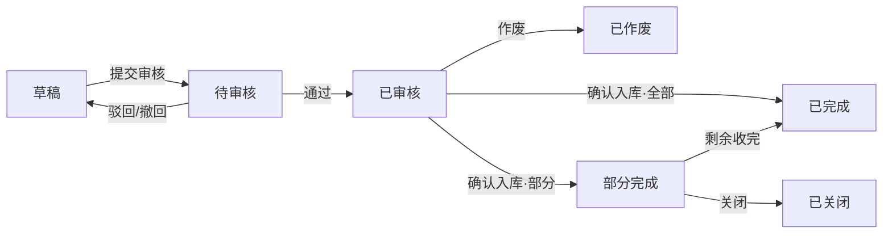

# 状态机设计模板

> **用途**：设计一张业务单据的状态机，产出「状态定义 + 状态流转图 + 状态流转表」三件套。状态流转表是核心，每行 = 一个状态 + 一个动作 = 一条可编程的规则。
>
> **前置输入**：已确认的 需求澄清清单 + 拍板记录 + 字段清单详细稿 + 单据目录与通用状态。
>
> **层级定位**：规则层的输入。状态机设计好之后，主PRD 四、状态流转 直接引用它；也作为推演的下游依据。

## 一、状态定义

| 状态 | 枚举值 | 含义 | 是否终态 | 进入条件 | 离开条件 |
| --- | --- | --- | --- | --- | --- |
| 草稿 | `DRAFT` | 创建后尚未提交，可编辑/删除 | 否 | 创建单据 | 提交审核 / 删除 |
| 待审核 | `PENDING_AUDIT` | 已提交，等审核 | 否 | 提交审核 | 审核通过 / 驳回 / 撤回 |
| 已审核 | `AUDITED` | 审核通过，关键字段锁定 | 否 | 审核通过 | 确认入库 / 作废 |
| 部分完成 | `PARTIAL_DONE` | 至少一次部分收货 | 否 | 确认入库(部分) | 剩余收完 / 关闭 |
| 已完成 | `COMPLETED` | 全部到齐 | 是 | 剩余收完 / 全部入库 | — |
| 已关闭 | `CLOSED` | 人为终止，不可恢复 | 是 | 关闭 | — |
| 已作废 | `VOIDED` | 失效，不可恢复 | 是 | 作废 | — |

**设计原则**：
- 先少后多：一期用够用的状态，不为显得专业而拆细
- 状态名必须是业务语言（「待入库」），不能是系统语言（如 `WAITING`）
- 每个状态要能回答：现在处于哪个阶段？允许做什么？不允许做什么？
- 订单层单据才有"审核流"；执行层单（如入库单）更简洁，通常 草稿→已确认，不要硬套审核

## 二、状态流转图（mermaid）

可用 `flowchart LR` 或 `stateDiagram-v2` 画。终态不胜（已完成/已关闭/已作废）作为终止节点；系统自动触发的转移标注"（自动）"。

## 三、状态流转表（最核心）

每行 = 状态 + 动作 = 一条可落地规则。

| 当前状态 | 动作 | 谁能做 | 前置条件 | 结果状态 | 二次确认 | 后置影响 |
| --- | --- | --- | --- | --- | --- | --- |
| 草稿 | 提交审核 | 创建人 | 通过全量校验 | 待审核 | — | — |
| 草稿 | 删除 | 创建人 | — | 记录消失 | 需确认 | — |
| 待审核 | 驳回 | 审核角色(非创建人) | 填驳回原因 | 草稿 | — | 可重新编辑 |
| 待审核 | 审核通过 | 审核角色(非创建人) | 达到审批线 | 已审核 | — | 关键字段锁定 |
| 已审核 | 作废 | 创建人/采购组长 | 无已执行入库单 | 已作废 | 需确认 + 填作废原因 | 只读 |
| 已审核 | 确认入库(部分) | 仓管员(入库单上操作) | 至少一行未入库 | 部分完成 | — | 生成入库单 |
| 部分完成 | 剩余收完 | 仓管员 | 未入库数为0 | 已完成 | — | 关联入库单完成 |
| 部分完成 | 关闭 | 创建人/采购组长 | 填关闭原因 | 已关闭 | — | — |

**列填写规范**：
- 前置条件：写具体字段和判断逻辑，不写"数据完整"这种模糊话
- 谁能做：写角色，不写"相关人员"；审核类要标"非创建人"
- 二次确认：需要弹窗确认的写弹窗文案；系统自动触发标注"（自动）"

## 四、自检：设计完再过一遍

- 每个终态是否从合法路径可达？（有没有到不了的终点）
- 每个非终态是否都能继续往前走？（有没有"活在里面出不来"的死胡同）
- 有没有配置了但业务永远用不上的动作？（多余岔路，砍）
- 角色之间是否出现"能审核自己的单"这类越权？（加"非创建人"）

> 设计完，拿 `状态机推演模板` 把它走一遍，拿 `用例数据推演模板` 用数据验一遍，再过主PRD。