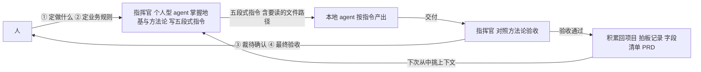
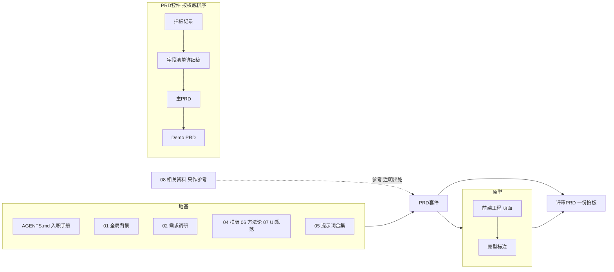
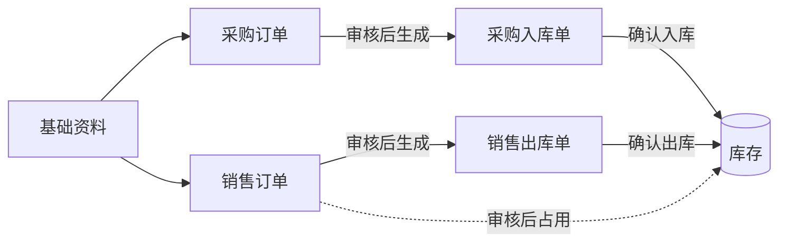
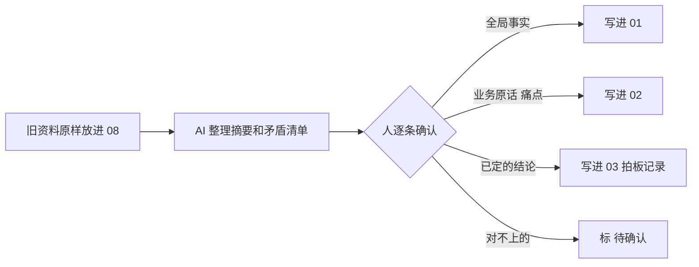
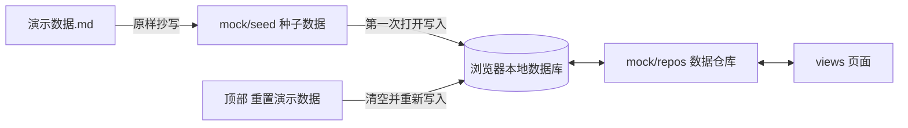
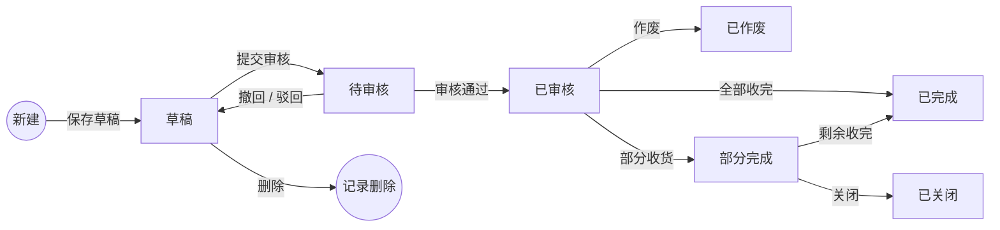
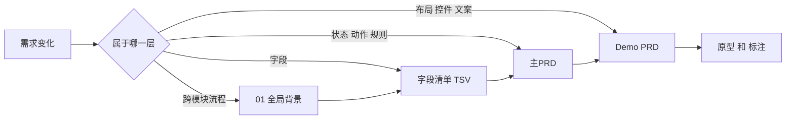

# 实战篇：从0到1搭建“顺诚进销存（SC-JXC）”，并用本地 Agent 落地采购订单 PRD 套件

## 一、这节课是什么

这是一节实战课。我们拿一个虚构的小项目——“顺诚进销存（SC-JXC）”，从一个空文件夹开始，一步步把它搭成一个“AI 能看懂、能接着干活”的产品项目，然后让 AI 在这个项目里，把“采购订单”这张单据的整套需求文档和可点击原型做出来。

:::info
SC-JXC 是一个教学用的虚构项目：公司是“顺诚商贸（杭州）有限公司”，一家小型快消品批发商；SC 取自“顺诚”的拼音首字母，JXC 是“进销存”的拼音首字母。文中所有公司、人物、数据都是虚构的。

:::

和以往很多“直接从现成项目讲起”的实战课不同，这一节**把 0→1 也讲完整**：

1. **实操一：从 0 到 1 搭地基**。每一个文件夹、每一个关键文件，都讲清楚为什么要有、里面写什么、怎么让 AI 帮你生成、你要检查什么。
2. **实操二：落地采购订单 PRD 套件**。按 01→11 共 11 条提示词的顺序，每一步给出完整提示词、产出文件、产出长什么样、人工走查清单和常见翻车。
3. **实操三：需求变了怎么回写**。用“老板审批金额从 2 万改到 3 万”的例子，演示一处改动要改哪些文件、按什么顺序改。
4. **实操四：三个 Agent 并跑原型 PK**。同一份文档、同一个工程地基、同一条提示词，交给三个 AI 工具，看谁做得最准、最守规矩。

本节课的听众是**没有技术背景的产品经理**。文中第一次出现的技术词，都会用大白话解释一遍，不需要你会写代码。

### 1.1 学完能得到什么

| 收获 | 具体是什么 | 在本节哪里 |
| --- | --- | --- |
| 一套方法 | 两类读者与指挥分工、人在回路、三层分离、权威来源排序、PRD 四件套 + 评审PRD、五段式提示词、谋定而后动、独立核验、改动入口表 | 第二节 |
| 一个能复用的项目地基 | 目录结构、AI 入职手册 `AGENTS.md`、全局背景、需求调研、相关资料、模版、提示词合集、方法论、UI 规范、原型工程骨架 | 第三、四节 |
| 一整套采购订单文档 | 澄清清单 → 拍板记录 → 字段清单 → 主PRD → Demo PRD → 原型 → 原型标注 → 评审PRD | 第五节 |
| 11 条能直接复制的提示词 | 每条都是五段式，写明读什么、产出什么、不许做什么、什么时候停 | 第五节 |
| 一套改需求的套路 | 先找改动入口，再从上游改到下游，最后核对 | 第六节 |
| 一场可复现的 AI 比赛 | 统一提示词、5 个必考点、100 分评分表 | 第七节 |

## 二、先看懂“SC-JXC”的工作流方法论

方法论不多，但每一条都会在后面的实操里反复用到。先把它们讲清楚，后面看实操才知道“为什么要这么做”。

### 2.1 先认识几种 AI：几种“许愿池”

整节课我们把“给 AI 下任务”比作“许愿”。不同的 AI，就像不同的许愿池。

| 类型 | 许愿比喻 | 它能做什么 | 你要做什么 | 例子 |
| --- | --- | --- | --- | --- |
| 网页对话型 | 站在许愿池边说话：你说一句，它回一句 | 回答问题、写一段文字 | 把资料复制进去，再把结果复制出来 | 各类网页版对话 AI |
| AI IDE（带文件夹的工作台） | 请精灵进你的办公室，它能直接翻你的文件夹，你在旁边看着 | 读项目里的文件，新建、修改文件，每一步你都看得见 | 看它改了什么，随时喊停 | Cursor |
| Agent（智能体） | 给精灵一张任务单，它自己去跑腿，跑完回来交差 | 连续做很多步，中间不用你盯 | 把任务单写清楚，最后验收 | 见下表 |

:::info
**术语解释**

+ **AI IDE**：IDE 原本是程序员写代码用的软件，现在加了 AI，产品经理也能用它管文档。记住一句话就行：“能直接读写你电脑文件夹的 AI”。
+ **Agent（智能体）**：能自己连续做很多步、最后交差的 AI。你给它一个任务，它会自己读文件、写文件、检查，直到做完。
+ **本地 Agent**：本节标题里的“本地”，指 AI 直接在你电脑上的项目文件夹里干活，产出的文件就落在这个文件夹里，而不是只在聊天窗口里回你一段话。

:::

Agent 再分两种：

| 对比 | 个人型 agent | 通用型 agent |
| --- | --- | --- |
| 许愿比喻 | 你的贴身管家精灵：跟了你很久，知道你是谁、爱怎么做事 | 接单的跑腿精灵：每次拿着任务单来，干完就走 |
| 记忆 | 有长期记忆，上次聊过的事这次还记得 | 每次按任务干活，任务之间一般不记得 |
| 了解你 | 有你的“用户画像”：记得你的身份、习惯、偏好 | 不了解你，你给多少资料它就知道多少 |
| 适合做什么 | 长期跟着你的事：日常助理、反复出现的工作、需要懂你习惯的活 | 一次性、边界清楚的活：按文档出原型、批量改文件 |
| 在本项目里的角色 | **指挥与验收**：掌握地基与方法论，写五段式指令，对照方法论验收 | **动手产出**：严格按五段式指令干活，产出文档和原型（AI IDE 在本项目里也是这个角色） |
| 例子 | Grok Bot、Hermes Agent、OpenClaw、Muse | Codex、WorkBuddy、Antigravity（反重力） |

四个个人型 agent 各是什么样（只列官方资料里写明的信息，链接见文末“参考链接”）：

| 个人型 agent | 是什么 | 记忆和“了解你” | 和项目文件的关系 | 参考 |
| --- | --- | --- | --- | --- |
| Grok Bot | 有自己的云端电脑，可以带多个队友 agent 协作 | 有长期记忆和用户画像 | 本课件就是由它产出 | — |
| Hermes Agent | Nous Research 出品的自我改进型个人 agent | 长期记忆分两份：MEMORY.md（环境事实、项目约定、经验）和 USER.md（用户画像与偏好）；会自己沉淀技能 | 会读取项目里的 AGENTS.md | [1] |
| OpenClaw | 开源，自己部署在自己电脑或服务器上的个人 AI 助手，可以在 WhatsApp、Telegram、Slack 等聊天工具里对话 | 有持久记忆和技能 | 工作区里用 SOUL.md 定义人设 | [2] |
| Muse | Meta 于 2026-09-08 发布的个人 AI agent，运行在专属的安全虚拟机里，能主动帮人办事；可在 Muse App、WhatsApp、网页使用，首发美国 | — | — | [3] |

口诀：**聊天用网页，干活用工作台，跑腿交给 Agent；要它懂你，找个人型；要它照单干活，找通用型。**

不管哪一种，有一点是共通的：**通用型的 AI 不认识你的公司，你给多少资料，它就知道多少。**所以这节课花大力气“打地基”——把资料提前整理好放进项目文件夹，让每个 AI、每次对话都从同一份资料出发。

### 2.2 两类读者：给人看，也给 agent 看

同一个项目文件夹，有两类读者；agent 里又分“指挥”和“动手”两种角色，需要的东西不一样：

| 读者 | 是谁 | 需要什么 | 本项目里对应的文件 |
| --- | --- | --- | --- |
| 给人看 | 产品经理、评审人、开发 | 中文、大白话、结构清楚，能快速找到东西 | 各目录的 `说明.md`、`前端工程/README.md`、评审PRD、目录树和结构图 |
| 给指挥官看 | 个人型 agent（如 Grok Bot、Hermes Agent、OpenClaw、Muse），或讲者本人 | 掌握地基、项目背景和方法论，才能写对指令、做对验收 | `AGENTS.md`（入职手册）、`01`～`08` 全部地基、`06-产品方法论`、`05-提示词合集` |
| 给本地 agent 看 | 通用型 agent（Codex、WorkBuddy、Antigravity）、AI IDE | 一条清楚的五段式指令；指令点名要读哪些文件，就读哪些 | 指令 Context 里列出的文件路径 |

**`AGENTS.md` 是入职手册，主要给指挥官看。**本地 agent 以指挥官的五段式指令为准；指令里通常会写“先读 SC-JXC/AGENTS.md”，读到的规矩如果和指令冲突，本地 agent 应该停下汇报，而不是自己选。

#### 谁指挥、谁动手：地基是指挥官的知识来源

个人型 agent 当**指挥官**：它要熟练掌握地基、项目背景和方法论（`06-产品方法论`、技能、五段式提示词）。**本地 agent 不自己去翻背景**，它严格按指挥官的五段式指令干活（Context / Request / Output format / 红线禁止 / Checkpoint）。这次任务需要什么上下文，由指挥官从地基里挑出来写进 Context，包括要读哪些文件的路径。所以地基仍然必须存在：它是指挥官的知识来源，也是本地 agent 按指令去读的材料。



人在这条链上做的是四件具体的事：

| 序号 | 人做什么 | 本项目里的例子 |
| --- | --- | --- |
| ① | 定做什么：模块、范围 | 先做采购订单的原型；安全库存提醒本次不做 |
| ② | 定业务规则 | 2 万以内采购组长审、超过 2 万老板审；分批入库怎么处理；不允许超收；部分完成可以关闭 |
| ③ | 裁【待确认】 | “上次进价”取哪一次的单价 |
| ④ | 最终验收 | 通过，或者打回重做 |

指挥官把①②翻译成五段式指令派给本地 agent；本地 agent 交付后，指挥官先对照方法论验收，把③④交回给人。验收通过的产出积累回项目，下一次指挥官再从中挑上下文。实操二的 11 条提示词，就是指挥官写给本地 agent 的指令：每条的 Context 都写明了背景和要读的文件路径。课堂上没有现场接入个人型 agent 时，**讲者可以自己扮演指挥官**：亲手写指令、派活、对照清单验收。

### 2.3 人在回路：人做判断，AI 做执行

这是整套方法的第一条，写在 `06-产品方法论/产品方法论（精简版）.md` 的开头：

```latex
人做判断：给输入、定范围、定优先级、做验收
AI 做执行：读资料、整理、生成、修改、自查
发现 AI 方向跑偏，立刻喊“停”，在判断层纠正，不让它在错误方向上反复改
```

落到本项目，“人做判断”就是 2.2 里那四件事：①定做什么（模块、范围，例如“先做采购订单原型”）；②定业务规则（例如 2 万以内采购组长审、超过 2 万老板审，分批入库怎么处理、允不允许超收、部分完成能不能关闭）；③裁【待确认】（例如“上次进价”取哪一次）；④最终验收（通过，或打回重做）。

后面你会看到，11 条提示词里有好几步是专门留给人的：第 02 步 AI 只提问不拍板；第 03 步由人定业务规则（②）、AI 只负责记录；第 09、10 步把【待确认】交给人裁（③）；每一步结尾都有“写完就停，等我确认”，确认就是最终验收（④）。**AI 交的是候选稿，这四件事永远是人做。**

### 2.4 三层分离：每类信息只有一个家

同一个字段，往往同时涉及“字段定义”“业务规则”和“页面交互”。最容易出问题的，就是把这三类信息混在一起写。SC-JXC 规定：

| 信息 | 放在哪 | 例子（以“采购数量”为例） |
| --- | --- | --- |
| 字段事实 | 字段清单 TSV | 整数，大于 0，用户填写 |
| 业务规则 | 业务主PRD | 提交审核时每行都必须填写；审核后不可改；入库数量累计不能超过它 |
| 页面交互 | Demo PRD | 数字输入框，离开时校验，错误显示在本行下方 |

写成三句话就是：

```latex
字段清单TSV：采购数量是整数，必须大于0，来源是用户填写。

业务主PRD：提交审核时，每个明细行都必须填写采购数量；审核通过后不可修改；累计入库数量不能超过采购数量。

Demo PRD：使用数字输入框；离开输入框时校验格式；提交审核时全量校验；错误提示显示在本行下方。
```

这三段话不是重复，而是在回答三个不同的问题：**字段是什么，业务怎么限制，页面怎么让人完成操作。**字段只在 TSV 里写一次，不在别的文档里留副本，这样以后改字段只改一个地方。

:::info
**术语解释：TSV**

TSV 是“用 Tab 键分隔的表格文件”。可以把它理解成一张没有格式的 Excel 表：Excel 能直接打开，AI 也能准确地一行一行读。我们用它放字段清单，是因为表格比 Word 段落更不容易被 AI 读错。

:::

### 2.5 权威来源排序：文件打架时听谁的

文件多了，难免有说法不一致的时候。SC-JXC 在 `AGENTS.md` 第三节把“听谁的”写死了：


规则很简单：

+ 排在前面的说了算；**下游只能引用上游，不能反过来改上游**；
+ 原型上多了一个按钮，不代表业务上就该有这个动作——原型排在最后，它只能“照着文档画”；
+ 全局规则（01）和单据文件冲突时，先列为【待确认】，不要自己选。
+ `08-相关资料`（竞品调研、接手项目的旧资料）只作参考，排在上面全部项目文件之后，也低于 01、02；引用时注明出处，和项目文件冲突时列出来标【待确认】。

### 2.6 PRD 四件套 + 评审PRD

一张单据的需求文档，不是一份大 Word，而是一个“套件”：

| 文件 | 回答什么问题 | 谁看 |
| --- | --- | --- |
| 字段清单 TSV（初稿 → 详细稿） | 有哪些字段，每个字段叫什么、什么类型、必不必填、从哪来 | 产品、开发、AI |
| 业务主PRD | 有哪些状态、什么动作、谁能做、业务规则是什么 | 产品、开发、测试 |
| Demo PRD（列表页、新增编辑页、详情页各一份） | 页面怎么摆、怎么点、什么时候提示 | 产品、开发、AI 生成原型用 |
| 原型标注 | 原型上每个编号（角标）是什么、依据是哪条规则 | 评审人 |
| **评审PRD** | 把上面四件浓缩成一份全中文、能直接拍板的文档 | 老板、业务负责人 |

前四件是**开发依据**，评审PRD 是**拍板依据**。评审PRD 只转译、不造数据；评审会上改了什么，要回写到前四件里，保证两边一致。

整个产出顺序可以画成一条线：


**不过关不往下走。**上一步有问题，先回上一步改。

### 2.7 五段式提示词：先给边界，再给任务

给 AI 下任务时，SC-JXC 统一用五段式。11 条提示词全部是这个结构：

```latex
Context（背景）：你在哪个项目、这次要读哪些资料、上一步已经确认了什么。

Request（要做什么）：这次只做哪一件事，分几步做。

Output format（交成什么样）：新建哪个文件、放在哪个路径、包含哪些内容，聊天里回复什么。

红线禁止（不许做什么）：只许新建哪些文件，不许改什么、不许编什么，禁止 git 提交。

Checkpoint（什么时候汇报）：做到哪一步停下来等我确认。
```

:::info
**术语解释：git commit / push**

git 是程序员用来保存“文件历史版本”的工具，commit 是“存一个版本”，push 是“把版本传到公司服务器上”。这两个动作会影响团队共享的代码库，所以我们要求 AI 一律不做，文件改完由人决定要不要提交。

:::

一句话许愿和五段式许愿的差别，可以这样对比：

```latex
一句话许愿：
帮我写一份采购订单的 PRD。

五段式许愿（节选）：
Context：项目根目录 SC-JXC/，先读 SC-JXC/AGENTS.md。采购订单的拍板记录和字段清单详细稿已确认……
Request：按模版九个章节写采购订单主PRD……状态—动作矩阵要写清“谁能做”……
Output format：新建 SC-JXC/03-产品设计/采购管理/采购订单/采购订单-主PRD.md……
红线禁止：只新建这一个文件……不发明详细稿里没有的字段……禁止 git commit 或 push
Checkpoint：写完就停，等我审完规则再写 Demo PRD。
```

前一种，AI 只能凭“通用经验”拼一份看起来很完整的文档；后一种，AI 知道读什么、写到哪、边界在哪、什么时候停。

另外一个原则：**AI 一次只做一层产物**。一次要求它同时生成字段、规则、页面和原型，看起来省时间，实际上最容易把不同层次的内容搅在一起。

### 2.8 谋定而后动：先盘点，再动手

“谋定而后动”写在方法论第六节：**先盘点依赖和现状，缺地基先汇报，不硬做。**

落到操作上就是两件事：

1. 每条提示词的第一句都是“先读 SC-JXC/AGENTS.md”，再列出这次要读的上游文件；
2. `AGENTS.md` 红线第 4 条：“先盘点依赖再动手：上游文件缺了或没确认，先汇报，不硬做”。

第 01 步“让 AI 认识项目”就是一次完整的“谋定”：AI 什么都不写，只读资料、复述项目，并列出它发现的不清楚之处。复述错了，说明地基有缺口，先补地基。

### 2.9 独立核验：AI 说“完成了”不算数

方法论第六节第 4 条：**AI 说“完成了”不算数，人或另一个 AI 对照权威来源检查才算数。**

在本项目里，核验分三层：

| 层次 | 怎么做 | 本项目的例子 |
| --- | --- | --- |
| 人工抽查 | 每步结束，打开文件抽看一处 | 每步的“人工走查要点”清单 |
| 交叉对照 | 让下游和上游逐项对一遍 | 第 07 步要求 AI 回复“按钮 \| 所在页面 \| 显示状态 \| 显示角色 \| 对应主PRD 哪一条”核对表 |
| 脚本核验 | 用程序自动点一遍原型、对一遍文档 | `00-草稿对话/核验脚本/` 下的验收测试和一致性核对，结果写在 `00-草稿对话/采购订单-一致性核对报告.md` |

### 2.10 改动入口表：需求变了先改哪

需求变化时，先判断变化属于哪一层，再从这一层往下游改：

| 变化类型 | 先改哪里 | 再检查哪里 |
| --- | --- | --- |
| 字段名称、类型、必填、来源、取值变了 | 字段清单 TSV | 主PRD、Demo PRD、原型 |
| 状态、动作、业务规则变了 | 主PRD | Demo PRD、原型、标注 |
| 页面布局、控件、提示文案变了 | Demo PRD | 原型、标注 |
| 已拍板的结论变了（如评审会上改了审核金额线） | 拍板记录（末尾追加一条新结论，不改原文） | 字段清单、主PRD、Demo PRD、原型 |
| 跨模块流程变了 | 01-全局背景信息 | 相关模块全部文件 |

方法论原话：“**只在聊天里纠正、只改原型不改文档，都等于没改。**”因为下一次 AI 读的还是旧文档。

这些就是方法论部分要掌握的核心内容。接下来先把项目拆开看一遍，再进入实操。

## 三、拆解 SC-JXC 项目有哪些东西

这一节用四张“结构图”把项目拆开看：完整目录树、各部分关系图、一张单据的 PRD 套件目录、原型工程骨架目录。目录树都是按课件包里的真实文件整理的，右边的中文是每个文件夹或文件的用途。

### 3.1 完整目录树：每个文件夹、每个关键文件是干什么的

```
SC-JXC/
├── AGENTS.md ································ 入职手册：主要给指挥官看；本地 agent 按指令要求读
│
├── 00-草稿对话/ ····························· 临时分析和草稿，不是事实来源
│   ├── 说明.md ······························ 本目录的规矩：草稿结论要写回 01/02/03 才算数
│   ├── 01-项目理解.md ······················· 01 号提示词产出：AI 复述项目，用来验收地基
│   ├── 采购订单-一致性核对报告.md ··········· 独立核验结果：文档互相对照 + 42 项原型验收测试
│   └── 核验脚本/ ···························· 独立核验用的脚本（不依赖 AI 的自我汇报）
│       ├── 公共.py ·························· 脚本公用的小工具：打开原型、操作页面控件
│       ├── 原型验收测试.py ·················· 在浏览器里逐条点主PRD 验收标准
│       ├── 一致性核对.py ···················· 字段、状态、角标、文案在各文件之间是否一致
│       └── 评审PRD截图.py ··················· 重新生成评审PRD 用的 20 张红框截图
│
├── 01-全局背景信息/ ························· 全局基线：所有单据共用的事实
│   ├── 00-背景信息索引.md ··················· 先读这页，再按需读下面的文件
│   ├── 10-公司业务背景.md ··················· 公司做什么、有哪些角色、现在怎么干活
│   ├── 20-项目背景.md ······················· 为什么做、一期目标、一期不做
│   ├── 30-系统模块与边界.md ················· 四个模块、模块怎么接力、边界规则、库存口径
│   ├── 40-单据目录与通用状态.md ············· 单据清单、单号格式、7 个通用状态
│   └── 50-默认字段校验规范.md ··············· 字段没特别说明时的默认校验规则
│
├── 02-需求调研/ ····························· 需求来源：业务原话 + 痛点 + 初步需求 + 待确认问题
│   ├── 10-销售需求调研.md ··················· 销售模块调研（本节课不直接用，留作练习）
│   ├── 20-采购需求调研.md ··················· 采购模块调研（实操二的主要输入）
│   └── 30-库存需求调研.md ··················· 库存模块调研（库存口径参考）
│
├── 03-产品设计/ ····························· 按“模块/单据”存放 PRD 套件，是事实来源
│   ├── 说明.md ······························ 套件目录约定和命名规则
│   ├── 基础资料/ ···························· 课前已备好：供应商/商品/仓库/员工 四档案（主数据）
│   └── 采购管理/采购订单/ ··················· 采购订单的整套文档（展开见 3.3）
│
├── 04-常用模版/ ····························· 只管格式，不管内容
│   ├── 00-模版说明.md ······················· 每个模版生成什么、谁看；TSV 填写说明
│   ├── 需求澄清与拍板模版.md ················ 澄清清单 + 拍板记录的格式
│   ├── 字段清单初稿模版.tsv ················· 字段初稿 6 列表头
│   ├── 字段清单模版.tsv ····················· 字段详细稿 13 列表头
│   ├── 主PRD模版.md ························· 主PRD 九个章节
│   ├── DemoPRD模版.md ······················· 每个页面一份的页面说明格式
│   ├── 原型标注模版.md ······················ 每个角标：位置、说明、规则、来源
│   └── 评审PRD模版.md ······················· 给评审人看的完整档格式
│
├── 05-提示词合集/ ··························· 每一步给 AI 的五段式提示词，按编号执行
│   ├── 00-执行顺序.md ······················· 总表：每步的提示词、产出文件、参考用时
│   ├── 01-让AI认识项目.md ··················· 验证地基
│   ├── 02-需求澄清清单.md ··················· 找没说清的地方
│   ├── 03-拍板记录.md ······················· 人定业务规则、裁【待确认】，AI 记录
│   ├── 04-字段清单初稿.md ··················· 确认字段范围
│   ├── 05-字段清单详细稿.md ················· 补全 13 列，字段定稿
│   ├── 06-主PRD.md ·························· 状态、动作、规则
│   ├── 07-DemoPRD.md ························ 三个页面的交互说明
│   ├── 08-前端原型.md ······················· 在骨架上加单据页面
│   ├── 09-原型标注.md ······················· 给每个角标写说明
│   ├── 10-评审PRD.md ························ 一份能拍板的评审档
│   └── 11-评审后回写.md ····················· 评审改动回写到源头（两步）
│
├── 06-产品方法论/
│   └── 产品方法论（精简版）.md ·············· 一页纸：人在回路、三层分离、改动入口表等
│
├── 07-UI规范库/ ····························· 视觉和原型工程基线
│   ├── 页面风格约定.md ······················ 布局、状态颜色、按钮、金额显示
│   └── 前端技术约定.md ······················ 原型工程的技术栈、目录规则、组件复用、红线
│
├── 08-相关资料/ ····························· 外部或历史的二手资料，只作参考，不是事实来源
│   ├── 说明.md ······························ 放什么、不放什么、命名规则、AI 怎么读
│   ├── 竞品调研/ ···························· 竞品和行业参考资料（目前只有说明.md）
│   │   └── 说明.md
│   └── 历史资料（接手项目）/ ················ 半路接手时前任留下的旧PRD、旧原型、会议纪要、接口说明
│       └── 说明.md
│
└── 99-产品原型/ ····························· 可点击原型和标注，不是事实来源
    ├── 说明.md ······························ 怎么看、怎么改原型
    ├── 前端工程/ ···························· 原型工程（Vue 3 + Element Plus，展开见 3.4）
    └── 标注/ ································ 09 号提示词产出的原型说明书
        ├── 采购订单列表页-标注.md ··········· 6 个角标（L1～L6）
        ├── 采购订单新增编辑页-标注.md ······· 7 个角标（F1～F7）
        └── 采购订单详情页-标注.md ··········· 7 个角标（D1～D7）
```

课件包里和 `SC-JXC/` 并列的还有：`三agent并跑提示词.md`（实操四）、`现场演示用地基.zip`、`并跑用干净副本.zip`、`课程大纲.md`、`课前彩排清单.md`。

每个目录是不是“事实来源”，`AGENTS.md` 第二节写得很清楚：

| 目录 | 放什么 | 是不是事实来源 |
| --- | --- | --- |
| 00-草稿对话 | 临时分析、对话导出、草稿 | 不是，不要当依据 |
| 01-全局背景信息 | 公司、项目、模块边界、单据目录与状态、默认字段校验规范 | 是，全局基线 |
| 02-需求调研 | 业务原话、痛点、初步需求、待确认问题 | 是，需求来源 |
| 03-产品设计 | 按“模块/单据”存放 PRD 套件和拍板记录（含课前备好的基础资料：供应商/商品/仓库/员工 四档案） | 是，按第三节排序 |
| 04-常用模版 | 各类文档的格式模版 | 只管格式，不管内容 |
| 05-提示词合集 | 每个阶段给 AI 的提示词，按编号执行 | 不是 |
| 06-产品方法论 | 做事方法、改动入口表 | 是，工作方法 |
| 07-UI规范库 | 页面风格约定、前端技术约定 | 是，视觉和原型工程基线 |
| 08-相关资料 | 外部或历史的二手资料：竞品调研、半路接手项目的旧PRD/旧原型/会议纪要/接口说明 | 不是，只作参考输入 |
| 99-产品原型 | 可点击原型工程 `前端工程/`（Vue 3 + Element Plus）、原型标注 | 不是，原型只能照着文档画 |

:::info
**为什么编号要留空隙（10、20、30……）？**

`01-全局背景信息/00-背景信息索引.md` 里有一句：“编号留了空隙，以后加文件不用改编号。”比如以后要加一份“财务口径说明”，直接起名 `35-…` 插进去就行，前后文件不用改名，AI 之前学到的引用也不会失效。

:::

### 3.2 各部分是什么关系：地基 → PRD 套件 → 原型

把目录按“谁喂给谁”串起来。中间“PRD 套件”一栏从左到右，就是权威来源排序（越靠左越说了算）：



一句话：**01、02 是“原材料”，04、06、07 是“规矩”，05 是“许愿单”，03 和 99 是“产出”，08 是“参考资料”。**下游只能引用上游；原型排在最后，只能照着文档画；08 用虚线连着，表示只参考、不当依据。

### 3.3 一张单据的 PRD 套件目录（以采购订单为例）

按 `03-产品设计/采购管理/采购订单/` 下的真实文件整理，括号里是产出它的提示词编号：

```
03-产品设计/采购管理/采购订单/
├── 采购订单-需求澄清清单.md ········ （02）写 PRD 前必须先确认的 10 个问题
├── 采购订单-拍板记录.md ············ （03）人定下的 9 条业务规则，权威排第一
├── 采购订单-字段清单-初稿.tsv ······ （04）32 个字段，只定范围
├── 采购订单-字段清单-详细稿.tsv ···· （05）32 个字段 × 13 列，字段唯一来源
├── 采购订单-主PRD.md ··············· （06）状态、动作、规则、19 条验收标准，规则唯一来源
├── 采购订单_Demo_列表页.md ········· （07）列表页交互，角标 L1～L6
├── 采购订单_Demo_新增编辑页.md ····· （07）新增编辑页交互，角标 F1～F7
├── 采购订单_Demo_详情页.md ········· （07）详情页交互，角标 D1～D7
├── 采购订单-演示数据.md ············ （讲者准备）原型统一用的演示数据，12 张采购订单
├── 采购订单-评审PRD.md ············· （10）给老板和业务负责人看的评审档
└── images/ ························· （10）评审PRD 用的 20 张红框截图
```

命名有个小规矩：**规则层文件用“-”，页面层文件用“_Demo_”。**一眼就能看出这份文件属于哪一层。第 11 步跑过之后，这里还会多出一份 `采购订单-回写差异清单.md`（课件包里还没有）。

### 3.4 原型工程骨架目录

原型不是一张张图片，而是一个能点、能切换身份、能存数据的“小网站”。按 `99-产品原型/前端工程/` 下的真实文件整理（不含自动下载的 `node_modules/`）：

```
前端工程/
├── README.md ························ 怎么看、怎么改原型（三条命令）
├── package.json ····················· 依赖清单（不许新增、不许升级）
├── package-lock.json ················ 依赖的精确版本，npm install 按它装
├── vite.config.js ··················· 打包配置：相对路径 + 单文件，双击能开（不许改）
├── index.html ······················· 网页入口
├── .gitignore ······················· 不提交 node_modules 和 dist
├── dist/
│   └── index.html ··················· 打包产物：一个文件，双击就能打开
└── src/
    ├── main.js ······················ 程序入口：打开演示数据库 → 挂载页面
    ├── App.vue ······················ 根组件
    ├── router/index.js ·············· 路由总表：自动收集各单据的 routes.js
    ├── layout/AdminLayout.vue ······· 后台布局：顶部演示开关 + 左侧菜单
    ├── stores/demo.js ··············· 全局演示状态：当前身份、是否显示角标
    ├── config/
    │   ├── menu.js ·················· 左侧菜单：基础资料 / 采购管理 / 销售管理 / 库存管理
    │   └── status.js ················ 7 个状态的标签颜色（来自页面风格约定）
    ├── components/ ·················· 公共组件，所有单据共用
    │   ├── QueryBar.vue ············· 查询区
    │   ├── StatusTag.vue ············ 状态标签
    │   ├── ReasonDialog.vue ········· 原因弹窗（驳回、作废、关闭）
    │   ├── FooterBar.vue ············ 底部固定按钮栏
    │   └── AnnoBadge.vue ············ 角标
    ├── directives/anno.js ··········· v-anno 角标指令
    ├── styles/global.css ············ 全局样式
    ├── utils/format.js ·············· 金额、日期、单号小工具
    ├── mock/ ························ 演示数据层（页面只能通过 repos 读写）
    │   ├── db.js ···················· 打开浏览器本地数据库、写种子、重置
    │   ├── seed/
    │   │   ├── 基础资料.js ·········· 骨架自带：身份、供应商、商品、仓库等
    │   │   └── 采购订单.js ·········· 08 号产出：抄自采购订单-演示数据.md
    │   └── repos/
    │       ├── 基础资料.js ·········· 骨架自带
    │       └── 采购订单.js ·········· 08 号产出
    └── views/
        ├── 公共/
        │   ├── 首页.vue ············· 原型首页
        │   └── 未制作.vue ··········· 还没做的菜单项显示“原型还没做”
        └── 采购/采购订单/ ··········· 08 号产出：一个单据一个文件夹
            ├── routes.js ············ 本单据路由（自动收集，菜单自动变成可点）
            ├── anno.js ·············· 角标编号和文字（和 Demo PRD 一致）
            ├── rules.js ············· 业务规则（只抄主PRD）
            ├── service.js ··········· 提交、审核、驳回等动作
            ├── 列表页/index.vue
            ├── 新增编辑页/index.vue
            └── 详情页/index.vue
```

标着“08 号产出”的文件，是第 08 步在骨架上加的；其余是**骨架本身**，所有单据共用。`现场演示用地基.zip` 和 `并跑用干净副本.zip` 里的前端工程只有骨架，没有这些采购订单文件。

原型顶部有三个“演示开关”，是原型特有的，不属于系统功能：

| 开关 | 作用 |
| --- | --- |
| 演示身份 | 切换采购员、采购组长、老板，看不同身份能看到哪些按钮 |
| 显示角标 | 打开后页面上出现 L1、F1、D1 这样的橙色角标，点击看说明 |
| 重置演示数据 | 演示数据存在浏览器本地，刷新不丢；点它恢复初始数据 |

## 四、实操一：从 0 到 1 搭地基

现在开始从一个空文件夹做起。整个搭地基的顺序如下：


每一样东西，都按四个问题来讲：**为什么要有、里面写什么、怎么让 AI 帮忙生成、人要检查什么。**

:::info
**搭地基时的总原则**

+ AI 可以帮你“整理和起草”，但**业务事实只能来自你**：会议记录、访谈原话、公司资料。AI 不认识顺诚，凡是它“补”出来的事实都要删掉或标【待确认】。
+ 下面每一节给出的“生成提示词”，是本节课为搭地基新写的示例，不在 `05-提示词合集` 里；`05` 里的 11 条是落地单据用的，在实操二里原文给出。

:::

### 4.1 建空目录：先把“家”分好

**为什么要有**：AI 每次进项目都是“第一天上班”。如果资料东一份西一份，它只能凭感觉找；目录分好了，每类信息就有固定的家。

**里面写什么**：先建好 3.1 节那棵树里的 10 个文件夹（00～08、99），每个文件夹里放一份 `说明.md`，写一句“这里放什么、是不是事实来源”。例如 `00-草稿对话/说明.md`：

```latex
放临时分析、和 AI 的对话导出、没定稿的草稿。
- 这里的内容不是事实来源，AI 不要拿来当依据
- 草稿里讨论出的结论，要写回 01、02 或 03 对应的文件才算数
```

**怎么让 AI 帮忙生成**：这一步很机械，可以直接交给 AI IDE：

```latex
Context：我要新建一个产品项目 SC-JXC，用来管理“顺诚进销存”的需求文档和原型。
Request：在当前目录下建文件夹 00-草稿对话、01-全局背景信息、02-需求调研、03-产品设计、04-常用模版、05-提示词合集、06-产品方法论、07-UI规范库、08-相关资料、99-产品原型，每个文件夹里新建一份“说明.md”，各写 3～5 行：放什么、不放什么、是不是事实来源。
Output format：只建文件夹和说明.md；聊天里回复目录树。
红线禁止：不要写任何业务内容；不要建我没列出的文件夹；禁止 git commit 或 push。
Checkpoint：建完就停，等我确认目录。
```

**人要检查什么**：

- [ ] 文件夹名和编号和设计的一致，没有多建
- [ ] 每份说明都写了“是不是事实来源”
- [ ] `00-草稿对话`、`08-相关资料` 和 `99-产品原型` 明确写了“不是事实来源”

### 4.2 AGENTS.md：给 AI 的入职手册

**为什么要有**：新同事入职，先发一份员工手册；AI 进项目，也先给一份“入职手册”。`AGENTS.md` 是很多 AI 工具约定俗成会主动去读的文件名，放在项目根目录，**每次都要遵守的规矩**写在这里。

**给谁看**：项目有两类读者（见 2.2）。各目录的 `说明.md`、`README.md` 和结构图主要给人看；`AGENTS.md` 主要给**指挥官**看——由个人型 agent（如 Grok Bot、Hermes Agent、OpenClaw、Muse）或讲者本人担任。本地 agent 以指挥官的五段式指令为准，指令要求时才读它。所以它的开头专门写了这几段：

```latex
指挥官进入本项目，先读完这一页再干活；本地 agent 在指令要求时读它。这里只写“每次都要遵守”的规矩；业务事实不写在这里，去 01-全局背景信息 和 02-需求调研 找。

本项目有两类读者：给人看的（产品、评审人、开发——看各目录 说明.md、README.md、中文文档和结构图）和给 agent 看的。本手册主要给指挥官看：由个人助手型 agent（如 Grok Bot、Hermes Agent、OpenClaw、Muse）或讲者本人担任指挥官，掌握本手册、地基（01～08）和 06-产品方法论，据此给本地 agent 写五段式指令（Context / Request / Output format / 红线禁止 / Checkpoint）并验收。任务需要的背景和要读的文件路径，由指挥官从地基里挑出来写进 Context。

本地 agent（Codex、WorkBuddy、Antigravity、AI IDE 等）以指挥官的五段式指令为准：只读指令里点名的文件，不自己去翻项目背景；指令和本手册冲突时，停下汇报，不要自己选。

人负责四件事：①定做什么（模块、范围）；②定业务规则；③裁【待确认】；④最终验收（通过或打回）。
```

**里面写什么**：一共七节——项目说明、目录职责、权威来源排序、文件命名、AI 协作红线、开工前先读、原型工程约定（摘要）。

红线部分节选（共 10 条）：

```latex
1. 只在任务指定的目录里新建文件；任务没点名的已有文件一律只读
2. 不新增字段清单里没有的字段，不新增主PRD 里没有的规则，不发明第二套状态
3. 信息不足、前后矛盾时，写【待确认】并列出来，不自己猜着补
4. 先盘点依赖再动手：上游文件缺了或没确认，先汇报，不硬做
5. 一次只做一层产物（字段、规则、页面、原型分开做）
……
8. 禁止 git commit 或 push；禁止删除、移动、重命名任何已有文件
9. 不联网查资料、不连接任何真实系统；前端工程只允许按现有 package-lock.json 执行 npm install，不新增、不升级依赖
10. 需求变化时，按 06-产品方法论 的“改动入口表”找到该改哪一层，从上游改到下游
```

**怎么让 AI 帮忙生成**：`AGENTS.md` 的内容本质上是“你的管理规矩”，建议你先口述要点，让 AI 整理成稿：

```latex
Context：项目 SC-JXC 已建好目录，各目录说明.md 已确认。下面是我口述的项目规矩：（粘贴你的要点：项目是什么、哪些目录是事实来源、文件打架时听谁的、命名规则、AI 不许做的事、开工前读哪些文件）。
Request：把我的口述整理成项目根目录的 AGENTS.md，分为：项目说明、目录职责（表格：目录 | 放什么 | 是不是事实来源）、权威来源排序、文件命名、AI 协作红线、新任务开工前先读。
Output format：新建 SC-JXC/AGENTS.md，全中文，控制在一页内；聊天里回复每节的要点。
红线禁止：不加我没说过的规矩；业务事实（公司、单据、规则）不写进这里；禁止 git commit 或 push。
Checkpoint：写完就停，等我逐条确认。
```

**人要检查什么**：

- [ ] 只写“规矩”，没有混进业务事实（例如具体审批金额）
- [ ] 权威来源排序和 06 方法论一致
- [ ] 红线每一条都能“检查得出来”，不是空话
- [ ] 后续加了原型工程，记得同步补“原型工程约定”一节（本项目的第七节就是后补的）

### 4.3 01-全局背景信息：所有单据共用的“地基事实”

**为什么要有**：公司是干什么的、有哪些角色、单据怎么编号、状态怎么走——这些事实**每一张单据都会用到**。如果写在某张单据的 PRD 里，别的单据就得抄一份，一改就不一致。

先放一份索引，告诉 AI 先读什么、再按需读什么：

```latex
00-背景信息索引.md
| 编号 | 文件 | 回答什么问题 |
| 10 | 10-公司业务背景.md | 这家公司是做什么的、有哪些人、现在怎么干活 |
| 20 | 20-项目背景.md | 为什么要做这个系统、一期要达成什么 |
| 30 | 30-系统模块与边界.md | 有哪些模块、各管什么、一期做不做 |
| 40 | 40-单据目录与通用状态.md | 有哪些单据、单号怎么编、状态怎么走、库存什么时候变 |
| 50 | 50-默认字段校验规范.md | 字段没有特别说明时，默认按什么规则校验 |
```

下面逐个文件讲。

#### 4.3.1 10-公司业务背景.md

**为什么要有**：AI 不认识顺诚。不告诉它公司规模、角色和现在怎么干活，它写出来的 PRD 只能是“通用进销存”。

**里面写什么**：基本情况、主要角色（含人数和日常工作）、现在怎么干活。节选：

```latex
- 业务：快消品批发。从品牌方或一级代理商进货，批发给杭州及周边的社区超市、便利店和小型连锁
- 商品：休闲零食、饮料、日化清洁三大类，在售商品约 1200 个
- 供应商：约 40 家；仓库：1 个，位于杭州余杭

| 角色 | 人数 | 日常工作 |
| 老板 | 1 | 看销售额、毛利、库存资金占用，审批大额采购 |
| 采购组长 | 1 | 带采购组，审核日常采购单，自己也下单 |
| 采购员 | 2 | 看库存、下采购单、跟供应商对账 |
```

“角色”表非常关键：后面主PRD 的“谁能做什么”、原型的“演示身份”，都从这里来。

#### 4.3.2 20-项目背景.md

**为什么要有**：回答“为什么做、一期做到什么程度、一期不做什么”。“一期不做”尤其重要，它能防止 AI 自作主张往 PRD 里加功能。

**里面写什么**：为什么要做（4 个痛点）、一期目标（4 条）、一期不做、项目名称说明。节选：

```latex
一期目标
3. 采购有依据、有管控：采购员能看到“可用库存”和“低于安全库存”的商品；大额采购必须经老板审批

一期不做
- 财务结算（应收、应付、发票），继续用现有财务软件，系统只记录单据金额
- 多仓库、库位管理
- 手机端、门店自助下单
```

#### 4.3.3 30-系统模块与边界.md

**为什么要有**：模块之间怎么接力、库存由谁改变，是跨单据的规则。写在这里，采购订单和销售订单就不会各说各话。

**里面写什么**：模块总览、模块之间怎么接力（流程图）、边界规则（7 条）、库存口径。模块接力图原文（这里统一画成从左到右）：



边界规则节选：

```latex
1. 库存只由“入库单/出库单”改变。采购订单、销售订单本身不改现存量
3. 基础资料被单据引用后不能删除，只能停用。停用的商品、客户、供应商不能再被新单据选用
6. 一张单据只对应一个往来对象：一张采购订单只能选一个供应商
7. 商品的“参考进价”在商品资料里维护；每次采购入库确认后，系统记录“该供应商该商品的上次进价”，供采购下单参考
```

#### 4.3.4 40-单据目录与通用状态.md

**为什么要有**：所有订单类单据共用一套状态。如果每张单据自己发明状态，系统里就会出现“已批准”“已审批”“审核通过”三种说法。AGENTS 红线第 2 条“不发明第二套状态”，依据就在这里。

**里面写什么**：单据目录（单号前缀、谁创建、上下游、是否改库存）、单号格式、通用状态表、状态图。节选：

```latex
| 单据 | 单号前缀 | 由谁创建 | 上游 | 下游 | 是否改库存 |
| 采购订单 | CGDD | 采购员、采购组长 | 无 | 采购入库单（审核通过后系统自动生成） | 否 |
| 采购入库单 | CGRK | 系统生成，仓管员确认 | 采购订单 | 无 | 确认后增加现存量 |

单号格式：前缀-年月日-4位流水，例如 CGDD-20261020-0001，每天从 0001 开始，系统生成，不可修改。

| 状态 | 含义 | 可做的动作 |
| 草稿 | 刚保存，还没提交 | 编辑、提交审核、删除 |
| 待审核 | 已提交，等审核人处理 | 审核通过、驳回；创建人可撤回 |
| 已审核 | 审核通过，已生成下游单据 | 作废（仅下游单据还没有任何执行时） |
| 部分完成 | 下游单据执行了一部分 | 关闭 |
| 已完成 / 已关闭 / 已作废 | …… | 查看 |
```

#### 4.3.5 50-默认字段校验规范.md

**为什么要有**：几十个字段，如果每个都在字段清单里写一遍“两位小数、大于 0”，既啰嗦又容易写漏。先定一份“默认规则”，字段清单只写例外。

**里面写什么**：按字段类型的默认规则、校验时机、明细行通用规则、必填标识。节选：

```latex
| 数量 | 整数，大于 0，按商品最小单位 | 24 |
| 单价 | 数字，大于等于 0，两位小数 | 3.50 |
| 金额 | 系统计算，两位小数，四舍五入，只读 | 数量 × 单价 |
| 下拉选择 | 只能从基础资料中选，不可手输；停用的不出现 | 客户、供应商、商品、仓库 |

明细行通用规则
- 明细至少要有 1 行才能提交
- 同一张单据里，同一个商品不能重复出现在两行；要加量就改原来那行的数量
```

**怎么让 AI 帮忙生成（01 整组）**：把你手里的公司资料、立项材料丢给 AI，让它“按文件分拣”，而不是“帮你编”：

```latex
Context：项目 SC-JXC，先读 SC-JXC/AGENTS.md。我会粘贴公司介绍、立项材料和组织架构等原始资料（见下方）。
Request：把资料分拣整理进 01-全局背景信息/ 下的 6 个文件：00-背景信息索引、10-公司业务背景、20-项目背景、30-系统模块与边界、40-单据目录与通用状态、50-默认字段校验规范。资料里没有的内容一律写【待确认】，并说明缺什么。
Output format：新建这 6 个 md 文件；聊天里回复每个文件的条目数和【待确认】清单。
红线禁止：不编造公司数据、人数、单号规则；不写任何一张单据的具体业务规则；禁止 git commit 或 push。
Checkpoint：写完就停，等我逐个文件确认。
```

**人要检查什么（01 整组）**：

- [ ] 每个数字（人数、商品数、仓库数）都能在原始资料里找到
- [ ] 角色名称全项目统一（例如“采购组长”不要一会儿写成“采购主管”）
- [ ] 状态表只有一套，后面所有单据都从这里引用
- [ ] “一期不做”写清楚了
- [ ] 这里只有“所有单据共用”的东西，没有混进某张单据的细节

### 4.4 02-需求调研：业务原话要“原样留底”

**为什么要有**：需求调研是“需求从哪来”的证据。后面每一条规则，都要能追溯到某一句原话或某一条痛点。

**里面写什么**：每个模块一份，三份结构相同——原话记录（不加工）、痛点整理、初步需求、待确认问题。`20-采购需求调研.md` 开头写明了规矩：

```latex
- 调研时间：2026-09（虚构）
- 调研对象：采购组长 1 名、采购员 2 名、仓管组长 1 名、财务 1 名、老板
- 说明：第一部分是原话记录，不加工；第二部分是整理后的痛点和初步需求
```

原话节选：

```latex
> 采购组长老赵：“日常的单我来审就行，但我自己下的单总不能自己批吧？”
> 老板：“超过 2 万的采购单必须我亲自批。还有，进价比上次涨了的，要给我标出来，别悄悄就买了。”
> 仓管组长：“供应商经常分几批送，这批 30 箱，下周再送 20 箱。现在纸单上划来划去，最后谁也说不清还差多少。”
```

痛点整理节选：

```latex
| 序号 | 痛点 | 影响 | 涉及角色 |
| 3 | 进价靠翻聊天记录 | 填错价、涨价没人发现 | 采购员、老板 |
| 4 | 审批不清 | 大额采购没管住，自己批自己的单 | 采购组长、老板 |
| 5 | 分批到货难追踪 | 不知道还差多少没到 | 仓管员、采购员 |
```

三份文件分别是：

| 文件 | 管什么 | 本节课用到吗 |
| --- | --- | --- |
| 10-销售需求调研.md | 销售订单、出库、退货相关的原话和痛点 | 不直接用，留作课后练习 |
| 20-采购需求调研.md | 采购订单、入库相关的原话和痛点 | 实操二的主要输入 |
| 30-库存需求调研.md | 库存、盘点相关的原话和痛点 | 不直接用 |

**怎么让 AI 帮忙生成**：

```latex
Context：项目 SC-JXC，先读 SC-JXC/AGENTS.md 和 01-全局背景信息/00-背景信息索引.md。下面是我采购模块访谈的录音转文字（见下方）。
Request：整理成 02-需求调研/20-采购需求调研.md，分四部分：一、原话记录（只做去口语化断句，不改意思，标明是谁说的）；二、痛点整理（表格：序号 | 痛点 | 影响 | 涉及角色）；三、初步需求（每条注明来自哪句原话）；四、待确认问题。
Output format：新建这一个文件；聊天里回复原话条数、痛点条数、待确认条数。
红线禁止：不改写原话的意思，不补原话里没有的需求；不写解决方案细节；禁止 git commit 或 push。
Checkpoint：写完就停，等我核对原话。
```

**人要检查什么**：

- [ ] 原话没有被“润色”出新意思（对照录音抽查 3 条）
- [ ] 每条痛点都能对上至少一句原话
- [ ] “初步需求”没有越界写成 PRD 规则
- [ ] 互相矛盾的说法进了“待确认问题”，而不是被 AI 悄悄选了一个

### 4.5 08-相关资料：别人的资料可以参考，不能当依据

**为什么要有**：做产品经常会拿到“不是自己调研出来的”资料——竞品长什么样、前任留下的旧文档。这些资料有用，但**不是本项目的事实**：竞品怎么做不等于我们要这么做，旧PRD 也可能早就过时。如果混进 02 或 03，AI 会把它们当成依据，直接写进 PRD。所以单独放一个文件夹，并且明确它的地位：**只作参考输入，不是权威来源**。

**里面写什么**：一份总的 `说明.md`，加两个建议子目录，每个子目录各有一份 `说明.md` 和一张“资料登记”表。课件包里这两个子目录目前是空的，只放了说明，没有任何竞品或历史资料——真实项目里由你把资料放进去。

```
08-相关资料/
├── 说明.md ······················ 放什么、不放什么、命名规则、AI 怎么读
├── 竞品调研/
│   └── 说明.md ·················· 竞品功能清单、截图、试用笔记、行业文章摘录
└── 历史资料（接手项目）/
    └── 说明.md ·················· 旧PRD、旧原型、会议纪要、接口/系统说明、旧需求池
```

和 02-需求调研 的区别，`08-相关资料/说明.md` 里用一张表讲清楚：

| | 02-需求调研 | 08-相关资料 |
| --- | --- | --- |
| 来源 | 本项目一手调研：业务原话、痛点、待确认问题 | 外部或历史的二手资料：竞品、前任文档 |
| 地位 | 需求来源，是事实来源 | 只作参考输入，不是事实来源 |
| 怎么用 | 规则可以追溯到这里 | 想用里面的东西，要先经人确认，写进 02/03 才算数 |

命名规则：文件名用“来源-主题-日期”，例如 `会议纪要-采购流程-20260815.md`；原始文件保持原样，需要整理时另建 `-摘要.md`；每份资料在子目录的 `说明.md` 里登记一行（文件名、来源、日期、备注）。

**两种典型场景**：

| 场景 | 放什么 | 怎么用 | 容易踩的坑 |
| --- | --- | --- | --- |
| 竞品调研 | 竞品功能清单、截图、试用笔记 | 写需求澄清清单时，让 AI 参考竞品做法给出“可选答案” | AI 把竞品功能直接写进 PRD，范围悄悄变大 |
| 半路接手项目 | 前任的旧PRD、旧原型、会议纪要、接口/系统说明 | 先让 AI 整理“旧资料里说了什么、彼此哪里对不上”，人确认后再写进 01/02/03 | 旧资料版本不一、互相矛盾，AI 自己挑了一个当结论 |

半路接手时，建议的整理顺序：



**怎么让 AI 用**：`AGENTS.md` 已经写明规矩——08 只作参考，排在全部项目文件之后，也低于 01、02；引用时注明出处；和项目文件冲突时，列出来标【待确认】，不要自己选。`05-提示词合集` 的 01、02、04、06 四条提示词也把 08 列为“可选参考”。半路接手时，可以这样让 AI 先整理：

```latex
Context：项目根目录 SC-JXC/，先读 SC-JXC/AGENTS.md。我刚接手这个项目，前任留下的资料已经放在 SC-JXC/08-相关资料/历史资料（接手项目）/。
Request：逐份阅读这些旧资料，整理出：一、每份资料讲了什么（各 3～5 行）；二、资料之间对不上的地方；三、和 01、02 现有内容对不上的地方；四、建议写进 01/02/03 的内容（只是建议）。
Output format：新建 SC-JXC/00-草稿对话/接手资料整理.md，每一条都注明出处（文件名 + 页码或章节）。
红线禁止：只新建这一个文件；不修改 01、02、03 和 08 里的任何文件；对不上的地方标【待确认】，不要自己选；禁止 git commit 或 push。
Checkpoint：写完就停，等我逐条确认。
```

**人要检查什么**：

- [ ] 08 里的每份资料都登记了来源和日期，能看出是不是最新
- [ ] AI 引用 08 时注明了出处（文件名、页码或章节）
- [ ] PRD 里没有“只在 08 里出现、没经过拍板”的规则或字段
- [ ] 08 和项目文件冲突的地方，都列成了【待确认】，而不是被 AI 悄悄选了一边
- [ ] 本项目自己的调研原话没有误放进 08（应该放 02）

### 4.6 04-常用模版：只管格式，不管内容

**为什么要有**：同一类文档每次长得不一样，评审的人要重新适应，AI 也要重新猜结构。模版把“长什么样”固定下来。`00-模版说明.md` 第一句：

```latex
模版只管“格式长什么样”，不管“内容写什么”。内容来自 01-全局背景信息 和 02-需求调研。
```

**里面写什么**：7 个模版 + 1 份说明。

| 模版 | 生成什么 | 谁看 |
| --- | --- | --- |
| 需求澄清与拍板模版.md | 需求澄清清单、拍板记录 | 产品、业务负责人 |
| 字段清单初稿模版.tsv | 字段清单初稿（先定“有哪些字段”） | 产品 |
| 字段清单模版.tsv | 字段清单详细稿（字段唯一来源） | 产品、开发、AI |
| 主PRD模版.md | 业务主PRD（规则唯一来源） | 产品、开发、测试 |
| DemoPRD模版.md | 每个页面一份 Demo PRD | 产品、开发、AI 生成原型用 |
| 原型标注模版.md | 原型每页的标注说明 | 评审人 |
| 评审PRD模版.md | 评审用一页档 | 业务负责人、拍板的人 |

模版里的“示范行”能帮 AI 一次就写对格式。比如 `字段清单模版.tsv` 的表头和示范行（原文件是 TSV，这里按表格展示）：

| 字段所属分组 | 字段名称 | 字段类型 | 字段来源 | 字段说明 | 必填性 | 新增页 | 编辑页 | 列表展示 | 可筛选 | 详情展示 | 取值说明 | 备注 |
| --- | --- | --- | --- | --- | --- | --- | --- | --- | --- | --- | --- | --- |
| 基本信息 | 单据编号 | 文本 | 系统生成 | 单据唯一编号 | 必填 | 不显示 | 只读 | 是 | 是 | 是 | 前缀-年月日-4位流水 | - |
| 商品明细 | 数量 | 整数 | 用户填写 | 本行商品数量 | 必填 | 可填 | 可填 | 否 | 否 | 是 | 大于0，按最小单位 | - |

每个 md 模版开头都有一句“本文件管什么、不管什么”，比如 `DemoPRD模版.md`：

```latex
本文件只回答“页面怎么摆、怎么点、什么时候提示”。字段以字段清单 TSV 为准，规则以主PRD 为准，这里只引用不新增。
```

**怎么让 AI 帮忙生成**：

```latex
Context：项目 SC-JXC，先读 SC-JXC/AGENTS.md 和 06-产品方法论/产品方法论（精简版）.md（三层分离、PRD 套件与评审PRD）。
Request：在 04-常用模版/ 下起草 7 个空模版：需求澄清与拍板、字段清单初稿（TSV）、字段清单（TSV）、主PRD、DemoPRD、原型标注、评审PRD，外加 00-模版说明.md。每个模版开头写一句“本文件管什么、不管什么”；用【】标出要填的位置；TSV 只放表头和 1～2 行通用示范。
Output format：新建 8 个文件；聊天里回复每个模版的章节目录。
红线禁止：模版里不写任何顺诚或采购订单的具体内容；禁止 git commit 或 push。
Checkpoint：写完就停，等我确认章节结构。
```

**人要检查什么**：

- [ ] 模版里没有具体业务内容（否则 AI 会把示范内容当事实抄走）
- [ ] 主PRD 模版没有“字段表”章节，DemoPRD 模版没有“业务规则”章节（三层分离）
- [ ] 评审PRD 模版写明“全中文，不出现英文技术字段”
- [ ] TSV 表头列名和 `00-模版说明.md` 里的填写说明一致

### 4.7 06-产品方法论：做事的方法也要写下来

**为什么要有**：方法只在你脑子里，AI 每次都得重新教。写成一页，AI 和新同事都按这一页执行。

**里面写什么**：一页纸，七节——人在回路、文档三层分离、PRD 套件与评审PRD（含产出顺序）、改动入口表、版本迭代、和 AI 协作的规矩、产品迭代飞轮（背景，不作为执行规则）。其中“版本迭代”一节：

```latex
- 第一版做完后保留不动，作为对照基线
- 新需求在 03-产品设计 下新建版本文件夹（如 20261020-第二版迭代/），只放本轮相关内容
- AI 默认读当前版本目录，需要对比时才读旧版本
```

**怎么让 AI 帮忙生成**：方法论是你的经验，AI 只负责“压缩成一页”：

```latex
Context：项目 SC-JXC，先读 SC-JXC/AGENTS.md。下面是我平时带团队的做事方法（口述，见下方）。
Request：整理成 06-产品方法论/产品方法论（精简版）.md，控制在一页，用表格表达“三层分离”和“改动入口表”。
Output format：新建这一个文件；聊天里回复章节目录。
红线禁止：不加我没说过的方法；不写成长篇理论；禁止 git commit 或 push。
Checkpoint：写完就停，等我确认。
```

**人要检查什么**：

- [ ] 和 `AGENTS.md` 的权威排序、红线一致，不打架
- [ ] 改动入口表的“先改哪里”都指向真实存在的文件类型
- [ ] 每一条都能落到操作上，不是口号

### 4.8 07-UI规范库：页面风格 + 前端技术约定

**为什么要有**：不给规范，AI 每次生成的页面风格都不一样；不给技术约定，三个 AI 会做出三种完全不同的工程，没法比较、也没法接着改。

#### 4.8.1 页面风格约定.md

**里面写什么**：新系统没有老页面可参考，直接借用成熟的后台风格（参照 Ant Design 默认风格），不自创。节选：

```latex
- 布局：左侧菜单 + 顶部面包屑 + 内容区
- 列表页：上方查询区，中间操作按钮（新建、导出），下方表格 + 分页
- 新增/编辑页：分区块（基本信息、商品明细、金额汇总），底部固定“保存草稿 / 提交审核 / 取消”
- 需要填写原因的操作（驳回、作废、关闭）用弹窗，原因必填
- 状态标签颜色：草稿-灰，待审核-橙，已审核-蓝，部分完成-青，已完成-绿，已关闭-紫，已作废-红
- 提醒类标记（如“涨价”）：红色小标签，紧跟在对应数值后面
- 金额右对齐，保留两位小数，带千分位
```

#### 4.8.2 前端技术约定.md

**里面写什么**：这份是给“做原型的 AI”看的，产品经理不需要看懂代码，但要知道它管了哪几件事：

| 章节 | 管什么 | 产品经理要记住的一句话 |
| --- | --- | --- |
| 一、技术栈 | 用什么工具做原型 | 不要换，不要加 |
| 二、怎么运行 | 三条命令 | `npm install` → `npm run dev` → `npm run build` |
| 三、目录规则 | 文件放哪 | 每张单据一个文件夹 |
| 四、公共组件 | 查询区、状态标签、原因弹窗、底部按钮栏、角标 | 能复用就复用 |
| 五、新增一个单据页面 | 6 个步骤 | 先确认上游齐全，缺了就停 |
| 六、演示数据规则 | 数据存哪、怎么重置 | 只有前端，种子数据只来自“演示数据.md” |
| 七、原型不能做的事 | 8 条红线 | 字段只来自详细稿，规则只来自主PRD |
| 八、验收口径 | 怎么算做完 | 双击能开、按钮按矩阵显示、刷新数据还在 |

:::info
**术语解释（第一次看到这些词时对照这张表）**

+ **Node.js**：让电脑能运行原型工程的“发动机”。只有做原型、改原型时需要装，看打包好的原型不需要。
+ **npm**：Node.js 自带的“应用商店 + 管家”。`npm install` 是按清单把原型要用的零件下载下来；`npm run dev` 是边改边看；`npm run build` 是打包成一个文件。
+ **Vue 3**：搭网页的框架，可以理解成“网页的乐高底板”，页面一块块拼上去。
+ **Element Plus**：一套现成的后台页面零件（按钮、表格、弹窗、下拉框），长得像标准的管理后台，不用自己画。
+ **Vite**：把一堆源文件打包成网页的工具。我们配置成打包出一个 `dist/index.html`，双击就能打开。
+ **路由 / hash 模式**：路由就是“网址和页面的对应关系”；hash 模式是网址里带 `#` 的写法，好处是打包后双击打开也能在页面间跳转。
+ **Pinia**：存放“全局小状态”的地方，比如当前演示身份、是否显示角标。
+ **IndexedDB**：浏览器自带的小仓库，网页可以把数据存在你电脑的浏览器里，刷新也不丢。
+ **Dexie.js**：帮我们更方便地用 IndexedDB 的小工具。
+ **mock / 演示数据**：假数据。原型没有真正的服务器，所有数据都是照着“演示数据.md”写的假数据。
+ **依赖**：原型工程要用到的别人写好的零件，清单记在 `package.json` 和 `package-lock.json` 里。

:::

技术约定里最重要的是第七节“原型不能做的事”，节选：

```latex
1. 字段只能来自字段清单详细稿：页面上的字段名、列名、查询条件，和详细稿的“字段名称”一字不差；详细稿没有的字段不加
2. 规则只能来自主PRD：按钮、状态、谁能做什么、校验、提示文案，主PRD 和 Demo PRD 没写的一律不加；文档有矛盾写【待确认】
3. 不发明第二套状态，状态颜色只用 config/status.js 里的
4. 不做登录、不连后端、不调外部接口、不引用外部网络资源（字体、图片、CDN 都不行）
5. 不新增依赖、不升级依赖版本、不改 vite.config.js 的打包方式（相对路径 + 单文件 + hash 路由是“双击能开”的前提）
```

**怎么让 AI 帮忙生成**：页面风格约定可以让 AI 参照成熟后台风格起草，你来删改；技术约定建议在原型工程骨架（4.9 节）做好之后，让 AI 对照骨架“反向写说明书”，保证文档和代码一致：

```latex
Context：项目 SC-JXC，先读 SC-JXC/AGENTS.md 和 07-UI规范库/页面风格约定.md。原型工程骨架已在 99-产品原型/前端工程/ 建好。
Request：对照骨架的实际代码，写 07-UI规范库/前端技术约定.md：技术栈、怎么运行、目录规则、公共组件用法、新增一个单据页面的步骤、演示数据规则、原型不能做的事、验收口径。
Output format：新建这一个文件；目录规则用文件树表示；聊天里回复“文档描述 ↔ 实际文件”对照表。
红线禁止：只写骨架里真实存在的文件和组件；不改任何代码；禁止 git commit 或 push。
Checkpoint：写完就停，等我确认。
```

**人要检查什么**：

- [ ] 状态颜色和 01 的 7 个状态一一对应，一个不多一个不少
- [ ] 技术约定里提到的每个文件、组件，在 `前端工程/` 里都真实存在
- [ ] “原型不能做的事”包含：字段只来自详细稿、规则只来自主PRD、不加依赖、不连网
- [ ] 同步把摘要写进 `AGENTS.md` 第七节

### 4.9 05-提示词合集：把“许愿单”也沉淀下来

**为什么要有**：提示词写好一次、跑通一次，就应该存下来。下次换一张单据，只需要把“采购订单”、对应调研文件、目录和拍板内容换掉。

**里面写什么**：一份执行顺序 + 11 条五段式提示词。`00-执行顺序.md` 的总表：

| 编号 | 提示词文件 | 产出文件 | 许愿阶段 | 彩排参考用时 |
| --- | --- | --- | --- | --- |
| 01 | 01-让AI认识项目.md | 00-草稿对话/01-项目理解.md | 许愿前：确认 AI 听懂了 | 1～2 分钟 |
| 02 | 02-需求澄清清单.md | 采购订单目录/采购订单-需求澄清清单.md | 打磨：找没说清的地方 | 2～3 分钟 |
| 03 | 03-拍板记录.md | 采购订单目录/采购订单-拍板记录.md | 打磨：人来拍板 | 1 分钟 |
| 04 | 04-字段清单初稿.md | 采购订单目录/采购订单-字段清单-初稿.tsv | 许愿第一层：有哪些字段 | 2～3 分钟 |
| 05 | 05-字段清单详细稿.md | 采购订单目录/采购订单-字段清单-详细稿.tsv | 许愿第一层：字段定稿 | 3～4 分钟 |
| 06 | 06-主PRD.md | 采购订单目录/采购订单-主PRD.md | 许愿第二层：业务规则 | 4～6 分钟 |
| 07 | 07-DemoPRD.md | 采购订单目录/采购订单_Demo_列表页.md、_新增编辑页.md、_详情页.md | 许愿第三层：页面交互 | 5～8 分钟 |
| — | （讲者课前准备，无提示词） | 采购订单目录/采购订单-演示数据.md | 原型用的统一演示数据 | — |
| — | （讲者课前准备，无提示词） | 99-产品原型/前端工程/ 执行 npm install | 原型工程地基装好依赖 | 2～5 分钟 |
| 08 | 08-前端原型.md | 99-产品原型/前端工程/src/views/采购/采购订单/ 等（见 08 文件） | 看愿望实现 | 10～20 分钟 |
| 09 | 09-原型标注.md | 99-产品原型/标注/采购订单列表页-标注.md 等 3 个 | 沉淀：原型说明书 | 4～6 分钟 |
| 10 | 10-评审PRD.md | 采购订单目录/采购订单-评审PRD.md | 沉淀：一页拍板 | 5～8 分钟 |
| 11 | 11-评审后回写.md | 采购订单目录/采购订单-回写差异清单.md，再回写权威来源 | 沉淀：闭环 | 评审会后用 |

（表中“采购订单目录”指 `SC-JXC/03-产品设计/采购管理/采购订单/`。）

**怎么让 AI 帮忙生成**：提示词合集通常不是一次写成的，而是**边跑边沉淀**——第一次跑某一步时，你和 AI 来回纠正了几次；跑顺之后，让 AI 把“最后那版有效的说法”整理成五段式存档：

```latex
Context：项目 SC-JXC，先读 SC-JXC/AGENTS.md。我们刚才完成了采购订单的【某一步】，过程中我纠正过你几次（见上面的对话）。
Request：把这一步整理成一条可以直接复用的五段式提示词：Context / Request / Output format / 红线禁止 / Checkpoint，把我纠正过的点都写进红线或要求里。
Output format：新建 05-提示词合集/【编号】-【名称】.md，开头一行写“产出：……”，提示词正文放在代码块里，方便整段复制；同时在 00-执行顺序.md 的表里补一行。
红线禁止：不改其他提示词文件；禁止 git commit 或 push。
Checkpoint：写完就停，等我确认。
```

**人要检查什么**：

- [ ] 每条都是完整五段式，红线里有“只新建哪些文件”和“禁止 git commit 或 push”
- [ ] 每条第一句都是“先读 SC-JXC/AGENTS.md”
- [ ] 每条都有明确的“停”点
- [ ] 产出路径和 `AGENTS.md` 第四节命名规则一致

### 4.10 99-产品原型：前端工程骨架

**为什么要有**：如果每次都让 AI 从零写原型，三次会写出三种结构，后面没人接得住。所以我们先搭好一个**所有单据共用的骨架**，AI 只需要在约定位置“加页面”。这也是实操四“三个 Agent 公平比赛”的前提。

**里面写什么**：骨架 = 布局 + 菜单 + 公共组件 + 演示数据层 + 路由自动收集。单据页面不在骨架里，由 08 号提示词按单据加。

完整目录见 3.4 节的骨架目录树：除了标着“08 号产出”的文件，其余就是骨架。

演示数据是怎么流动的：



关键是那条规矩：**页面不直接碰数据库**，只能通过 `repos` 读写；种子数据只能抄“演示数据.md”。这样原型上的每一条数据都能追溯到文档。

每个单据文件夹的约定结构（以采购订单为例）：

```
views/采购/采购订单/
├── routes.js ············ 本单据的路由（自动被收集，左侧菜单自动变成可点）
├── anno.js ·············· 角标编号和文字（和 Demo PRD 一致）
├── rules.js ············· 业务规则（只抄主PRD）
├── service.js ··········· 动作：提交、审核、驳回……调用 repos
├── 列表页/index.vue
├── 新增编辑页/index.vue
└── 详情页/index.vue
```

**怎么让 AI 帮忙生成**：骨架属于“技术活”，适合交给 AI，但边界要说死：

```latex
Context：项目 SC-JXC，先读 SC-JXC/AGENTS.md、07-UI规范库/页面风格约定.md、01-全局背景信息/30-系统模块与边界.md 和 40-单据目录与通用状态.md。
Request：在 99-产品原型/前端工程/ 搭一个可复用的原型工程骨架：Vite + Vue 3 + Element Plus（中文）+ Vue Router（hash 模式）+ Pinia；后台布局（左侧菜单按 30 号文件的四个模块，顶部“演示身份”切换和“显示角标”开关、“重置演示数据”按钮）；公共组件：查询区、状态标签（颜色按页面风格约定）、原因弹窗、角标、底部固定按钮栏；演示数据层用 IndexedDB + Dexie，页面只能通过 repos 读写；npm run build 打包成一个相对路径的 dist/index.html，双击能打开。暂时不做任何单据页面。
Output format：在 前端工程/ 下新建工程文件；代码注释写中文；聊天里回复目录树和运行命令。
红线禁止：不做任何单据的页面和规则；不做登录、不连后端、不引用外部网络资源；只在 前端工程/ 里新建文件；禁止 git commit 或 push。
Checkpoint：搭完先停，等我双击 dist/index.html 验收后，再写 07-UI规范库/前端技术约定.md。
```

**人要检查什么**（不用看代码，只看效果）：

- [ ] 双击 `dist/index.html` 能打开，不需要联网
- [ ] 左侧四个模块的菜单齐全；点还没做的菜单，出现“原型还没做”提示，而不是白屏
- [ ] 顶部能切换演示身份、能打开角标开关、能重置演示数据
- [ ] 骨架里**没有**任何单据页面（单据页面是 08 号提示词的活）
- [ ] `前端工程/` 下有 `package-lock.json`（以后 `npm install` 都按它装，版本不会乱）

### 4.11 用 01 号提示词验收地基

地基搭完，怎么知道它“够不够用”？答案是：**让一个全新的 AI 读一遍，复述给你听。**复述得准，说明地基清楚；复述错了，就是地基有缺口。这一步就是实操二的第 01 步，下面直接进入。

## 五、实操二：采购订单 PRD 套件落地（01 → 11）

地基好了，现在让 AI 在这个地基上，把“采购订单”这张单据的整套文档和原型做出来。

### 5.0 先看全貌：11 步一条链


按“许愿”主线分阶段看：

| 阶段 | 步骤 | 人做什么 | AI 做什么 |
| --- | --- | --- | --- |
| 许愿前：确认 AI 听懂了 | 01 | 看它复述得对不对 | 读地基、复述 |
| 打磨：找没说清的地方 | 02、03 | 逐条拍板 | 提问、给选项、记录 |
| 许愿第一层：字段 | 04、05 | 审字段范围、审字段细节 | 列字段、补全 13 列 |
| 许愿第二层：规则 | 06 | 审状态、动作、规则 | 写主PRD |
| 许愿第三层：页面 | 07 | 审按钮、角标、文案 | 写三份 Demo PRD |
| 看愿望实现 | 08 | 点一遍原型 | 在骨架上加页面 |
| 沉淀 | 09、10、11 | 裁【待确认】、最终验收（通过或打回）、确认回写 | 写标注、评审PRD、回写 |

几条通用操作规矩（`00-执行顺序.md` 开头）：

+ 同一条链严格按编号顺序跑，**上一步人工确认过再跑下一步**；
+ 每条提示词整段复制给 AI 即可（11 分两步）；
+ 换单据时，只需要把提示词里的“采购订单”、对应需求调研文件、目录和拍板内容换掉。

:::info
**用什么工具跑？**

01～07 是纯文档工作，用 AI IDE（如 Cursor）最方便：你能实时看到它新建了哪个文件、写了什么，不对就喊停。08 前端原型步骤多、时间长（彩排参考 10～20 分钟），交给 Agent 跑更省心。不管用哪种，打开的都是同一个 `SC-JXC/` 文件夹。

:::

下面每一步都按同样的结构展开：**目的 → 输入材料 → 完整提示词 → 产出文件路径 → 产出长什么样 → 人工走查要点 → 常见翻车与纠偏**。

### 5.1 第 01 步：让 AI 认识项目（验证地基）

**目的**：开工前确认 AI 读懂了项目。介绍得不对，说明地基有缺口，先补地基再往下走。

**输入材料**：`AGENTS.md`、`01-全局背景信息/` 下全部文件。

**完整提示词**（`05-提示词合集/01-让AI认识项目.md`）：

```
Context:
你刚加入"顺诚进销存（SC-JXC）"项目，项目根目录是 SC-JXC/。
这是一家小型快消品批发商的进销存系统，产品文档按目录分类存放。接下来要做"采购订单"的需求文档，开工前我要先确认你读懂了项目。

Request:
1. 读 SC-JXC/AGENTS.md
2. 读 SC-JXC/01-全局背景信息/ 下全部文件；SC-JXC/08-相关资料/ 只看各子目录的 说明.md，了解有哪些参考资料（可选，只作参考，不是权威来源）
3. 用你自己的话介绍这个项目，并写成文件

Output format:
新建 SC-JXC/00-草稿对话/01-项目理解.md，不超过 30 行，包含：
- 公司做什么、项目要解决什么问题（各 1 句）
- 一期有哪些模块，各管什么
- 库存在什么时候变化；现存量、占用量、可用量分别是什么
- 和采购订单有关的全局规则（列出你找到的全部条目，注明出自哪个文件）
- 本项目文档的权威来源排序
- 你在本项目里不能做的 3 件事
- 读资料时发现的不清楚或矛盾之处（没有就写"无"）
文件开头写：产出步骤：05-提示词合集/01-让AI认识项目.md

红线禁止:
- 只新建上面这一个文件，不修改、不删除任何已有文件
- 不编造资料里没有的信息，没写的就说"资料未提及"
- 禁止 git commit 或 push

Checkpoint:
写完就停，在聊天里用 5 行以内概括，等我确认后再接下一个任务。
```

**产出文件路径**：`SC-JXC/00-草稿对话/01-项目理解.md`

**产出长什么样**（节选）：

```latex
- 公司：顺诚商贸（杭州）有限公司，快消品批发商，从品牌方进货批发给约 300 家社区超市和便利店
- 库存什么时候变：只在入库单、出库单确认时变化；订单本身不改现存量
- 库存口径：现存量 = 仓库实际数量；占用量 = 已审核未出库的销售订单数量；可用量 = 现存量 − 占用量

和采购订单有关的全局规则
| 序号 | 规则 | 出处 |
| 1 | 单号前缀 CGDD，格式“前缀-年月日-4位流水”，系统生成不可改 | 40-单据目录与通用状态 |
| 7 | 停用的供应商、商品不能被新单据选用 | 30 边界规则第 3 条、50 下拉选择 |
| 8 | 一张采购订单只能选一个供应商 | 30 边界规则第 6 条 |

权威来源排序
拍板记录 > 字段清单详细稿 > 主PRD > Demo PRD > 原型标注
```

**人工走查要点**：

- [ ] 公司、模块、库存口径说得和 01 一致
- [ ] “和采购订单有关的全局规则”每条都注明了出处，随便抽一条去原文核对
- [ ] 权威来源排序和 `AGENTS.md` 第三节一致
- [ ] “不能做的 3 件事”来自 `AGENTS.md` 红线，不是它自己想的
- [ ] “不清楚或矛盾之处”认真看：这是地基缺口的线索

**常见翻车与纠偏**：

| 翻车表现 | 原因 | 纠偏 |
| --- | --- | --- |
| 复述里出现资料里没有的数字（如员工人数对不上） | AI 用“通用经验”补了空 | 指出原文位置，要求“没写的就说资料未提及” |
| 把销售订单的规则当成采购订单的 | 01 文件里规则没写清适用单据 | 回到 01 补“适用于哪些单据”，**改地基而不是改复述** |
| 一口气开始写澄清清单 | 没遵守 Checkpoint | 喊停，提醒“写完就停” |

### 5.2 第 02 步：需求澄清清单（打磨：找没说清的地方）

**目的**：写 PRD 之前，先让 AI 把“没说清的地方”找出来，给出选项和建议，**但不替你做决定**。

**输入材料**：`02-需求调研/20-采购需求调研.md`、`30-库存需求调研.md`、`01-全局背景信息/` 全部文件、`04-常用模版/需求澄清与拍板模版.md` 第一部分。

**完整提示词**（`05-提示词合集/02-需求澄清清单.md`）：

```
Context:
项目根目录 SC-JXC/，先读 SC-JXC/AGENTS.md。
接下来要做"采购订单"的 PRD 套件。需求来源是 SC-JXC/02-需求调研/20-采购需求调研.md；库存口径见 SC-JXC/02-需求调研/30-库存需求调研.md；全局规则见 SC-JXC/01-全局背景信息/ 全部文件。
可选参考：SC-JXC/08-相关资料/（竞品调研、接手项目的历史资料），只作参考、不是权威来源；引用时注明出处，和项目文件冲突的列为【待确认】。
格式模版：SC-JXC/04-常用模版/需求澄清与拍板模版.md 第一部分。

Request:
1. 读上面的资料
2. 只围绕"采购订单"这一张单据，找出写 PRD 前必须先确认的问题；需求调研第四节的待确认问题必须全部覆盖
3. 每个问题给出 2～3 个可选答案和你的建议
4. 另外列出你在资料里已经找到、不需要再问的采购订单规则，注明出处

Output format:
新建 SC-JXC/03-产品设计/采购管理/采购订单/采购订单-需求澄清清单.md，包含：
- 文件开头：产出步骤：05-提示词合集/02-需求澄清清单.md；依据文件清单
- 一、必须先确认（表格：序号 | 问题 | 可选答案 | AI 建议 | 不确认会影响什么 | 来源）
- 二、可以先按建议假设（同上表格）
- 三、资料里已明确的规则（表格：序号 | 规则 | 出处）
问题总数不超过 10 个。

红线禁止:
- 只新建上面这一个文件，不修改、不删除任何已有文件
- 不要替我做决定，不要开始写字段清单或 PRD
- 不讨论采购订单以外的单据，除非它直接影响采购订单（如采购入库单）
- 禁止 git commit 或 push

Checkpoint:
清单写完就停，等我逐条拍板。
```

**产出文件路径**：`SC-JXC/03-产品设计/采购管理/采购订单/采购订单-需求澄清清单.md`

**产出长什么样**（节选）：

```latex
一、必须先确认
| 序号 | 问题 | 可选答案 | AI 建议 | 不确认会影响什么 | 来源 |
| 1 | 审核分工：谁审、按多少金额分级？采购组长自己的单谁审？ | A. 全部老板审 / B. 2 万以下组长审、以上老板审，组长的单老板审 / C. 全部组长审 | B | 状态—动作矩阵、审核按钮显示 | 采购调研第一节老板、老赵原话；第四节第 1 条 |
| 3 | 涨价多少要提醒？提醒是拦截还是提示？ | A. 高于上次进价就提醒 / B. 高于 5% 才提醒，可继续提交 / C. 高于 5% 禁止提交 | B，审核时标出“涨价” | 提交校验、审核页显示 | 第一节老板原话 |

二、可以先按建议假设
| 9 | 单价含不含税？ | A. 一期不区分，按供应商报价填 / B. 拆含税、不含税两列 | A，一期不区分，二期随财务需求再定 | 金额口径 | 资料未提及 |
```

本次产出共 10 个问题：6 个“必须先确认”，4 个“可以先按建议假设”。

**人工走查要点**：

- [ ] 需求调研第四节“待确认问题”全部被覆盖
- [ ] 每个问题都有“不确认会影响什么”，能看出它为什么重要
- [ ] 每个问题都有来源；“资料未提及”的问题要特别留意
- [ ] 问题总数不超过 10 个
- [ ] AI 只给了“建议”，没有把建议直接写成结论

**常见翻车与纠偏**：

| 翻车表现 | 原因 | 纠偏 |
| --- | --- | --- |
| 问了一堆显而易见的问题（如“单号要不要唯一”） | 没读 01 | 提醒“资料里已明确的规则放第三部分，不要再问” |
| 顺手开始写字段或 PRD | 越界 | 喊停，引用红线“不要开始写字段清单或 PRD” |
| 问到了销售订单的事 | 范围没收住 | 引用红线“不讨论采购订单以外的单据” |

### 5.3 第 03 步：拍板记录（打磨：人来拍板）

**目的**：人对澄清清单逐条拍板，AI **只负责原样记录**。拍板记录在权威排序里排第一，优先于需求调研里的待确认问题。

**输入材料**：上一步的需求澄清清单 + 你的拍板结论（写在提示词里）+ 模版第二部分。

**完整提示词**（`05-提示词合集/03-拍板记录.md`）：

```
Context:
项目根目录 SC-JXC/，先读 SC-JXC/AGENTS.md。
我已经看完 SC-JXC/03-产品设计/采购管理/采购订单/采购订单-需求澄清清单.md，对采购订单拍板如下（拍板人：产品负责人，日期以今天为准）：
1. 审核分级：订单金额合计不超过 20000 元的，由采购组长审核；超过 20000 元的，由老板审核；采购组长自己建的单，不论金额都由老板审核；任何人不能审核自己建的单
2. 进价带出：选商品后，单价默认带出"该供应商该商品的上次进价"；没有上次进价时带出商品的"参考进价"；采购员可以手改；单价比上次进价高 5% 以上时，提交审核时弹出提醒（可以继续提交），审核时该行显示"涨价"标记；没有上次进价的不做比较
3. 分批入库：审核通过后系统生成一张采购入库单，包含全部数量；仓库按实收数量确认；没收完的剩余数量自动生成一张新的待执行入库单；采购订单变为"部分完成"，全部收完变为"已完成"
4. 不允许超收：每行累计入库数量不能超过采购数量
5. 关闭：部分完成的采购订单，创建人或采购组长可以"关闭"，必须填写关闭原因；关闭后还没执行的入库单自动取消，订单变为"已关闭"
澄清清单里其余问题，按 AI 建议执行。

Request:
1. 按 SC-JXC/04-常用模版/需求澄清与拍板模版.md 第二部分，把上面 5 条结论写成拍板记录
2. 每条对应到澄清清单的序号
3. 把澄清清单里"按 AI 建议执行"的问题也逐条列出，拍板结论写"按建议：……"

Output format:
新建 SC-JXC/03-产品设计/采购管理/采购订单/采购订单-拍板记录.md，包含：
- 文件开头：产出步骤：05-提示词合集/03-拍板记录.md；说明"本文件优先于需求调研中的待确认问题"
- 拍板表格：序号 | 问题 | 拍板结论 | 拍板人 | 日期 | 对应澄清清单序号
- 最后一节"仍待确认"：列出拍板后还没解决的问题（没有就写"无"）

红线禁止:
- 只新建上面这一个文件，不修改澄清清单和需求调研
- 拍板结论原样记录，不改写含义、不补充我没说的规则
- 禁止 git commit 或 push

Checkpoint:
写完就停，等我确认。
```

:::info
提示词里的 5 条拍板结论是**课程示范**，拍板记录文件开头也写明了“拍板结论为课程示范，【讲者可改】”。你自己用时，把这 5 条换成你真实的决定。

:::

**产出文件路径**：`SC-JXC/03-产品设计/采购管理/采购订单/采购订单-拍板记录.md`

**产出长什么样**（节选）：

```latex
| 序号 | 问题 | 拍板结论 | 拍板人 | 日期 | 对应澄清清单序号 |
| 1 | 审核分级 | 订单金额合计不超过 20000 元的，由采购组长审核；超过 20000 元的，由老板审核；采购组长自己建的单，不论金额都由老板审核；任何人不能审核自己建的单 | 产品负责人 | 2026-10-04 | 1 |
| 4 | 超收 | 不允许超收：每行累计入库数量不能超过采购数量 | 产品负责人 | 2026-10-04 | 5 |
| 6 | 期望到货日期 | 按建议：必填，且不早于下单日期 | 产品负责人 | 2026-10-04 | 7 |

仍待确认
1. “上次进价”取哪一次：建议取该供应商该商品最近一次“已执行”入库单上的采购单价【待确认】
```

**人工走查要点**：

- [ ] 5 条结论逐字对照提示词，含义没被改写（尤其是“不超过”“超过”这类边界词）
- [ ] “按 AI 建议执行”的问题也逐条列出，结论以“按建议：”开头
- [ ] 每条都对应到澄清清单序号
- [ ] “仍待确认”一节没有被省略

**常见翻车与纠偏**：

| 翻车表现 | 原因 | 纠偏 |
| --- | --- | --- |
| 把“不超过 20000”写成“低于 20000” | AI 改写措辞，边界值含义变了 | 要求原样记录；边界值在第 06 步会写成验收标准（20000 和 20000.01 两条） |
| 自己补了一条“老板也可以驳回任何单” | 补充了你没说的规则 | 删除，引用红线“不补充我没说的规则” |

### 5.4 第 04 步：字段清单初稿（许愿第一层：有哪些字段）

**目的**：先只确认**字段范围**——有哪些字段、分在哪组、依据是什么。细节留给下一步。

**输入材料**：拍板记录、`20-采购需求调研.md`、01 的 30/40/50 号文件、`字段清单初稿模版.tsv` 和 `00-模版说明.md`。

**完整提示词**（`05-提示词合集/04-字段清单初稿.md`）：

```
Context:
项目根目录 SC-JXC/，先读 SC-JXC/AGENTS.md。
采购订单的拍板记录已确认：SC-JXC/03-产品设计/采购管理/采购订单/采购订单-拍板记录.md。
现在整理采购订单的字段清单初稿，只确认字段范围。
输入资料：
- 拍板记录（上面路径）
- SC-JXC/02-需求调研/20-采购需求调研.md
- SC-JXC/01-全局背景信息/30-系统模块与边界.md、40-单据目录与通用状态.md、50-默认字段校验规范.md
- 格式模版：SC-JXC/04-常用模版/字段清单初稿模版.tsv、00-模版说明.md
- 可选参考：SC-JXC/08-相关资料/（只作参考，不能作为字段依据；想用的字段先列进回复，备注写【待确认】）

Request:
1. 列出采购订单需要的字段，分为五组：基本信息、审核信息、商品明细、金额汇总、系统信息
2. 每个字段填 6 列：字段所属分组、字段名称、字段类型、字段来源、字段说明、备注
3. 备注写这个字段的依据（拍板第几条 / 需求调研第几条 / 全局规则哪个文件）

Output format:
- 新建 SC-JXC/03-产品设计/采购管理/采购订单/采购订单-字段清单-初稿.tsv（Tab 分隔，第一行是 6 列表头，删掉模版示例行）
- 聊天里回复：各组字段数、字段总数、你拿不准的字段（备注写了【待确认】的）

红线禁止:
- 只新建这一个文件，不修改、不删除任何已有文件
- 只写字段，不写状态流转和页面交互
- 不加资料里没有依据的字段；拿不准的可以列出，备注写【待确认】和理由
- 禁止 git commit 或 push

Checkpoint:
写完就停，等我审完字段范围再出详细稿。
```

**产出文件路径**：`SC-JXC/03-产品设计/采购管理/采购订单/采购订单-字段清单-初稿.tsv`

**产出长什么样**（前 5 个字段；原文件是 TSV，这里按表格展示）：

| 字段所属分组 | 字段名称 | 字段类型 | 字段来源 | 字段说明 | 备注 |
| --- | --- | --- | --- | --- | --- |
| 基本信息 | 采购订单号 | 文本 | 系统生成 | 采购订单的唯一编号 | 依据：40-单据目录与通用状态 |
| 基本信息 | 供应商 | 关联选择 | 用户选择 | 本单的供应商，一张单只能选一个 | 依据：30 边界规则第3、6条 |
| 基本信息 | 下单日期 | 日期 | 用户填写 | 下采购单的日期 | 依据：50-默认字段校验规范 |
| 基本信息 | 期望到货日期 | 日期 | 用户填写 | 希望供应商送达的日期 | 依据：拍板第6条；50 日期区间 |
| 基本信息 | 仓库 | 关联选择 | 用户选择 | 收货仓库 | 依据：30 边界规则第5条 |

本次初稿共 32 个字段。

**人工走查要点**：

- [ ] 五组都有：基本信息、审核信息、商品明细、金额汇总、系统信息
- [ ] 每个字段的“备注”都写了依据，抽 3 个回原文核对
- [ ] 拍板记录里提到的东西都有字段承接（如“上次进价”“涨价标记”“审核层级”“已入库数量”）
- [ ] 没有状态流转、页面交互的内容混进来
- [ ] 用 Excel 打开不乱列（说明分隔符是 Tab）

**常见翻车与纠偏**：

| 翻车表现 | 原因 | 纠偏 |
| --- | --- | --- |
| 多出“税率”“含税金额”等字段 | AI 按通用进销存经验补的 | 指出拍板第 8 条“一期不区分含税与不含税”，删掉 |
| 用逗号分隔，Excel 打开挤成一列 | 没按 TSV 输出 | 要求“Tab 分隔，第一行是 6 列表头” |
| 字段名前后不一致（“采购价”“采购单价”混用） | 没统一命名 | 统一后，后面所有文件都以这里为准 |

### 5.5 第 05 步：字段清单详细稿（许愿第一层：字段定稿）

**目的**：把初稿补全为 13 列的详细稿。**从这一步起，后面的主PRD、Demo PRD、原型都只能引用详细稿里的字段。**

**输入材料**：字段清单初稿、拍板记录、01 的 40/50 号文件、`字段清单模版.tsv` 和 `00-模版说明.md`。

**完整提示词**（`05-提示词合集/05-字段清单详细稿.md`）：

```
Context:
项目根目录 SC-JXC/，先读 SC-JXC/AGENTS.md。
采购订单字段清单初稿已确认：SC-JXC/03-产品设计/采购管理/采购订单/采购订单-字段清单-初稿.tsv。
现在补全为详细稿，后面的主PRD、Demo PRD、原型都只能引用详细稿里的字段。
输入资料：
- 字段清单初稿、采购订单-拍板记录.md（同目录）
- SC-JXC/01-全局背景信息/40-单据目录与通用状态.md、50-默认字段校验规范.md
- 格式模版：SC-JXC/04-常用模版/字段清单模版.tsv、00-模版说明.md

Request:
1. 字段范围以初稿为准，按模版 13 列逐个补全
2. 必填性、取值说明没有特别规定的，按默认字段校验规范填
3. 状态字段的取值说明写全全部状态；系统计算字段写清计算口径
4. 如果补全时发现初稿缺字段或多字段，不要直接改范围，写进回复

Output format:
- 新建 SC-JXC/03-产品设计/采购管理/采购订单/采购订单-字段清单-详细稿.tsv（Tab 分隔，13 列表头，无示例行，空值填"-"）
- 聊天里回复：字段总数（应与初稿一致）、必填字段数、系统计算字段数、建议增减的字段

红线禁止:
- 只新建这一个文件，不修改初稿和其他已有文件
- 只写字段事实，不写状态流转和页面布局
- 禁止 git commit 或 push

Checkpoint:
写完就停，等我审完字段再写主PRD。
```

**产出文件路径**：`SC-JXC/03-产品设计/采购管理/采购订单/采购订单-字段清单-详细稿.tsv`

**产出长什么样**（4 个关键字段；原文件是 TSV，这里按表格展示）：

| 字段所属分组 | 字段名称 | 字段类型 | 字段来源 | 字段说明 | 必填性 | 新增页 | 编辑页 | 列表展示 | 可筛选 | 详情展示 | 取值说明 | 备注 |
| --- | --- | --- | --- | --- | --- | --- | --- | --- | --- | --- | --- | --- |
| 基本信息 | 采购订单号 | 文本 | 系统生成 | 采购订单的唯一编号 | - | 不显示 | 只读 | 是 | 是 | 是 | CGDD-年月日-4位流水，首次保存时生成，不可修改 | - |
| 审核信息 | 审核层级 | 单选 | 系统计算 | 这张单应由谁审核 | - | 只读 | 只读 | 是 | 是 | 是 | 采购组长 / 老板；订单金额合计超过20000元，或创建人是采购组长时为老板，否则为采购组长；随明细实时计算，提交时固定 | - |
| 商品明细 | 采购单价 | 金额 | 用户填写 | 本次采购单价 | 必填 | 可填 | 可填 | 否 | 否 | 是 | 大于等于0，两位小数；默认带出上次进价，没有上次进价时带出商品参考进价；可手改；一期不区分含税与不含税 | - |
| 商品明细 | 涨价标记 | 标记 | 系统计算 | 采购单价比上次进价高5%以上时显示 | - | 只读 | 只读 | 否 | 否 | 是 | 涨价 / 空；采购单价 > 上次进价 × 1.05 时为涨价；没有上次进价时不比较 | - |

再回看一次“三层分离”：上面“采购单价”这一行只写了**字段事实**（类型、来源、取值）；它“提交时要校验”“审核后不能改”写在主PRD；“用什么输入框、错误提示在哪”写在 Demo PRD。

**人工走查要点**：

- [ ] 字段总数和初稿一致（32 个）；如有增减建议，只在聊天里提，没有直接改
- [ ] 系统计算字段（审核层级、涨价标记、金额等）都写清了计算口径
- [ ] 状态字段的取值说明写全了 7 个状态
- [ ] “列表展示=是”的字段，就是将来列表页的列；“可筛选=是”的，就是将来的查询条件——现在就想清楚
- [ ] 空值都填了“-”，没有留空格子

**常见翻车与纠偏**：

| 翻车表现 | 原因 | 纠偏 |
| --- | --- | --- |
| 偷偷加了一个字段 | 补全时发现“好像缺了” | 要求写进回复，人决定后再改初稿和详细稿 |
| 审核层级口径写成“大于等于 20000” | 边界没对照拍板记录 | 对照拍板第 1 条“超过 20000 元”改正 |
| “取值说明”里写了页面交互（如“下拉框，可搜索”） | 层次混了 | 删掉，留给 Demo PRD |

### 5.6 第 06 步：主PRD（许愿第二层：业务怎么限制）

**目的**：写采购订单**业务规则的唯一来源**：用到哪些状态、什么动作、谁能做、每种情况下的结果、对下游的影响、验收标准。

**输入材料**：拍板记录、字段清单详细稿、`20-采购需求调研.md`、01 的 30/40/50 号文件、`主PRD模版.md`。

**完整提示词**（`05-提示词合集/06-主PRD.md`）：

```
Context:
项目根目录 SC-JXC/，先读 SC-JXC/AGENTS.md。
采购订单的拍板记录和字段清单详细稿已确认，都在 SC-JXC/03-产品设计/采购管理/采购订单/。
现在写采购订单的主PRD，它是采购订单业务规则的唯一来源。
输入资料：
- 采购订单-拍板记录.md、采购订单-字段清单-详细稿.tsv
- SC-JXC/02-需求调研/20-采购需求调研.md
- SC-JXC/01-全局背景信息/30-系统模块与边界.md、40-单据目录与通用状态.md、50-默认字段校验规范.md
- 格式模版：SC-JXC/04-常用模版/主PRD模版.md
- 可选参考：SC-JXC/08-相关资料/（只作参考，不能作为规则依据；和项目文件冲突的写进"九、待确认"）

Request:
1. 按模版九个章节写采购订单主PRD
2. 状态流转和全局通用状态一致；写清采购订单用到哪些状态
3. 状态—动作矩阵要写清"谁能做"（创建人、采购组长、老板），包括审核分级和"不能审自己的单"
4. 写清审核通过、作废、关闭、仓库确认入库四个时点对采购入库单和采购订单的影响
5. 业务规则必须覆盖：拍板记录全部结论，以及全局规则中和采购订单有关的条目（停用资料不可选、一单一供应商、同商品不重复、日期先后、驳回和作废原因、作废条件等）
6. 验收标准至少 12 条，每条规则至少对应一条

Output format:
- 新建 SC-JXC/03-产品设计/采购管理/采购订单/采购订单-主PRD.md
- 文件开头：产出步骤、依据文件清单
- 聊天里回复：功能条数、状态数、动作数、业务规则条数、验收标准条数、【待确认】条数

红线禁止:
- 只新建这一个文件，不修改字段清单和其他已有文件
- 不复制完整字段表，引用字段名即可；引用的字段名必须和详细稿一字不差
- 不写页面布局、控件、颜色（那是 Demo PRD 的事）
- 不发明详细稿里没有的字段；发现字段不够用，写进"九、待确认"
- 禁止 git commit 或 push

Checkpoint:
写完就停，等我审完规则再写 Demo PRD。
```

**产出文件路径**：`SC-JXC/03-产品设计/采购管理/采购订单/采购订单-主PRD.md`

**产出长什么样**：

主PRD 第四章写明“本单据使用全部 7 个订单类通用状态”，状态流转表共 11 行。画成从左到右的流程图：



状态—动作矩阵（节选，“可”表示该状态下有这个动作，括号内是能做的人）：

```latex
| 动作 \ 状态 | 草稿 | 待审核 | 已审核 | 部分完成 | 已完成 | 已关闭 | 已作废 |
| 编辑 | 可（创建人） | - | - | - | - | - | - |
| 撤回 | - | 可（创建人） | - | - | - | - | - |
| 审核通过 | - | 可（审核层级对应角色，非创建人） | - | - | - | - | - |
| 作废 | - | - | 可（创建人、采购组长；无已执行入库单） | - | - | - | - |
| 关闭 | - | - | - | 可（创建人、采购组长） | - | - | - |

全部角色 = 采购员、采购组长、老板。新建只有采购员、采购组长可以做，老板不新建采购订单。
```

业务规则（5.2 节选）和验收标准（第八章节选）：

```latex
5.2 第 4 条  计算《审核层级》：《订单金额合计》超过 20000 元，或《创建人》是采购组长时，为“老板”；否则为“采购组长”
5.2 第 6 条  审核待审核的订单：只有与《审核层级》一致的角色可以审核通过或驳回；任何人都不能审核自己建的单

验收 9   采购员提交金额合计 20000 元的订单 → 《审核层级》为采购组长
验收 10  采购员提交金额合计 20000.01 元的订单 → 《审核层级》为老板
验收 11  采购组长提交金额 5000 元的订单 → 《审核层级》为老板；采购组长看这张单没有审核按钮
```

注意两个细节：一是字段名用《》括起来，和详细稿一字不差，方便核对；二是边界值 20000 和 20000.01 各写了一条验收标准，这样“超过”和“不超过”就不会被理解错。本次主PRD 共 19 条验收标准。

**人工走查要点**：

- [ ] 状态和 01 的通用状态一致，没有发明新状态
- [ ] 矩阵每个格子都写清“谁能做”；“不能审自己的单”体现在矩阵里
- [ ] 拍板记录 9 条结论，每条都能在第五章找到对应规则
- [ ] 审核通过、作废、关闭、仓库确认入库四个时点，对入库单和订单的影响都写了
- [ ] 每条规则至少对应一条验收标准；边界值有专门的验收条
- [ ] 没有复制字段表、没有写页面布局和颜色
- [ ] 第九章“待确认”里的问题，和拍板记录“仍待确认”对得上

**常见翻车与纠偏**：

| 翻车表现 | 原因 | 纠偏 |
| --- | --- | --- |
| 矩阵里老板可以“编辑”任何单 | AI 默认“老板权限最大” | 对照拍板和全局规则，老板不新建、不编辑采购订单 |
| 写了“已审核状态下可修改备注” | 自己发明规则 | 删除，依据 5.1 第 10 条“已审核及之后主要信息不能修改” |
| 写了“提交按钮为蓝色” | 层次混了 | 删掉，留给 Demo PRD |
| 引用了详细稿里没有的字段名 | 字段名不统一 | 改成详细稿原名；确实缺字段写进第九章 |

### 5.7 第 07 步：Demo PRD（许愿第三层：页面怎么操作）

**目的**：把字段清单和主PRD“翻译”成三份页面说明：列表页、新增编辑页、详情页。下一步原型就照着它做。

**输入材料**：字段清单详细稿、主PRD、`50-默认字段校验规范.md`、`07-UI规范库/页面风格约定.md`、`DemoPRD模版.md`。

**完整提示词**（`05-提示词合集/07-DemoPRD.md`）：

```
Context:
项目根目录 SC-JXC/，先读 SC-JXC/AGENTS.md。
采购订单的字段清单详细稿和主PRD 已确认，都在 SC-JXC/03-产品设计/采购管理/采购订单/。
现在把它们"翻译"成页面说明，下一步要照着它生成原型。
输入资料：
- 采购订单-字段清单-详细稿.tsv、采购订单-主PRD.md
- SC-JXC/01-全局背景信息/50-默认字段校验规范.md
- SC-JXC/07-UI规范库/页面风格约定.md
- 格式模版：SC-JXC/04-常用模版/DemoPRD模版.md

Request:
1. 写三份 Demo PRD：列表页、新增编辑页、详情页
2. 每个按钮在哪些状态、对哪些角色显示，必须和主PRD 的状态—动作矩阵一致
3. 每份画一张 ASCII 线框图，并给每个需要标注的区域编角标号（列表页 L1 起、新增编辑页 F1 起、详情页 D1 起）
4. 写清校验时机、提示文案、弹窗（驳回、作废、关闭原因）

Output format:
- 在采购订单目录新建三个文件：采购订单_Demo_列表页.md、采购订单_Demo_新增编辑页.md、采购订单_Demo_详情页.md
- 每个文件开头：产出步骤、依据文件
- 聊天里回复一张核对表：按钮 | 所在页面 | 显示状态 | 显示角色 | 对应主PRD 哪一条

红线禁止:
- 只新建这三个文件，不修改字段清单、主PRD 和其他已有文件
- 页面上出现的字段名必须和详细稿一字不差；不新增字段、规则、状态
- 发现字段清单或主PRD 有缺口，列在回复里，不要自己补
- 禁止 git commit 或 push

Checkpoint:
三份写完再汇报，中途不用停。
```

**产出文件路径**：采购订单目录下的 `采购订单_Demo_列表页.md`、`采购订单_Demo_新增编辑页.md`、`采购订单_Demo_详情页.md`

**产出长什么样**：每份 Demo PRD 都给页面上需要说明的区域编了“角标”号——列表页 L1～L6、新增编辑页 F1～F7、详情页 D1～D7，共 20 个。后面原型、标注、评审PRD 都靠这些编号对齐。每份的核心是两张表：“区域说明（角标）”和“按钮与状态”。

列表页的区域说明表（节选）：

```latex
| 序号 | 角标 | 区域 | 包含字段或按钮 | 交互说明 |
| 1 | L1 | 状态页签 | 《订单状态》7 个值 + “全部” | 默认“全部”；每个页签后显示数量；切换页签立即刷新表格，保留查询条件 |
| 3 | L3 | 新建按钮 | “新建采购订单” | 只对采购员、采购组长显示；点击进入新增页 |
| 5 | L5 | 行操作 | 查看、编辑、删除 | “查看”始终显示；“编辑”“删除”只在草稿且当前用户是创建人时显示；删除需二次确认 |
```

新增编辑页 F4、F5 的交互说明：

```latex
| 4 | F4 | 进价带出与涨价标记 | 《上次进价》《采购单价》《涨价标记》 | 选商品后《采购单价》自动填入上次进价，没有上次进价时填入参考进价；可手改；修改后立即比较，比上次进价高 5% 以上时在单价后显示红色“涨价”标签；《上次进价》没有记录显示“-” |
| 5 | F5 | 金额汇总与审核层级 | 《商品种类数》《采购总数量》《订单金额合计》《审核层级》 | 明细变化时实时重算；《审核层级》实时显示“采购组长”或“老板”，并附说明“超过 20000 元或创建人为采购组长时由老板审核” |
```

详情页按钮表节选：

```latex
| 序号 | 按钮 | 在哪些状态显示 | 对谁显示 | 点击后 | 提示文案 |
| 5 | 审核通过 | 待审核 | 与《审核层级》一致的角色，且不是创建人 | 二次确认后变为已审核，生成入库单 | “确定审核通过吗？”；成功：“审核通过，已生成采购入库单 CGRK-…” |
| 8 | 关闭 | 部分完成 | 创建人、采购组长 | 打开原因弹窗，确认后变为已关闭 | 弹窗说明：“关闭后，剩余未入库数量不再收货，待执行的入库单将自动取消。”；成功：“已关闭” |

已完成、已关闭、已作废的订单只显示“返回列表”。
```

**人工走查要点**：

- [ ] 拿 AI 回复的核对表（按钮 | 所在页面 | 显示状态 | 显示角色 | 对应主PRD 哪一条），逐行对照主PRD 矩阵
- [ ] 列表列 = 详细稿“列表展示=是”的字段；查询条件 = “可筛选=是”的字段
- [ ] 每个区域都编了角标，编号不跳号（L1～L6、F1～F7、D1～D7，共 20 个）
- [ ] 提示文案写全了：成功提示、错误提示、二次确认、弹窗说明
- [ ] 驳回、作废、关闭三种原因弹窗都写了
- [ ] 页面上的字段名和详细稿一字不差

**常见翻车与纠偏**：

| 翻车表现 | 原因 | 纠偏 |
| --- | --- | --- |
| 列表页多了“导出”按钮 | 页面风格约定里提到过“导出”，AI 照搬了 | 主PRD 没有导出功能（评审PRD 写明“本期不做导入导出和打印”），删掉 |
| 详情页“作废”按钮在部分完成时也显示 | 和矩阵不一致 | 对照矩阵：部分完成只能关闭 |
| 某个提示文案写成“操作成功” | 文案没写具体 | 要求每个动作写专门的成功提示，后面原型会照抄 |

### 5.8 第 08 步：前端原型（看愿望实现）

**目的**：在原型工程骨架上，按《前端技术约定》加出采购订单的三个页面，给业务方点着看。

**前提**：讲者课前已在 `SC-JXC/99-产品原型/前端工程/` 执行过 `npm install`（需要 Node.js LTS 20.19 及以上）；`采购订单-演示数据.md` 由讲者课前准备好（这一份没有提示词）。

**输入材料**：`AGENTS.md`、`07-UI规范库/` 两份约定、字段清单详细稿、主PRD、三份 Demo PRD、演示数据。

**完整提示词**（`05-提示词合集/08-前端原型.md`）：

```
Context:
项目根目录 SC-JXC/，先读 SC-JXC/AGENTS.md，再读 SC-JXC/07-UI规范库/前端技术约定.md 和 SC-JXC/07-UI规范库/页面风格约定.md。
原型工程的地基已经搭好：SC-JXC/99-产品原型/前端工程/（Vue 3 + Element Plus + Vue Router + Pinia + Dexie），有后台布局、演示身份切换、显示角标开关、重置演示数据按钮、公共组件（查询区、状态标签、原因弹窗、底部按钮栏、角标）和演示数据层（浏览器本地数据库）。依赖已经装好。
采购订单的 PRD 套件已确认，在 SC-JXC/03-产品设计/采购管理/采购订单/：字段清单详细稿、主PRD、三份 Demo PRD。演示数据统一用同目录的 采购订单-演示数据.md。
现在在这个工程里加上采购订单的三个页面，给业务方看。看原型的人不懂技术，打包后必须双击就能打开。

Request:
1. 按《前端技术约定》第五节"新增一个单据页面"的步骤做：种子数据 → 数据仓库 → 单据文件夹（anno.js、rules.js、service.js、三个页面、routes.js）
2. 种子数据按 采购订单-演示数据.md 原样录入（身份、供应商、商品、上次进价、12 张采购订单），一条不少、不另编；基础资料已在 src/mock/seed/基础资料.js，核对一致即可
3. 页面只通过 src/mock/repos/ 读写数据，不直接用 Dexie；能用公共组件的必须用（查询区、状态标签、原因弹窗、底部按钮栏、v-anno）
4. 按 Demo PRD 实现全部按钮、校验、提示和弹窗；按钮按状态和演示身份显示（主PRD 状态—动作矩阵）
5. 给 Demo PRD 里编了角标的区域加 v-anno，角标编号和文字写在 anno.js
6. 自查：npm run build 不报错；双击 dist/index.html 三页能打开能跳转、控制台无报错；先点"重置演示数据"，再把主PRD 验收标准逐条点一遍；刷新后数据还在

Output format:
- 新建（都在 SC-JXC/99-产品原型/前端工程/ 下）：
  src/mock/seed/采购订单.js、src/mock/repos/采购订单.js、
  src/views/采购/采购订单/ 下的 anno.js、rules.js、service.js、routes.js、列表页/index.vue、新增编辑页/index.vue、详情页/index.vue
- 重新生成 dist/index.html（npm run build）
- 聊天里回复：新建文件清单、复用了哪些公共组件、角标清单（角标号 | 位置）、主PRD 验收标准自查结果（序号 | 通过/不通过）

红线禁止:
- 只新建上面列出的文件并重新打包；不修改任何文档，不修改公共组件、布局、mock/db.js、打包配置
- 页面字段只能来自字段清单详细稿，按钮和规则只能来自主PRD 和 Demo PRD
- 不新增依赖、不做登录、不连后端、不引用外部网络资源
- 禁止 git commit 或 push

Checkpoint:
做完并自查通过再汇报；自查不通过就继续修，修好再汇报。
```

**产出文件路径**：都在 `SC-JXC/99-产品原型/前端工程/` 下——

```
前端工程/
├── dist/index.html ····················· 重新打包
└── src/
    ├── mock/seed/采购订单.js ·············· 种子数据（抄演示数据.md）
    ├── mock/repos/采购订单.js ············· 数据仓库
    └── views/采购/采购订单/
        ├── anno.js / rules.js / service.js / routes.js
        ├── 列表页/index.vue
        ├── 新增编辑页/index.vue
        └── 详情页/index.vue
```

**产出长什么样**：

双击 `dist/index.html`，左侧点“采购管理 / 采购订单”，就能看到列表页；顶部切换“演示身份”，按钮会跟着变。演示数据是固定的 12 张采购订单，覆盖全部 7 个状态，并专门安排了几张“考点单”，例如（节选自 `采购订单-演示数据.md`）：

```latex
| 采购订单号 | 状态 | 供应商 | 创建人 | 明细（商品 数量×单价） | 说明 |
| CGDD-20261013-0001 | 待审核 | 杭州优果 | 小李 | 原味薯片 150×84.00；每日坚果 80×125.00 | 合计 22600，老板审；每日坚果涨价 |
| CGDD-20261013-0002 | 待审核 | 宁波洁家 | 老赵 | 洗洁精 60×50.00 | 合计 3000，采购组长自己建的，老板审 |
| CGDD-20261008-0001 | 部分完成 | 杭州优果 | 小李 | 原味薯片 100×84.00（已入库 60）；番茄味薯片 50×84.00（已入库 50） | 1 张已执行、1 张待执行入库单 |
```

这样，同一套演示数据下，每个人点出来的结果都应该一样——这也是实操四能公平打分的基础。

**人工走查要点**（不看代码，只点页面）：

- [ ] 双击 `dist/index.html` 能打开，三页能互相跳转
- [ ] 先点“重置演示数据”，再把主PRD 第八章 19 条验收标准逐条点一遍
- [ ] 切换演示身份：老板看不到“新建”；老赵打开 22600 元的单没有审核按钮
- [ ] 改一张单后刷新，数据还在；点“重置演示数据”后恢复初始
- [ ] 列表列、表单字段名和详细稿一字不差
- [ ] 打开“显示角标”，20 个角标齐全
- [ ] 没有多出文档里没有的按钮、文字或功能

**常见翻车与纠偏**（下面几条都来自本项目 `00-草稿对话/采购订单-一致性核对报告.md` 的真实记录）：

| 翻车表现 | 属于哪一层 | 纠偏 |
| --- | --- | --- |
| 详情页待审核提示多了一句“（不能审核自己建的单）”，Demo PRD 没有 | 原型越界 | 删掉，和 Demo PRD 一致：“本单由【审核层级】审核” |
| 老板身份下，列表页显示“当前身份不能新建采购订单”文字，Demo PRD 只说不显示按钮 | 原型越界 | 改为不显示 |
| 草稿没选供应商或商品就保存时，列表页和详情页报错打不开 | 原型缺陷 | 修正，未选的显示“-” |
| 作废时入库单刚好被执行，提示的是通用文案，和主PRD 第六章第 3 条不一致 | 原型与主PRD 不一致 | 改为主PRD 的文案 |

**原型越界**是最常见的翻车：AI 出于“好心”多加一句提示、一个按钮。记住权威排序——**原型多了东西，不代表业务就该有**，删掉；如果你觉得这句提示确实应该有，先改 Demo PRD，再改原型。

### 5.9 第 09 步：原型标注（沉淀：给原型配说明书）

**目的**：给原型上每个角标写一段“说明书”：位置、说明、规则、来源。评审人看原型时，知道每个位置是什么、为什么这样。

**输入材料**：原型的 `anno.js` 和三个页面、三份 Demo PRD 的角标表、主PRD、`原型标注模版.md`。

**完整提示词**（`05-提示词合集/09-原型标注.md`）：

```
Context:
项目根目录 SC-JXC/，先读 SC-JXC/AGENTS.md。
采购订单原型已完成：SC-JXC/99-产品原型/前端工程/src/views/采购/采购订单/（三个页面），角标编号和文字在同目录 anno.js，页面上用 v-anno 标好了位置（打开 dist/index.html 后点"显示角标"可看到）。
PRD 套件在 SC-JXC/03-产品设计/采购管理/采购订单/。
现在给每个角标写说明，让评审人看原型时知道每个位置是什么、为什么这样。
如果你装了 prototype-annotation 技能，先读它。

Request:
1. 读 anno.js 和三个页面里的全部 v-anno 角标，对照三份 Demo PRD 的角标表
2. 每个角标按 SC-JXC/04-常用模版/原型标注模版.md 写一段：位置、说明、规则、来源
3. 规则从主PRD 原文搬运，写明是第几章第几条

Output format:
- 在 SC-JXC/99-产品原型/标注/ 下新建三个文件：采购订单列表页-标注.md、采购订单新增编辑页-标注.md、采购订单详情页-标注.md
- 每个文件开头：产出步骤、角标数量
- 聊天里回复：每页角标数、原型里有但 Demo PRD 没有的角标（或反过来）

红线禁止:
- 只新建这三个文件，不修改原型和任何文档
- 用业务语言写（如"待审核"），不写英文状态码和技术路径
- 找不到来源的写【待确认】，不要编
- 禁止 git commit 或 push

Checkpoint:
三页写完再汇报。
```

**产出文件路径**：`SC-JXC/99-产品原型/标注/` 下 `采购订单列表页-标注.md`、`采购订单新增编辑页-标注.md`、`采购订单详情页-标注.md`

**产出长什么样**（新增编辑页角标 F4）：

```latex
角标 F4：进价带出与涨价标记
- 位置：明细表“采购单价”列
- 说明：选商品后单价自动填好：有这家供应商的上次进价就用上次进价，没有就用商品的参考进价。可以手改。改到比上次进价高 5% 以上，单价后面出现红色“涨价”标签
- 规则：有《上次进价》时带出上次进价，没有时带出参考进价，用户可以手改；单价比上次进价高 5% 以上时提交要提醒，可继续提交
- 来源：主PRD 第五章 5.1 第 6 条、5.2 第 3 条；拍板记录第 2 条
- 待确认：“上次进价”取最近一次已执行入库单上的单价，口径待业务确认【待确认】
```

“说明”用大白话给评审人看，“规则”从主PRD 原文搬运，“来源”精确到第几章第几条——这就是“人和 AI 都能追溯”。

**人工走查要点**：

- [ ] 三页角标数 = 6 + 7 + 7 = 20，和 Demo PRD、原型一致
- [ ] 每个“来源”都能在主PRD 找到原文，抽 3 条核对
- [ ] 没有英文状态码、代码路径这类技术词
- [ ] 找不到来源的写了【待确认】，而不是编了一个来源

**常见翻车与纠偏**：

| 翻车表现 | 原因 | 纠偏 |
| --- | --- | --- |
| “规则”一栏是 AI 自己总结的，和主PRD 原文对不上 | 没按“原文搬运” | 要求逐字搬运并写明条号 |
| 出现“status=pending”之类的写法 | 从代码里抄的 | 改成业务语言“待审核” |
| 原型里有的角标，标注里漏了 | 没对照 anno.js | 要求回复“原型有但 Demo PRD 没有的角标（或反过来）” |

### 5.10 第 10 步：评审PRD（沉淀：一页拍板）

**目的**：评审人是老板和业务负责人，他们不想翻好几份文件。把套件浓缩成一份**全中文、能直接拍板**的评审档，每个功能配一张红框截图。

**输入材料**：方法论、拍板记录、字段清单详细稿、主PRD、三份 Demo PRD、原型、原型标注、`评审PRD模版.md`。

**完整提示词**（`05-提示词合集/10-评审PRD.md`）：

```
Context:
项目根目录 SC-JXC/，先读 SC-JXC/AGENTS.md 和 SC-JXC/06-产品方法论/产品方法论（精简版）.md。
采购订单的 PRD 套件、原型（SC-JXC/99-产品原型/前端工程/，打包后双击 dist/index.html 打开）和原型标注（SC-JXC/99-产品原型/标注/）都已完成。
评审人是老板和业务负责人，他们不想翻好几份文件，需要一份全中文、能直接拍板的评审档。
权威来源排序：拍板记录 > 字段清单详细稿 > 主PRD > Demo PRD > 原型标注。
如果你装了 prd-doc-authoring 技能，先读它。

Request:
1. 盘点权威来源是否齐全，缺了先汇报，不要硬写
2. 按 SC-JXC/04-常用模版/评审PRD模版.md 写评审PRD
3. 功能清单条数 = 原型标注角标总数，一个角标一条，顺序一致
4. 字段清单按页面分表，六列：字段名称 | 填写格式 | 是否必填 | 字段来源 | 能不能改 | 字段说明，值全部取自详细稿
5. "原型页面"一列放整页截图并用红框圈出该角标位置，文件放 images/，命名"页面名-角标号.png"；不能截图时先写文件名占位

Output format:
- 新建 SC-JXC/03-产品设计/采购管理/采购订单/采购订单-评审PRD.md（截图在同目录 images/）
- 聊天里回复：功能条数、角标数（应相等）、字段数、规则数、和权威来源不一致的地方（没有就写"无"）

红线禁止:
- 只新建评审PRD 和 images/ 里的图片，不修改任何已有文件
- 只转译不造数据：不加新字段、新规则，含义不能变
- 全中文大白话，不出现英文字段名、"权威来源""TSV"之类的内部说法，不写"本节由 AI 生成"之类的制作说明
- 每张表的序号各自从 1 开始
- 禁止 git commit 或 push

Checkpoint:
写完再汇报。
```

**产出文件路径**：`SC-JXC/03-产品设计/采购管理/采购订单/采购订单-评审PRD.md`，截图在同目录 `images/`（共 20 张，命名如 `新增编辑页-F4.png`）。

**产出长什么样**：

评审PRD 共九章：业务总览、功能清单、主要流程、状态流转、业务规则、页面和操作、字段清单、验收标准、会上需拍板。第六章“页面和操作”里，每个功能一行，配一张整页截图，红框圈出该角标的位置（截图文件放在 `images/`，命名“页面名-角标号.png”）。

第二章功能清单节选（一个角标一条，共 20 条）：

```latex
| 序号 | 功能 | 一句话说清 | 本期 |
| 1 | 采购订单列表-状态页签 | 按订单状态切换查看 | 是 |
| 3 | 采购订单列表-新建采购订单 | 只有采购员、采购组长能看到这个按钮；老板看不到 | 是 |
| 11 | 新建/编辑采购订单-金额汇总与审核层级 | 实时显示商品种类数、采购总数量、订单金额合计，并提前告诉你这张单会由谁审核 | 是 |
```

评审PRD 最后一章“会上需拍板”，把仍待确认的问题直接摆给老板：

```latex
| 序号 | 问题 | 建议 |
| 1 | 上次进价取哪一次的单价 | 取这家供应商这个商品最近一次已入库的采购单价 |
| 2 | 采购入库单页面（仓库确认实收）另出需求 | 放在库存模块，下一轮评审 |
```

**人工走查要点**：

- [ ] 功能清单条数 = 角标总数 = 20，顺序一致
- [ ] 20 张截图都存在，红框圈的位置对
- [ ] 字段表的值全部来自详细稿，没有新字段
- [ ] 通读一遍：没有英文字段名、没有“权威来源”“TSV”这类内部说法、没有“本节由 AI 生成”
- [ ] 每张表的序号各自从 1 开始

**常见翻车与纠偏**（来自一致性核对报告的真实记录）：

| 翻车表现 | 纠偏 |
| --- | --- |
| 转写时把“商品编码、规格、单位”连成了一个词 | 补回顿号 |
| 字段来源出现“上游带入”这种内部说法 | 改为“系统带出” |
| 正文里有“产出步骤”这句制作说明 | 改为不显示的注释 |
| 截图时页面没滚到顶，红框圈的位置被挡住 | 截图前先把页面滚回顶部，再重新截 |

### 5.11 第 11 步：评审后回写（闭环：改了要回到源头）

**目的**：评审会上拍板的改动，先改在评审PRD 里，再回写到权威来源（拍板记录、字段清单详细稿、主PRD、Demo PRD），保证套件和评审PRD 一致。分两步：先出差异清单，人确认后再回写。

**输入材料**：会后修改过的评审PRD、拍板记录、字段清单详细稿、主PRD、三份 Demo PRD。

**完整提示词**（`05-提示词合集/11-评审后回写.md`）：

第一步（只出差异清单）：

```
Context:
项目根目录 SC-JXC/，先读 SC-JXC/AGENTS.md。
采购订单评审会已开完，评审PRD 已按会上结论修改：SC-JXC/03-产品设计/采购管理/采购订单/采购订单-评审PRD.md。
评审PRD 是最新拍板结果，和权威来源冲突时以评审PRD 为准。

Request:
1. 对比评审PRD 和同目录的拍板记录、字段清单详细稿、主PRD、三份 Demo PRD，列出全部差异
2. 差异分三类：确定要回写 / 需要我确认 / 表述不同但含义一致
3. 每条差异写明按"改动入口表"应回写到哪个文件

Output format:
新建 SC-JXC/03-产品设计/采购管理/采购订单/采购订单-回写差异清单.md，表格：序号 | 差异内容 | 评审PRD 写法 | 现有写法 | 回写到哪个文件 | 分类
聊天里回复三类各几条。

红线禁止:
- 只新建差异清单这一个文件，不修改任何已有文件
- 禁止 git commit 或 push

Checkpoint:
差异清单出来就停，等我确认。
```

第二步（人确认后回写）：

```
Context:
项目根目录 SC-JXC/，先读 SC-JXC/AGENTS.md。
我已确认 SC-JXC/03-产品设计/采购管理/采购订单/采购订单-回写差异清单.md：分类为"确定要回写"的全部回写；"需要我确认"的条目我的结论是：【在这里写结论】。

Request:
1. 按差异清单把需要回写的内容改进对应文件
2. 每个被改的文件，在"修改记录"表追加一行：日期 | 版本加 0.1 | 修改人写"AI 回写" | 修改内容写"依据评审PRD：……"
3. 改完再对比一次，确认"确定要回写"的差异已清零

Output format:
聊天里回复：改了哪些文件、每个文件改了几处、复核结果（剩余差异条数）。

红线禁止:
- 本次只允许修改差异清单"回写到哪个文件"一列里出现的文件，且只改有差异的地方
- 不修改评审PRD 本身，不顺手重写其他内容
- 禁止 git commit 或 push

Checkpoint:
一口气改完再汇报。
```

**产出文件路径**：第一步新建 `SC-JXC/03-产品设计/采购管理/采购订单/采购订单-回写差异清单.md`；第二步修改差异清单里列出的文件，并在各自的“修改记录”表追加一行。

**产出长什么样**：本课件包里的采购订单还停在“首次评审”（评审PRD 修改记录只有 V1.0），所以没有附差异清单成品。差异清单的表头是：

```latex
序号 | 差异内容 | 评审PRD 写法 | 现有写法 | 回写到哪个文件 | 分类
```

分类只有三种：确定要回写 / 需要我确认 / 表述不同但含义一致。实操三会用一个完整的例子演示。

**人工走查要点**：

- [ ] 第一步只新建了差异清单，没有改任何文件
- [ ] 每条差异的“回写到哪个文件”符合改动入口表
- [ ] 第二步只改了差异清单里列出的文件，每个文件都追加了修改记录
- [ ] 复核结果“剩余差异条数”为 0

**常见翻车与纠偏**：

| 翻车表现 | 原因 | 纠偏 |
| --- | --- | --- |
| 第一步就直接把文件改了 | 没遵守“只出清单” | 喊停；对比文件修改时间，找出被改的文件，恢复后重来 |
| 回写时“顺手”把主PRD 其他段落也重写了 | 越界 | 引用红线“只改有差异的地方，不顺手重写其他内容” |
| 只改了文档，原型没改 | 回写只覆盖文档 | 文档回写完，再让 AI 按新文档改原型并重新打包（见实操三） |

## 六、实操三：需求变化时怎么回写

PRD 写完不是终点。评审会上改、上线前改、业务方隔两周又改——**需求变化是常态**。这一节讲：变了以后，怎么保证所有文件和原型一起变，而且不漏。

### 6.1 两种变化来源，一套处理办法

| 来源 | 典型场景 | 入口 |
| --- | --- | --- |
| 评审会上拍板 | 老板看评审PRD 时说“这里改一下” | 先改评审PRD → 11 号提示词回写到权威来源 |
| 日常需求变更 | 业务方事后提出调整 | 按改动入口表找到该改的那一层 → 从上游改到下游 |

两种来源，最后都落到同一个原则：**改源头，再往下游同步；只改原型或只在聊天里说，都等于没改。**

### 6.2 回写的完整流程


日常需求变更则从“改动入口表”开始：



### 6.3 改动入口：先改哪、再查哪

再贴一次改动入口表，这是回写时最常翻的一张表：

| 变化类型 | 先改哪里 | 再检查哪里 |
| --- | --- | --- |
| 字段名称、类型、必填、来源、取值变了 | 字段清单 TSV | 主PRD、Demo PRD、原型 |
| 状态、动作、业务规则变了 | 主PRD | Demo PRD、原型、标注 |
| 页面布局、控件、提示文案变了 | Demo PRD | 原型、标注 |
| 已拍板的结论变了（如评审会上改了审核金额线） | 拍板记录（末尾追加一条新结论，不改原文） | 字段清单、主PRD、Demo PRD、原型 |
| 跨模块流程变了 | 01-全局背景信息 | 相关模块全部文件 |

另外两条配套规矩：

+ **大的迭代新开版本文件夹**：第一版做完后保留不动，新需求在 `03-产品设计` 下新建版本文件夹（如 `20261020-第二版迭代/`），只放本轮相关内容；
+ **小的修正就地改**，但每个被改的文件都要在“修改记录”表追加一行（11 号第二步的要求：版本加 0.1，修改内容写“依据评审PRD：……”）。

### 6.4 实战例子：老板审批金额线从 2 万改到 3 万

**场景**：评审会上，老板看了评审PRD 第三章流程图后说：“2 万太低了，日常一单经常就超，以后 3 万以下老赵审就行。”

这是一条**业务规则变化**（审核分级），按改动入口表，源头是主PRD；同时它推翻了拍板记录第 1 条的结论，拍板记录排在权威第一位，也必须跟着记一笔。

下面是在本项目里全文搜索“20000”“2 万”后，整理出的**完整影响面**。这张表就是“改一处到底要动多少个地方”的真实答案：

| 顺序 | 层次 | 文件 | 要改的地方 | 谁来改 |
| --- | --- | --- | --- | --- |
| 1 | 评审档（会上先改） | `采购订单-评审PRD.md` | 第三章流程图两条连线上的“2万元”；5.2 第 4 条；第七章字段表“审核层级”三处（三个页面各一张表）；第八章验收第 9、10 条；修改记录加 V1.1 | 人（会上或会后） |
| 2 | 拍板（权威第 0 位） | `采购订单-拍板记录.md` | **不改第 1 条原文**，在表格末尾追加一条：审核金额线由 20000 元调整为 30000 元，替代第 1 条中的金额，拍板人、日期、来源“评审会” | 人定结论，11 号回写追加（差异清单会列出这一条） |
| 3 | 字段（权威第 1 位） | `采购订单-字段清单-详细稿.tsv` | “审核层级”一行的取值说明：“超过20000元” → “超过30000元” | 11 号回写 |
| 4 | 规则（权威第 2 位） | `采购订单-主PRD.md` | 5.2 第 4 条；第八章验收第 9 条（20000 → 30000）、第 10 条（20000.01 → 30000.01）；修改记录加一行 | 11 号回写 |
| 5 | 页面（权威第 3 位） | `采购订单_Demo_新增编辑页.md` | F5 交互说明里的提示语“超过 20000 元或创建人为采购组长时由老板审核”；修改记录 | 11 号回写 |
| 6 | 原型 | `前端工程/src/views/采购/采购订单/` | `rules.js` 的老板审核金额线和两处注释；`anno.js` 的 F5 文字；`新增编辑页/index.vue` 底部提示语；然后 `npm run build` 重新打包 | AI（按 08 号的约定） |
| 7 | 标注 | `99-产品原型/标注/` | 新增编辑页标注 F5、列表页标注 L4 的“规则”一栏 | AI |
| 8 | 评审截图 | `采购订单/images/` | 新增编辑页的截图底部都带着这句提示语，原型改完后重新截图 | AI 或核验脚本 |
| 9 | 演示数据 | `采购订单-演示数据.md` 和 `mock/seed/采购订单.js` | CGDD-20261013-0001 合计 22600，说明写着“老板审”——见下方“需要人裁定” | 人裁定后 AI 同步 |
| 10 | 核验脚本 | `00-草稿对话/核验脚本/原型验收测试.py`、`一致性核对.py` | 验收测试的边界值 20000 / 20000.01；一致性核对里过滤提示语的“超过 20000” | AI |
| 11 | 课程材料 | `三agent并跑提示词.md`、`课程大纲.md`、`课前彩排清单.md`、`05-提示词合集/03-拍板记录.md` | 必考点 1 “超过 2 万走老板审批”；大纲里的拍板示范和产出说明；彩排清单第 05 步的“20000 元口径”；03 号提示词里的示范拍板结论 | 讲者 |

**哪些地方不改：**

| 文件 | 为什么不改 |
| --- | --- |
| `02-需求调研/20-采购需求调研.md` 里老板的原话“超过 2 万的采购单必须我亲自批” | 原话是调研当时的历史记录，“不加工”。新结论记在拍板记录里，拍板记录优先于需求调研 |
| `采购订单-需求澄清清单.md` 第 1 题的选项“2 万以下组长审” | 过程稿，记录的是当时的问题和选项 |
| 拍板记录第 1 条原文 | 拍板是历史决定，只追加、不改写，这样能看出“什么时候、谁、为什么改了” |

**需要人裁定的一处（③ 裁【待确认】）：演示数据**

主PRD 5.2 第 5 条写着：“提交成功，状态变为待审核，《审核层级》按提交时的金额固定”。演示数据里 CGDD-20261013-0001（合计 22600）是改规则之前提交的待审核单，标的是“老板审”。按新规则它应该归采购组长审，但按“提交时固定”它又可以继续由老板审。这里**没有标准答案**，要人来定：

| 方案 | 做法 | 影响 |
| --- | --- | --- |
| A. 演示数据跟新规则走 | 把这张单改成“采购组长审”，再新增或调整一张超过 30000 元的待审核单作为“老板审”的例子 | 演示数据.md、种子数据、必考点 1 的单号和金额都要换 |
| B. 保留为“改规则前提交的单” | 不改这张单，在说明里注明“规则调整前提交，层级已固定” | 必考点 1 的考法要重写，否则会误导打分 |

这正是 11 号提示词里“需要我确认”这一类差异的典型——AI 应该把它列出来，而不是自己选一个。

**差异清单示意**（11 号第一步跑出来大致是这个样子；下表为示意，课件包里没有这份成品）：

```latex
| 序号 | 差异内容 | 评审PRD 写法 | 现有写法 | 回写到哪个文件 | 分类 |
| 1 | 审核层级计算口径 | 超过 30000 元 | 超过 20000 元 | 采购订单-字段清单-详细稿.tsv | 确定要回写 |
| 2 | 业务规则 5.2 第 4 条 | 超过 30000 元 | 超过 20000 元 | 采购订单-主PRD.md | 确定要回写 |
| 3 | 验收标准第 9、10 条边界值 | 30000 / 30000.01 | 20000 / 20000.01 | 采购订单-主PRD.md | 确定要回写 |
| 4 | 新增编辑页 F5 提示语 | 超过 30000 元或创建人为采购组长时由老板审核 | 超过 20000 元…… | 采购订单_Demo_新增编辑页.md | 确定要回写 |
| 5 | 演示数据中 22600 元的待审核单 | （评审PRD 未涉及） | 老板审 | 采购订单-演示数据.md | 需要我确认 |
```

:::info
**一个容易漏的地方：拍板记录**

11 号提示词第一步对比的是“字段清单详细稿、主PRD、三份 Demo PRD”，没有把拍板记录列进去。但拍板记录在权威排序里排第一，如果它还写着 20000，下次 AI 读到时会以为“拍板记录说 2 万，主PRD 说 3 万，拍板记录优先”。所以**拍板记录这一条由人亲手追加**，或者在跑 11 号之前，先在拍板记录里补上这条新结论。

:::

**回写完怎么核验**（独立核验，不信 AI 的“已完成”）：

- [ ] 全项目搜索“20000”“2 万”“2万”，剩下的只能是上面“不改”清单里的历史记录
- [ ] 打开原型，采购员新建一张合计 30000 元的单，审核层级显示“采购组长”；改到 30000.01 元，显示“老板”
- [ ] 采购组长自己建的单，不论金额仍然是“老板”（这一条规则没变，别被顺手改掉）
- [ ] 重新跑验收测试和一致性核对
- [ ] 每个改过的文档，“修改记录”都多了一行

### 6.5 回写时最常见的三个错

| 错误 | 后果 | 正确做法 |
| --- | --- | --- |
| 只改了原型，没改文档 | 下次 AI 按旧文档重做原型，改动消失 | 先改文档，再改原型 |
| 只改了主PRD，没改详细稿和 Demo PRD | 三份文档互相矛盾，原型不知道听谁的 | 按改动入口表“再检查哪里”一列逐个检查 |
| 改写了拍板记录、需求调研原话 | 历史丢了，没人知道为什么改 | 拍板只追加，原话不动 |

## 七、实操四：三个 Agent 并跑生成原型 PK

### 7.1 比什么、不比什么

同一份定稿的采购订单 PRD 套件、同一个原型工程地基、同一条提示词，交给三个不同的 AI 工具（例如 Cursor、Codex、Antigravity 反重力，按你手头有的选），各自在地基上加出采购订单的三个页面，最后对照文档打分。

| 比 | 不比 |
| --- | --- |
| 照着文档、在给定的工程地基上做原型，谁做得最“像文档”、最守规矩 | 写 PRD（实操二已经演示过） |
| 字段对不对、按钮对不对、校验对不对 | 页面好不好看 |
| 有没有按工程约定放文件、复用组件 | |
| 能不能直接打开、快不快 | |

为什么只比原型？PRD 套件已经人工打磨定稿，题目对三方完全一样；原型是“照图施工”，对错能逐条对照文档判断，现场点几下就能看出差别。

为什么要给地基？真实项目里 AI 不是从零写，而是在团队已有的工程里按约定加页面。**守不守约定，是“能不能放心交给 AI”的关键。**

整个 PK 流程：


### 7.2 公平保证

| 项目 | 做法 |
| --- | --- |
| 同一份资料 | 用 `并跑用干净副本.zip`：包含地基（含原型工程骨架和公共组件）、定稿的采购订单 PRD 套件、演示数据，**不含**参考答案的采购订单页面、原型标注和评审PRD。三方各用一份，互相看不到 |
| 同一个工程地基 | 三份副本的 `前端工程/` 完全一样，都已执行过 `npm install`；打开 `dist/index.html` 只有首页，左侧“采购订单”显示“原型还没做” |
| 同一条提示词 | 下面这条提示词三方一字不改 |
| 同一份演示数据 | 都用 `采购订单-演示数据.md`，所以验收步骤对三方完全一样 |
| 同一个起跑时间 | 三个窗口同时发送，记下发送时间和各自汇报完成的时间 |
| 模型 | 尽量选同档模型，并记录各自用的模型名称 |

副本准备：解压 `并跑用干净副本.zip` 四次，三份分给三个工具（每个工具只打开自己那份里的 `SC-JXC/`），第四份不动，赛后用来对比谁改了不该改的文件。每份都要在 `SC-JXC/99-产品原型/前端工程/` 下执行一次 `npm install`（压缩包不带依赖目录）。产出都落在各自副本里（页面在 `前端工程/src/` 下，交付说明在 `SC-JXC/并跑产出/`），不会互相覆盖。

### 7.3 统一提示词（三方一字不改）

来自 `三agent并跑提示词.md` 第三节：

```
Context:
你在"顺诚进销存（SC-JXC）"项目里工作，项目根目录是 SC-JXC/。这是一家小型快消品批发商的进销存系统。开工前先读 SC-JXC/AGENTS.md。
采购订单的 PRD 套件已经定稿，放在 SC-JXC/03-产品设计/采购管理/采购订单/：
- 采购订单-字段清单-详细稿.tsv：字段的唯一来源
- 采购订单-主PRD.md：状态、动作、谁能做、业务规则的唯一来源（重点看第四章状态—动作矩阵、第五章业务规则、第八章验收标准）
- 采购订单_Demo_列表页.md、采购订单_Demo_新增编辑页.md、采购订单_Demo_详情页.md：页面结构、按钮、校验时机和提示文案
- 采购订单-演示数据.md：原型必须使用的演示数据
原型工程地基已经搭好：SC-JXC/99-产品原型/前端工程/（Vue 3 + Element Plus + Vue Router + Pinia + Dexie），依赖已经装好。有后台布局、演示身份切换、显示角标开关、重置演示数据按钮、公共组件和演示数据层（浏览器本地数据库 IndexedDB，没有后端）。
工程约定见 SC-JXC/07-UI规范库/前端技术约定.md，页面风格见 SC-JXC/07-UI规范库/页面风格约定.md，必须遵守。
看原型的人是业务负责人，不懂技术，打包后必须双击 dist/index.html 就能打开。

Request:
1. 读完上面全部文件
2. 按《前端技术约定》第五节"新增一个单据页面"，在地基上加采购订单：种子数据 src/mock/seed/采购订单.js、数据仓库 src/mock/repos/采购订单.js、单据文件夹 src/views/采购/采购订单/（anno.js、rules.js、service.js、routes.js、列表页/index.vue、新增编辑页/index.vue、详情页/index.vue）
3. 种子数据按 采购订单-演示数据.md 录入全部演示数据（身份、供应商、商品、上次进价、12 张采购订单），一条不少、不另编；基础资料已在 src/mock/seed/基础资料.js，核对一致即可
4. 页面只通过 src/mock/repos/ 读写数据，不直接用 Dexie；必须复用公共组件：查询区 QueryBar、状态标签 StatusTag、原因弹窗 ReasonDialog、底部按钮栏 FooterBar、角标 v-anno
5. 按钮按顶部"演示身份"和订单状态显示，严格按主PRD 状态—动作矩阵；按三份 Demo PRD 实现全部字段、按钮、校验、提示文案和弹窗，提示文案照抄 Demo PRD
6. 给 Demo PRD 里编了角标的区域加 v-anno（L1～L6、F1～F7、D1～D7），角标文字写在 anno.js
7. 执行 npm run build 重新生成 dist/index.html；双击打开自查：三页能打开能跳转、控制台无报错；先点"重置演示数据"，再把主PRD 第八章 19 条验收标准逐条点一遍；刷新后数据还在

Output format:
- 只新建第 2 步列出的文件，并重新生成 SC-JXC/99-产品原型/前端工程/dist/index.html
- 新建 SC-JXC/并跑产出/交付说明.md：开始和结束时间；新建文件清单；复用了哪些公共组件；角标清单（角标号 | 位置）；主PRD 第八章验收标准自查表（序号 | 通过/不通过 | 说明）；你认为文档里写得不清楚的地方
- 全部用中文

红线禁止:
- 不修改、不删除 SC-JXC/ 下任何已有文件（包括公共组件、布局、src/mock/db.js、router、config、vite.config.js、package.json 和全部文档），只能按上面清单新建文件、重新打包 dist
- 页面上的字段只能来自字段清单详细稿，名称一字不差；按钮、状态、规则只能来自主PRD 和 Demo PRD；不加文档里没有的功能
- 不新增或升级依赖、不连后端、不做登录、不引用外部网络资源
- 禁止 git commit 或 push

Checkpoint:
中途不要停下来问我，全部完成并自查通过后一次性汇报。自查不通过就继续修，修好再汇报。只有需要修改已有文件或安装东西时才停下来问。
```

和第 08 步的提示词相比，这一条多了三样东西：明确列出要读的每一份文件和重点章节；要求额外写一份 `并跑产出/交付说明.md`（含 19 条验收自查表和“文档里写得不清楚的地方”）；Checkpoint 改为“中途不要停下来问我”，因为并跑时没人盯着。

### 7.4 5 个必考点

来自 `三agent并跑提示词.md` 第四节：

打开各方的 `前端工程/dist/index.html`，先点右上角"重置演示数据"。每个必考点先在参考答案里点一遍，再依次在三方原型里点。

| 序号 | 必考点 | 怎么点 | 正确表现（参考答案） | 文档依据 |
| --- | --- | --- | --- | --- |
| 1 | 超过 2 万走老板审批 | 身份切到"采购组长老赵"，打开 CGDD-20261013-0001（合计 22600）；再切到"老板王总"打开同一张 | 老赵看不到"审核通过/驳回"，提示"本单由【老板】审核"；王总能看到 | 主PRD 5.2 第 4、6 条 |
| 2 | 不能审自己的单 | 身份切到"采购组长老赵"，打开他自己建的 CGDD-20261013-0002（合计 3000） | 审核层级显示"老板"，老赵没有审核按钮，只有"撤回" | 主PRD 5.2 第 4、6 条；拍板第 1 条 |
| 3 | 停用的供应商和商品不能选 | 身份"采购员小李"，点"新建采购订单"，展开供应商下拉；添加商品，展开商品下拉 | 没有"上海旧友贸易有限公司"，没有"苏打饼干（老款）" | 主PRD 5.1 第 2、4 条 |
| 4 | 进价带出与涨价提醒 | 新建时选"杭州优果食品有限公司"，添加"原味薯片"，把单价改成 90，填好数量和期望到货日期后提交 | 单价先自动带出 84.00；改成 90 后出现红色"涨价"；提交时弹出涨价提醒，可继续提交 | 主PRD 5.1 第 6 条、5.2 第 3 条 |
| 5 | 部分完成只能关闭、不能作废 | 身份"采购员小李"，打开 CGDD-20261008-0001，点"关闭"，原因不填直接确定，再填原因确定 | 只有"关闭"没有"作废"；不填原因提示"请填写原因"；关闭后待执行入库单变为"已取消" | 主PRD 第四章矩阵、5.4 第 3、4 条 |

这 5 个点不是随便挑的：前两个考“审核分级 + 不能审自己的单”（最容易被 AI 按常识写错），第三个考“停用资料”（要读懂全局边界规则），第四个考“进价带出 + 涨价”（字段、规则、页面三层联动），第五个考“部分完成只能关闭”（状态—动作矩阵）。

### 7.5 评分表（满分 100）

来自 `三agent并跑提示词.md` 第五节：

| 维度 | 检查项 | 分值 | 怎么查 |
| --- | --- | --- | --- |
| 能直接用（10） | `npm run build` 成功，双击 `dist/index.html` 能打开，控制台无报错 | 5 | 双击打开，按 F12 看一眼 |
| | 三页能互相跳转；刷新后数据还在；"重置演示数据"能恢复初始 | 5 | 点一圈，改一张单后刷新 |
| 字段对得上（15） | 列表 8 列与文档一致：采购订单号、供应商、下单日期、期望到货日期、订单金额合计、审核层级、订单状态、创建人 | 5 | 看列表表头 |
| | 新增编辑页字段齐全、名称一字不差（含上次进价、涨价标记、审核层级） | 6 | 对照字段清单抽查 |
| | 详情页有已入库数量、未入库数量、关联入库单、操作记录 | 4 | 打开 CGDD-20261008-0001 |
| 状态和按钮对得上（25） | 7 个状态页签齐全，没有多出来的状态 | 5 | 看状态页签 |
| | 必考点 1、2、5 全部正确（每错一个扣 5） | 15 | 见第四节 |
| | 已完成、已关闭、已作废的单只有"返回列表"；别人的草稿不能编辑 | 5 | 抽 2 张 |
| 交互和校验对得上（15） | 必考点 3、4 正确（每错一个扣 5） | 10 | 见第四节 |
| | 提交空单时有"请选择供应商""请至少添加 1 个商品"等提示，文案与文档一致 | 2 | 新建后直接点提交 |
| | 期望到货日期早于下单日期时提示"期望到货日期不能早于下单日期" | 1 | 改日期后提交 |
| | 有未保存修改时离开，弹出"有未保存的修改，确定离开吗？" | 2 | 填一项后点取消 |
| 遵守工程约定、复用组件（15） | 文件放对位置：`src/views/采购/采购订单/` 下三个页面 + routes、anno、rules、service；`src/mock/seed/`、`src/mock/repos/` 各一个采购订单文件 | 4 | 看文件夹 |
| | 页面不直接用 Dexie 或 `mock/db`，只通过 `mock/repos/` 读写 | 3 | 在 `src/views` 里搜 `dexie` 和 `mock/db`，搜不到才得分 |
| | 复用了 QueryBar、StatusTag、ReasonDialog、FooterBar、v-anno（每少用一个扣 1） | 5 | 在三个页面里搜这 5 个名字 |
| | 没改地基：公共组件、布局、`mock/db.js`、router、config、打包配置、`package.json` 都没动，没加依赖 | 3 | 和干净副本对比（见下方命令） |
| 符合页面风格（5） | 左侧菜单、面包屑、查询区、表格的布局与地基一致 | 2 | 看整体 |
| | 详情页用只读文字展示，不用灰色输入框 | 3 | 看详情页 |
| 速度（15） | 最快 15 分，第二 10 分，第三 5 分；没做完 0 分 | 15 | 按讲者记录的发送和汇报时间 |
| 红线扣分 | 修改或删除了已有文件（文档或地基代码） | −20 | 和干净副本对比 |
| | 新增或升级了依赖 | −10 | 看 `package.json` 有没有变 |
| | 执行了 git commit 或 push | −20 | 看工具记录 |
| | 引用了外部网络资源，断网打不开 | −5 | 断网后双击 dist 再打开 |

和干净副本对比（Mac 终端，在放副本的上级目录执行；`Only in 并跑-…` 是新建的文件，`differ` 是改过的文件，`dist` 和 `并跑产出` 的变化不算）：

```bash
diff -rq 干净副本/SC-JXC 并跑-Cursor/SC-JXC -x node_modules -x dist
```

### 7.6 现场记分卡

| 维度 | 满分 | Agent A | Agent B | Agent C |
| --- | --- | --- | --- | --- |
| 能直接用 | 10 | | | |
| 字段对得上 | 15 | | | |
| 状态和按钮对得上 | 25 | | | |
| 交互和校验对得上 | 15 | | | |
| 遵守工程约定、复用组件 | 15 | | | |
| 符合页面风格 | 5 | | | |
| 速度 | 15 | | | |
| 红线扣分 | — | | | |
| **合计** | 100 | | | |
| 必考点通过数（共 5） | — | | | |
| 用时（分钟） | — | | | |
| 使用工具和模型 | — | | | |

几条现场原则：

1. 生成原型一般要 10～25 分钟，可以先发出去，做别的事，回来直接看结果；
2. **只评产出，不评工具**：同一份图纸、同一个工地，看谁施工最准、最守工地规矩；
3. 某一方没做完或报错，如实展示做到哪一步，按“没做完”计分；
4. 正式比赛前，最好每个工具先完整预跑一次，记下用时、得分和截图，作为备份。

如果想换题，同一套流程可以换成**销售订单**（用 `02-需求调研/10-销售需求调研.md`，考点是可用量校验和“不能审自己的单”，需要先按 05 跑出销售订单套件；地基不用改，左侧菜单已有“销售订单”），或者最简单的**商品资料**（没有审核流程，但三方差距可能不明显）。

## 八、总结

回到开头：这一节课做了两件事——**先打地基，再在地基上许愿**。


几句话带走：

| 方法 | 一句话 |
| --- | --- |
| 人在回路 | 人做四件事：定做什么、定业务规则、裁【待确认】、最终验收；跑偏立刻喊停 |
| 三层分离 | 字段在 TSV，规则在主PRD，交互在 Demo PRD，每类信息只有一个家 |
| 权威来源排序 | 拍板记录 > 字段清单详细稿 > 主PRD > Demo PRD > 原型标注；下游不能改上游 |
| 四件套 + 评审PRD | 前四件是开发依据，评审PRD 是拍板依据，只转译不造数据 |
| 五段式 | Context / Request / Output format / 红线禁止 / Checkpoint |
| 谋定而后动 | 先读 AGENTS.md、先盘点上游；缺地基先汇报，不硬做 |
| 独立核验 | AI 说“完成了”不算数，对照权威来源检查才算数 |
| 改动入口表 | 需求变了先判断属于哪一层，从上游改到下游 |

和直接让 AI “写一份采购订单 PRD”相比，这套做法慢在前面（要打地基、要逐步确认），快在后面：换一张单据，地基、模版、提示词、原型骨架全部复用；需求一变，知道改哪、改完怎么核对；换一个 AI 工具，它读同一份 `AGENTS.md`，守同一套规矩。

## 九、课后练习

| 序号 | 练习 | 要用到的文件 | 完成标准 |
| --- | --- | --- | --- |
| 1 | 用 01 号提示词让一个新的 AI 复述项目，找出它复述错的一处，判断是地基缺口还是 AI 读错了 | `05-提示词合集/01-让AI认识项目.md` | 能说出“改哪个文件”或“为什么不用改” |
| 2 | 换单据：把 02～07 号提示词里的“采购订单”换成“销售订单”，跑出销售订单的澄清清单和拍板记录 | `02-需求调研/10-销售需求调研.md`、`05-提示词合集/` | 澄清清单覆盖销售调研的待确认问题，问题不超过 10 个 |
| 3 | 回写演练：按实操三的例子，在一份副本里把审批金额线从 2 万改到 3 万，跑 11 号两步 | 一份 `并跑用干净副本` 或课件包副本 | 全文搜索“20000”只剩历史记录；原型 30000 / 30000.01 两个边界表现正确 |
| 4 | 自己办一场小 PK：挑两个你能用的 AI 工具，用统一提示词跑采购订单原型，按评分表打分 | `三agent并跑提示词.md`、`并跑用干净副本.zip` | 交一张填好的记分卡，并写出每个工具扣分最多的一项 |
| 5 | 改写一条提示词：从 01～11 里挑一条你觉得最容易翻车的，补一条红线 | `05-提示词合集/` | 说清这条红线防的是哪种翻车 |

## 十、本节课资料

以下路径都相对于本文件所在的课件包目录：

| 资料 | 路径 | 说明 |
| --- | --- | --- |
| 项目地基 + 采购订单全套成品（参考答案） | `./SC-JXC/` | 本节课所有示例都出自这里 |
| AI 入职手册 | `./SC-JXC/AGENTS.md` | |
| 全局背景信息 | `./SC-JXC/01-全局背景信息/` | 6 个文件 |
| 需求调研 | `./SC-JXC/02-需求调研/` | 销售、采购、库存 3 份 |
| 采购订单 PRD 套件 | `./SC-JXC/03-产品设计/采购管理/采购订单/` | 澄清清单、拍板记录、字段清单、主PRD、Demo PRD、演示数据、评审PRD、截图 |
| 常用模版 | `./SC-JXC/04-常用模版/` | 7 个模版 + 说明 |
| 提示词合集 | `./SC-JXC/05-提示词合集/` | 00 执行顺序 + 01～11 |
| 产品方法论 | `./SC-JXC/06-产品方法论/产品方法论（精简版）.md` | |
| UI 规范库 | `./SC-JXC/07-UI规范库/` | 页面风格约定、前端技术约定 |
| 相关资料 | `./SC-JXC/08-相关资料/` | 竞品调研、接手项目的历史资料（目前只有说明），只作参考 |
| 原型工程 | `./SC-JXC/99-产品原型/前端工程/` | 只想看：双击 `dist/index.html` |
| 原型标注 | `./SC-JXC/99-产品原型/标注/` | 3 份 |
| 一致性核对报告 | `./SC-JXC/00-草稿对话/采购订单-一致性核对报告.md` | 独立核验的结果和发现的问题 |
| 核验脚本 | `./SC-JXC/00-草稿对话/核验脚本/` | 验收测试、一致性核对、评审截图 |
| 三 Agent 并跑提示词与评分表 | `./三agent并跑提示词.md` | |
| 现场演示用地基 | `./现场演示用地基.zip` | 只有地基和原型工程骨架，用来从 01 开始现场跑 |
| 并跑用干净副本 | `./并跑用干净副本.zip` | 地基 + 定稿 PRD 套件 + 骨架，不含参考答案页面 |
| 课程大纲 | `./课程大纲.md` | 90 分钟授课版的时间安排 |
| 课前彩排清单 | `./课前彩排清单.md` | |

## 十一、参考链接

1. Hermes Agent 官方文档（Nous Research）：https://hermes-agent.nousresearch.com/docs/
2. OpenClaw 官方文档：https://docs.openclaw.ai/
3. Meta 发布 Muse 的官方新闻：https://about.fb.com/news/2026/09/introducing-muse-personal-ai-agent/
