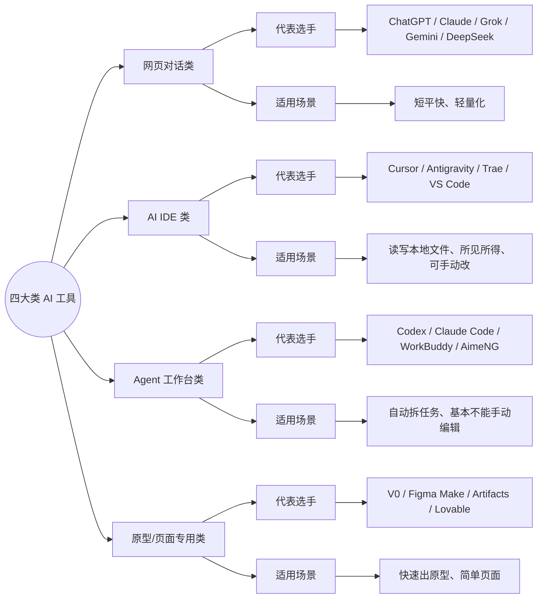
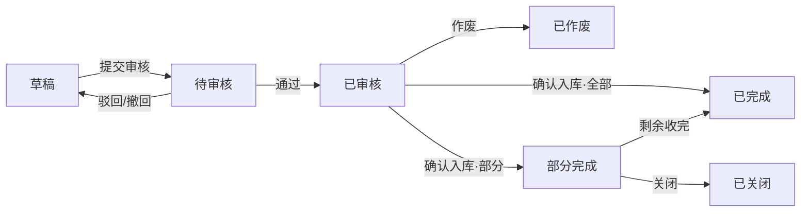

# 如何向 AI 许愿

## 开场 · 这门课解决什么问题

这一节只解决一个问题：怎么把需求「许」清楚，让 AI 真的把活干出来——以及，在工具越来越多的今天，怎么分场景选对工具。

它不是工具清单罗列，而是一套分场景选型的决策框架 + 一套把愿望说清楚的方法。学完你应该能做到三件事：

1. 把一个模糊需求，写成 AI 看得懂的「五段式」许愿单
2. 知道 AI 输出质量由什么决定，以及为什么「打地基、写清提示词、给它工具」能稳定产出
3. 在自己项目里，用一条条提示词，把一张单据的需求推到底

下面先讲通用部分——先认识许愿的对象（跟任何具体项目都没关系）。

---
## 第一幕 · 先认识许愿的对象（通用，先不碰项目）

### 2.3 四大类工具全景

先用一张思维导图记住全貌（这个分类不是按公司/模型，而是按"它跟你的工作、跟本地文件、跟最终交付物的关系"）：



### 2.0 先记住两个公式（外加一个视角）

在讲具体工具之前，先记住两个公式。它们看起来简单，但**能解释我们后面为什么要"打地基"、为什么要"五段式许愿"、为什么要让 AI 在文件夹里干活**——不是拍脑袋，是有原理支撑的。

**公式一：AI 的输出质量 ≈ 上下文 × 提示词**

| 名词 | 大白话 | 拉满它的方法 |
| --- | --- | --- |
| 上下文 | AI 这次能看到的全部资料：你说的话 + 它去读的文件 + 它记得的记忆 | 把公司背景、项目规矩、已确认的决策，一次喂够 |
| 提示词 | 你怎么说，也就是"愿望怎么表达" | 用五段式：背景、动作、样子、别做、汇报 |

同一个模型，上下文喂得胖一点、提示词说清楚一点，产出的东西天差地别。后面"一句话许愿 vs 五段式许愿"就是它的现场版。

**公式二：Agent = LLM + 上下文 + 工具**

| 要素 | 大白话 | 决定什么 | 缺了会怎样 |
| --- | --- | --- | --- |
| LLM | 大脑 | 能不能想 | 弱模型上限低 |
| 上下文 | 眼界 | 能看懂多少——**决定能力上限** | 健忘的实习生，什么都不知道 |
| 工具 | 手脚 | 能不能做 | 只是个聊天框，干不了活 |

这个公式来自开源书《深入理解 AI Agent》（李博杰，bojieli.github.io/ai-agent-book），书里原话是"上下文决定 Agent 能力上限的关键"。

**换个视角再记一个公式：Agent = Model + Harness**

上面说的"上下文、工具、约束"其实都并进同一个更大的名词——**Harness（骨架）**。这样看，Agent 只剩两部分：

| 要素 | 大白话 | 能不能换 |
| --- | --- | --- |
| Model（LLM / 大脑） | 能想、能算的那个模型 | **能换**：GPT、Claude、Gemini、DeepSeek 都行 |
| Harness（骨架） | 上下文 + 工具 + 记忆 + 约束（红线/模板/权限）+ 交互接口 | **不换**：跟着你走 |

一句话：**Model 是"能换的脑子"，Harness 是"属于你的身体和记忆"。** 这回答了为什么"个人助手型"值得用——你攒下的知识、记忆、技能、习惯都沉淀在 Harness 里，换来更强的大脑这些不丢。注意：**工具只是 Harness 的一部分**（加上上下文、记忆、约束，才是完整骨架）。这个说法来自 Anthropic，用它解释"换脑不换记忆"很顺。

**这几条，就是下面方法论的依据：**

- 为什么"打地基"（写 AGENTS.md、整理全局背景信息）→ 就是**给足上下文**
- 为什么要五段式许愿 → 就是**把提示词写清楚**
- 为什么要让 AI 能读写项目文件夹 → 就是**给它工具**
- 为什么要"人在回路、AI 完成不算数" → 因为输出质量由上下文和提示词决定，**它是概率，不是保证**

> **说明**：这套方法论的两个来源是《大话软件工程》和《深入理解 AI Agent》（李博杰）。后面要讲的"上下文工程、提示词工程、约束工程、循环工程"，以及"Agent=LLM+上下文+工具"，都能在这两本书里找到依据。

---

### 2.1 工具爆炸：为什么要先学会"选"，而不是"学"

打开手机和电脑，里面有 ChatGPT、有 Claude、有豆包、有 Kimi。你还听说 Cursor 很强、Claude Code 是天花板、Antigravity 是 Google 亲儿子、v0 能一键出页面。

每个都点开试过，每个都觉得挺厉害。但真正做项目的时候——你要写 PRD、要出原型了——**你打开哪个？你犹豫了。** 最后大概率随手点开最熟的那个网页版聊一聊，聊到一半发现不对劲：它不读你本地的文档、不了解你的项目结构、聊完一长串想整理成文档还得手动复制粘贴。你隐约觉得应该有更好的办法，但不知道是什么。

这节课不把时间花在"工具 ABC 功能介绍"上——那样的内容网上免费一大把。这节课做一件更底层的事：**帮你建立一套分场景选型的决策框架。** 以后不管工具怎么换代、新工具冒多少，你拿着这套框架，就能自己判断——这个阶段、这个任务、这个预算，该用什么。

现实是：和 PM 工作相关的 AI 工具，叫得上名字的 20 个以上，算上各种插件、API 中转站，轻松破几百。光是 AI IDE / Agent 这个品类，一年内就冒出 Cursor、Antigravity、Trae、Windsurf、Claude Code、Codex、Zcode、WorkBuddy……**很多人还没学会上一个，下一个已经出来了。** 想"把每个工具都学会再开始干活"的人，永远开不了工。

### 2.2 四个常见坑：为什么缺一套选型框架

观察下来，产品经理在 AI 工具选型上最容易掉进这几个坑：

| 坑 | 表现 | 根源 |
| --- | --- | --- |
| 坑 1 Chatbot 万能论 | 什么需求都往网页版扔：写 PRD、竞品分析、想生成页面，全在一个聊天窗口 | 不知道市面上还有专门干某些事的工具 |
| 坑 2 工具收藏癖 | 见新工具就注册，订阅了一堆，每个浅尝辄止，没有一个接进真工作 | 没按自己的真实场景筛选，在追工具 |
| 坑 3 不知道网页对话和 AI IDE 的边界 | 以为 AI IDE 是程序员用的，PM 用网页 AI 聊就够了；聊一下午需求，得到的只是一段文字，工作流在"文字"这断了 | 不理解"读文件＋写文件＋产出页面"才是 PM 的工作流 |

这几个坑对应的，是同一个根本问题：**没有一套分场景的选型框架。** 不是你不会用工具，是你缺少一个坐标系，告诉你什么时候该往哪走。

在讲选型之前，先做一次全貌扫描。注意，分类不是按公司、不是按模型，而是**按它跟你的工作、跟你电脑上的文件、跟你最终要交付的产物的关系**。

| 类别 | 一句话定位 | 核心特征 | 对 PM 意味着 |
| --- | --- | --- | --- |
| 网页对话类 | AI 聊天窗口 | 浏览器里打字问答，不碰本地文件，聊完就没了 | 快速查询、头脑风暴、信息整理——轻量任务的入口 |
| AI IDE 类 | 能读你文件的 AI 协作台 | 连接本地文件夹，能读写文件，能建能改项目 | 你边判断边指挥，让 AI 边读文件边产出物 |
| Agent 工作台类 | 能自己规划步骤、执行多轮任务的 AI | 你给目标，它自己拆任务、执行、检查 | 承接跨文件、多步骤、有检查动作的任务 |
| 原型/页面专用类 | 专注从描述生成 UI 页面的 AI | 输入自然语言或截图，直接出可交互页面 | 快速把想法变成看得见的东西，适合方案沟通和评审 |

> **说明**：除了这几类，还有 Manus、Genspark 这类云端 Agent，以及 Hermes、OpenClaw 这类 CLI Agent——时间关系不穷尽，大家感兴趣自己搜。工具名更新换代快，具体某款叫啥、官网在哪，配套资料里有完整清单；下面只讲"这类适合什么、不适合什么"。

**第一类 网页对话类**：ChatGPT、Claude Web、豆包、Kimi、DeepSeek 等。
- 适合：一次性轻量任务——快速查询、头脑风暴、信息整理、拿不准的规则临时问一句
- 不适合：需要读本地文件、多轮迭代、产出可交互页面的任务

**第二类 AI IDE 类**：Cursor、Antigravity IDE、Trae、GitHub Copilot 等。**这是产品经理真正干活的地方。**
- 适合：读项目文件、多轮迭代修改、产出 PRD 和原型页面——这节课实操的主力
- 不适合：轻量快速问答（没必要开 IDE）
- 一句话：PM 写文档、出原型 Demo，本质上和写代码没区别。它更像"项目文件夹里的 AI 协作台"：你负责判断指挥，它负责读文件、改文件、把产出物落到本地，所见所得，不满意可以二次改。

**第三类 Agent 工作台类**：Claude Code、Codex、Antigravity Agent Manager 等。和 AI IDE 有重叠，但使用逻辑不同：AI IDE 偏"你在旁边一轮轮指挥它改"，Agent 工作台偏"你给目标，它自己规划步骤、执行、检查、把结果交回来"。
- 适合：跨模块、需持续上下文、涉及多文件联动的重量级任务；控制本机执行更高权限操作
- 不适合：沟通完要立马修改、需选中具体某一行来对话

**第四类 原型/页面专用类**：Figma Make、v0、Claude Artifacts、Lovable、Bolt 等。
- 适合：快速验证想法、和业务方当场对齐方案，不需要完整项目环境
- 不适合：完整接入公司组件库、产出复杂项目的所有页面

### 2.4 分场景选型：三个底层原则

全景图讲完，把它变成一个能用的决策框架。核心逻辑三条，覆盖 90% 的日常选型：

1. **需要读文件、改文件、产出可交互的东西 → 用 AI IDE 或 Agent 工作台**
2. **只需要文字问答、快速查询、一次性任务 → 用网页对话**
3. **需要快速出页面给人看、不涉及复杂项目逻辑 → 用原型专用工具**

**原则 1 · 按项目阶段选入口**
- 刚开始理解业务 → 网页对话类：快速查概念、找参考、做初步拆解
- 开始整理项目资料 → 切到 AI IDE / Agent 工作台：让 AI 读你的本地文件和上下文
- 开始写 PRD / 原型 → 继续用 AI IDE / Agent 工作台：保证产出物落在项目文件夹里持续迭代
- 只想快速看一个页面想法 → 用原型专用工具先出一版画面

**原则 2 · 按任务复杂度选层级**
- 轻量级（单次查询、一句话问答）→ 网页对话
- 中量级（涉及几个文件、需一定上下文）→ AI IDE
- 重量级（多文件跨模块、需持续上下文）→ Agent 工作台

一句话：**宁可用简单工具快速开个轻活，也别拿一个重量级任务在网页 AI 里死磕。**

**原则 3 · 按预算选组合**（具体工具和价格会变，细节以配套资料为准）
- 🔵 低成本起步：网页版 + Claude Desktop（接 API）+ 免费或低成本 AI IDE
- 🟢 基础投入：Claude Desktop 接 API + 一款主力 AI IDE + 一款备用网页对话
- 🟠 进阶投入：高配模型订阅 + 主力 AI IDE / Agent 工作台 + 原型工具 + 其他

不管选哪档，这节课的所有练习都能完成。**工具是放大器，不是门槛。**

### 2.5 一个决策口诀

选工具时脑子里过一遍：

> **"聊天用网页，干活用 IDE；轻活网页就行，重活再开 Agent；快速看页面，用原型工具；要沉淀项目，回到 AI IDE。"**

不够严谨，但够用。把它用熟之后，你自然就懂口诀下面的判断逻辑了。

### 2.6 agent 只分两类：个人助手型 和 通用本地 agent

Agent 再往下，只分成两类——这个区分对我们后面怎么派活很关键。

| 对比 | 个人助手型 | 通用本地 agent |
| --- | --- | --- |
| 许愿比喻 | 你的贴身管家精灵：跟了你很久，知道你是谁、爱怎么做事 | 接单的跑腿精灵：每次拿着任务单来，干完就走 |
| 记忆 | 有长期记忆，上次聊过的事这次还记得 | 每次按任务干活，任务之间一般不记得 |
| 了解你 | 有你的用户画像：记得你的身份、习惯、偏好 | 不了解你，你给多少资料它就知道多少 |
| 适合做什么 | 长期跟着你的事：日常助理、反复出现的工作、需要懂你习惯的活 | 一次性、边界清楚的活：按文档出原型、批量改文件 |
| 在项目里的角色 | **指挥与验收**：掌握地基与方法论，写五段式指令，对照方法论验收 | **动手产出**：严格按五段式指令干活，产出文档和原型 |
| 例子 | Hermes、Grok Bot | Codex、Cursor、WorkBuddy、Antigravity |

**术语解释**：提示词 = 你对 AI 说的话，也就是"愿望怎么说"。上下文 = AI 这次能看到的全部资料，包括你说的话和它去读的文件。

### 2.7 人在回路：人做判断，AI 做执行

这一条是整节课的地基。

| 适合交给 AI | 不适合交给 AI |
| --- | --- |
| 整理会议记录、调研原话 | 替你决定做不做、先做哪个 |
| 按模版写文档初稿 | 判断业务规则对不对 |
| 找文档里的漏洞和矛盾 | 保证数字和事实一定正确 |
| 把文档变成可点击的页面原型 | 不给资料就懂你公司的业务 |
| 一次改很多个文件里的同一处 | 承担结果的责任 |

人做的判断，具体是四件事：

1. **定做什么**：模块、范围。例如"这次只做采购订单"
2. **定业务规则**：例如"2 万以内组长审、超过 2 万老板审"
3. **裁【待确认】**：AI 拿不准的地方，人来拍板
4. **最终验收**：通过，或打回重做

> **说明**：AI 交货说"完成了"不算数，要你自己核对。这一点在第四幕每一步都会用到。

### 2.8 五段式许愿

这是这节课最该带走的东西。五段不用背，记住五个词就行：**背景、动作、样子、别做、汇报**。

五段式不只是"提要求"——它本身就是一套**结构化输入**：把愿望拆进五个标准格子，AI 才知道按什么结构给你回。**输入越结构化，输出就越结构化、越可预测。** 后面每一条提示词里的 Output format（要表格就给表格、要编号就编号、要某节写完整就写完整），都是让 AI 的产出"长成你要的样子"。

| 段落 | 许愿比喻 | 一句话 | 常见错误 |
| --- | --- | --- | --- |
| Context（背景） | 告诉精灵你是谁、在哪、为了谁 | 交代背景和已经确定的事 | 什么都不说，让它猜 |
| Request（要做什么） | 给精灵一张任务单，几步就写几行 | 写清具体动作；要多个步骤就编号分条写 | 只给一个笼统愿望不拆步；或把不相关的事塞进一句 |
| Output format（交成什么样） | 愿望实现后长什么样 | 结构、长度、文件名 | 不说格式，交回来没法用 |
| 红线禁止（不许做什么） | 别让愿望变味 | 列出不要的东西 | 不说红线，它自作主张加功能 |
| Checkpoint（什么时候汇报） | 什么时候回来找我 | 做完再报，还是做一步停一步 | 不说，它要么一直问，要么一路做错到底 |

同一个愿望，两种说法，差别有多大？看这个对比（都是真实可用的提示词）：

**说法一：一句话许愿**

```
帮我写一份采购订单的PRD。
```

**说法二：五段式许愿**

```
Context:
我是一家小型快消品批发公司的产品经理。公司有约40家供应商、1200个商品，现在采购靠微信下单、Excel记账。
我要做一个进销存系统，现在写"采购订单"这张单据的需求文档，给开发和老板看。
已经确定：采购员录入订单，提交后要审核，超过2万元由老板审核，其余由采购组长审核；审核通过后通知仓库收货。

Request:
请写一份采购订单需求文档的大纲，并把"状态流转"这一节写完整。

Output format:
1. 先给大纲（不超过10个章节）
2. 再用表格写状态流转：当前状态 | 动作 | 下一状态 | 谁能做
3. 全文不超过800字，用中文

红线禁止:
- 不要加我没提到的功能，比如供应商门户、在线付款、比价招标
- 不要写技术实现（数据库、接口）
- 拿不准的地方标【待确认】，不要自己编

Checkpoint:
写完就停，我看完再决定下一步。
```

两个结果摆在一起看，差别是三处：

1. 第一个给的是**通用模板**，里面有一堆我们根本不要的东西（供应商门户、在线付款）；
2. 第二个**贴合我们的业务**，审核分级写对了；
3. 第二个会**主动标【待确认】**——它知道自己哪里没底，而不是硬编。

---
## 第二幕 · 从「单次许愿」到「沉淀」

单次许愿说清楚了，但每次重讲背景太累，而且 AI 每次都像「第一天上班」记不住你。所以要从「每次重讲」变成「把愿望和背景沉淀成文件」。下面三组约定，就是让「沉淀」做对的方法。

先看这条分工链——它解释"沉淀"靠什么撑起来：

```
人 ──① 定做什么 ② 定业务规则──▶ 指挥官（掌握地基与方法论，写五段式指令）
                                    │
                              五段式指令（含要读的文件路径）
                                    ▼
                              本地 agent（按指令产出）
                                    │
                                    ▼
                   指挥官对照方法论验收 ──③ 裁【待确认】④ 最终验收──▶ 人
                                    │
                              验收通过，积累回项目（拍板记录 / 字段清单 / PRD）
```

### 2.9 每份文件只回答一类问题

这是产品经理最容易被绕进去的地方：同一个字段，可能同时涉及字段定义、业务规则和页面交互，但它们应该放在**不同层次**里。

以"采购数量"为例：

```
字段清单TSV：采购数量是整数，必须大于0，来源是用户填写。

主PRD：提交审核时，每个有效明细行都必须填写采购数量；审核通过后不可修改。

Demo PRD：使用数字输入框；失焦时校验格式；提交审核时执行全量校验；错误定位到对应明细行。
```

这三段不是重复，是在回答三个不同的问题：**字段是什么，业务怎么限制，页面怎么让用户完成操作。**

| 层 | 放在哪 | 写什么 |
| --- | --- | --- |
| 字段是什么 | 字段清单（一张 Excel 能打开的表） | 整数，大于 0，用户填写 |
| 业务怎么限制 | 主 PRD | 提交审核时每行都必须填；审核后不能改；累计入库不能超过它 |
| 页面怎么操作 | Demo PRD | 数字输入框，离开时校验，错误显示在本行下方 |

分开放的好处：改的时候只改一处，不会东一处西一处对不上。

> **说明**：AI 最好一次只完成一个层次的产物。一次要求它同时生成字段、规则、页面和原型，看起来省时间，实际上更容易把不同层次混在一起。

### 2.10 文件打架时听谁的，需求变了先改哪

**打架时听谁的（权威来源排序）：**

| 顺序 | 来源 | 管什么 |
| --- | --- | --- |
| 0 | 拍板记录 | 人已经拍板的结论，优先于需求调研里的待确认问题 |
| 1 | 字段清单详细稿 TSV | 字段叫什么、什么类型、必不必填、从哪来 |
| 2 | 业务主 PRD | 状态、动作、谁能做、业务规则 |
| 3 | Demo PRD | 页面怎么摆、怎么点、什么时候提示 |
| 4 | 原型标注 | 解释原型上每个角标，只能引用上面几项 |

**迭代时常常反过来**：先改前端原型，把想法跑出来看效果，再回头审计、对齐主 PRD 套件和字段清单。原型是验证的手段，不是规则的来源——改动最后要以权威源为准回写干净，别让原型和文档越改越分叉。

**需求变了先改哪（改动入口表）：**

| 变化类型 | 先改哪里 | 再检查哪里 |
| --- | --- | --- |
| 字段名称、类型、必填、来源、取值变了 | 字段清单 TSV | 主PRD、Demo PRD、原型 |
| 状态、动作、业务规则变了 | 主PRD | Demo PRD、原型、标注 |
| 页面布局、控件、提示文案变了 | Demo PRD | 原型、标注 |
| 已拍板的结论变了 | 拍板记录（末尾追加一条新结论，不改原文） | 字段清单、主PRD、Demo PRD、原型 |
| 跨模块流程变了 | 01-全局背景信息 | 相关模块全部文件 |

只在聊天里跟 AI 说"改一下"、只改原型不改文档——**等于没改**，下次 AI 读文档还是旧的。

---
## 第三幕 · 看一个真实项目怎么落地

### 3.1 项目长什么样

```text
SC-JXC/
├── AGENTS.md ······························ AI 入职手册：读它就知道权威排序、协作红线、命名规则（先读这个）
│
├── 00-草稿对话/ ··························· 临时分析、AI 复述项目，不算数
│   └── 说明.md ··························· 草稿结论要写回 01/02/03 才算数
│
├── 01-全局背景信息/ ······················· 全局基线：所有单据共用的事实
│   ├── 03-系统模块与边界.md ··············· 四个模块怎么分工、边界、库存口径 ← 被引用最多
│   ├── 04-单据目录与通用状态.md ··········· 单据清单、单号格式、7 个通用状态
│   └── 00/01/02/05-…md ··················· 背景索引、公司/项目背景、默认字段校验
│
├── 02-需求调研/ ··························· 需求来源：业务原话 + 待确认问题
│   ├── 01-采购需求调研.md ················· 现场许愿的主要输入 ← 重点
│   └── 00/02-销售、库存调研 ··············· 留作练习 / 库存口径参考
│
├── 03-产品设计/ ··························· 按"模块/单据"存 PRD 套件，是事实来源
│   ├── 说明.md ··························· 套件目录约定和命名规则
│   ├── 基础资料/ ························· 课前备好的四档案：供应商/商品/仓库/员工
│   └── 采购管理/采购订单/ ················ 现场许愿目标（目前只有演示数据，套件当场落）
│
├── 04-常用模版/ ··························· 只管格式，不管内容（11 份：主PRD / Demo / 字段清单 / 评审 / 状态机设计+推演 / 用例数据…）
│
├── 05-提示词合集/ ························· 每一步给 AI 的五段式提示词，按编号执行
│   ├── 00-执行顺序.md ····················· 总表：每步提示词、产出文件、参考用时
│   └── 01-让AI认识项目 … 11-评审后回写 ···· 现场跑 11 步，一步一条
│
├── 06-产品方法论/ ························· 做事方法：人在回路、三层分离、改动入口表
│
├── 07-UI规范库/ ··························· 页面风格约定 + 前端技术约定（Vue 3 + Element Plus）
│
├── 08-相关资料/ ··························· 竞品调研、接手项目历史资料，只作参考
│
└── 99-产品原型/ ··························· 可点击原型（Vue 3），不是事实来源
```

整棵树的读取逻辑：`00-草稿对话`、`05-提示词合集`、`08-相关资料`不是事实来源；`01-全局背景信息`、`02-需求调研`、`03-产品设计`、`06-产品方法论`、`07-UI规范库`是事实/基线来源；`99-产品原型`只能照着文档画，不能反过来当依据。

**先认识两个文件格式——不用学语法，只要会"用"**（多数同事可能没接触过，但好消息：你们天天在用的公司 wiki 就支持）：

- **`.md`（Markdown）**——纯文本 + 轻标记的文档格式，是 **AI 直接产出的格式**，公司 **wiki 也支持 md 写法**。所以 AI 写的文档，你拿到手直接贴进 wiki 就变成排版好的正式文档，不用重新誊一遍。
- **mermaid**——用"文字"来描述图的格式，**公司 wiki 能识别**。你看到的那棵思维导图、后面那张状态机图，本质都是一段文字；把这段文字贴进 wiki，它就自动变成图。**你不用会画，也不用记语法**——要图就让 AI 给，你只管粘。
- **`.tsv`**——字段清单的表格文件，Excel 直接打开就是规整表格。

一句话：**这三种格式不是拿来学的，是拿来直接用的**——AI 产出它们，你粘进 wiki / Excel 就能用上，自己做排版和画图的那部分被替代了。

### 3.2 这个项目已经准备好了什么

**（1）地基：让 AI 每次"上班"都知道规矩**

- `AGENTS.md`：AI 的入职手册。里面写清了三件事——权威来源排序、协作红线（只读已有文件、不发明字段和规则、信息不足写【待确认】）、文件命名规则。
- `01-全局背景信息/`：公司业务背景、项目背景、系统模块与边界、单据目录与通用状态、默认字段校验规范。
- `02-需求调研/`：销售、采购、库存三个领域的业务原话和待确认问题。
- `04-常用模版/`：字段清单模版（13 列）、主PRD模版（九章）、DemoPRD模版、评审PRD模版、原型标注模版、需求澄清与拍板模版。
- `06-产品方法论/`：做事的方法，包括 2.7 那张改动入口表。
- `07-UI规范库/`：页面风格约定 + 前端技术约定（原型工程怎么加页面）。
- `05-提示词合集/`：`00-执行顺序.md` 加 11 条编号提示词。

**（2）基础资料：课前已经备好的主数据**

基础资料是系统里反复用到的"名单"。这个项目里已经有四个档案的文档：**供应商、商品、仓库、员工**。

这件事的意义是：**项目不是从空白开始的**。采购订单要用到的供应商、商品、参考进价、停用状态，都已经在基础资料里定义好了；采购订单只需要引用，不需要重新定义一遍。

> **说明**：这节课不演示基础资料怎么做。它是背景——现场做采购订单时，AI 会去读它、引用它。

**（3）原型工程：已经搭好的"工地"**

`99-产品原型/前端工程/` 是一个已经搭好骨架的 Vue 3 + Element Plus 工程：

- 后台布局、左侧菜单、面包屑
- 演示身份切换（采购员 / 采购组长 / 老板）、"重置演示数据"按钮、显示角标开关
- 公共组件：查询区、状态标签、原因弹窗、底部按钮栏、角标
- 演示数据层（浏览器本地数据库 IndexedDB，没有后端）
- 打包后是一个 `dist/index.html`，**双击就能打开**，不需要装环境

要加一张单据，只需要按约定往里加页面，不用从零搭架子。

**（4）采购管理第一期**

采购订单、采购入库单已经做完了。**这节课不推翻它们**，而是在这个项目里把"采购订单"这张单据的需求文档从需求到原型完整跑一遍——重点在演示方法，不在重建系统。

### 3.3 这套结构，其实是"三个工程"的落地

刚看的这套目录，不是随便划出来的。它把 AI 的三个关键工程，用"项目文件"的方式沉淀下来——这能解释为什么这个项目越做越顺手，也是这套方法论能复用的原因。

| 工程 | 在项目里落到哪 | 解决什么 |
| --- | --- | --- |
| 上下文工程 | `01-全局背景信息/`、`02-需求调研/`、`AGENTS.md` 的权威来源排序 | 给 AI 看什么——让它一开工就"看得见"公司、项目、模块边界、已确认的规则 |
| 提示词工程 | `05-提示词合集/`（五段式，按编号执行） | 怎么跟 AI 说——把每一步的"愿望如何表达"沉淀成可复制的文件 |
| 约束工程（Harness） | `AGENTS.md` 的协作红线、`04-常用模版/`、`06-产品方法论/` | 建什么环境让 AI 可靠地工作——红线、模板、改动入口，把"不能越界"和"改哪里"也写死 |

> **说明**：提示词工程→上下文工程→约束工程→循环工程这"四代演进"，出自这套方法论的两个来源（《大话软件工程》《深入理解 AI Agent》）。这个项目只是把它们翻译成了"一堆文件夹的事"——这三列就是前面两个公式（质量≈上下文×提示词，Agent=LLM+上下文+工具）在项目里的具体落点。

而"用项目的方式来做迭代"，是第四件事：**循环工程**——我们把它收在**人这一端**（人在回路的闭环，不是程序自动跑到测试通过）。落到项目里就是三步闭环：

- 需求变了 → 按 `06-产品方法论` 的改动入口表，找到该改哪一层，从上游改到下游；
- 评审会改了东西 → 用"评审后回写"把差异同步回源头文件；
- 换单据 / 换模块 → 复制一套提示词，改单据名、需求调研文件、目录和拍板内容即可。

所以这套结构不只是"搭一次"的地基，是**能跟着项目一起迭代的活资产**。每做完一张单据，地基和提示词又变厚一点，下一次做下一张就更快。

### 3.4 这节课从哪开始

需求边界先确认，再往下走：

```
确认已有资料和文件职责
→ 走查需求调研（采购领域）
→ 对照系统模块与边界、单据目录与通用状态（确认采购订单该管什么、不该管什么）
→ 整理字段清单初稿 → 详细稿
→ 输出主PRD
→ 输出 Demo PRD（页面怎么操作）
→ 生成前端原型 → 原型标注
→ 输出评审PRD（给老板和业务拍板）
→ 评审后回写（改动同步回源头文件）
```

> **说明**：如果上游资料已经能回答这次的问题，就直接引用它，不用为了形式重新复制一份。这节课没有重新做流程推演，也没有重新做用例数据——采购订单要用的跨模块规则，在 `01-全局背景信息` 里已经有依据。

---

---
## 第四幕 · 现场许愿，把采购订单落地

### 4.0 先看全貌：11 步一条链

| 编号 | 提示词文件 | 产出 | 属于哪一步 | 参考用时 |
| --- | --- | --- | --- | --- |
| 01 | 01-让AI认识项目 | 00-草稿对话/01-项目理解.md | 许愿前：确认 AI 听懂了 | 1～2 分钟 |
| 02 | 02-需求澄清清单 | 采购订单-需求澄清清单.md | 打磨：找没说清的地方 | 2～3 分钟 |
| 03 | 03-拍板记录 | 采购订单-拍板记录.md | 打磨：人来拍板 | 1 分钟 |
| 04 | 04-字段清单初稿 | 采购订单-字段清单-初稿.tsv | 第一层：有哪些字段 | 2～3 分钟 |
| 05 | 05-字段清单详细稿 | 采购订单-字段清单-详细稿.tsv | 第一层：字段定稿 | 3～4 分钟 |
| 06 | 06-主PRD | 采购订单-主PRD.md | 第二层：业务规则 | 4～6 分钟 |
| 07 | 07-DemoPRD | 采购订单_Demo_列表页/新增编辑页/详情页.md | 第三层：页面交互 | 5～8 分钟 |
| 08 | 08-前端原型 | 99-产品原型/前端工程/ 里的采购订单页面 | 看愿望实现 | 10～20 分钟 |
| 09 | 09-原型标注 | 99-产品原型/标注/ 下 3 个文件 | 沉淀：原型说明书 | 4～6 分钟 |
| 10 | 10-评审PRD | 采购订单-评审PRD.md + images/ | 沉淀：一页拍板 | 5～8 分钟 |
| 11 | 11-评审后回写 | 采购订单-回写差异清单.md，再回写源头 | 沉淀：闭环 | 评审会后用 |

下文 `采购订单目录` 指 `SC-JXC/03-产品设计/采购管理/采购订单/`。

严格按编号顺序跑，**上一步确认过再跑下一步**。每条提示词整段复制给 AI 即可。

### 4.1 第 01 步：让 AI 认识项目（验证地基）

开工前先确认它读懂了项目。**介绍得不对，说明地基有缺口，先补地基再往下走。**

```
Context:
你刚加入"顺诚进销存（SC-JXC）"项目，项目根目录是 SC-JXC/。
这是一家小型快消品批发商的进销存系统，产品文档按目录分类存放。接下来要做"采购订单"的需求文档，开工前我要先确认你读懂了项目。

Request:
1. 读 SC-JXC/AGENTS.md
2. 读 SC-JXC/01-全局背景信息/ 下全部文件；SC-JXC/08-相关资料/ 只看各子目录的 说明.md，了解有哪些参考资料（可选，只作参考，不是权威来源）
3. 用你自己的话介绍这个项目，并写成文件

Output format:
新建 SC-JXC/00-草稿对话/01-项目理解.md，不超过 30 行，包含：
- 公司做什么、项目要解决什么问题（各 1 句）
- 一期有哪些模块，各管什么
- 库存在什么时候变化；现存量、占用量、可用量分别是什么
- 和采购订单有关的全局规则（列出你找到的全部条目，注明出自哪个文件）
- 本项目文档的权威来源排序
- 你在本项目里不能做的 3 件事
- 读资料时发现的不清楚或矛盾之处（没有就写"无"）
文件开头写：产出步骤：05-提示词合集/01-让AI认识项目.md

红线禁止:
- 只新建上面这一个文件，不修改、不删除任何已有文件
- 不编造资料里没有的信息，没写的就说"资料未提及"
- 禁止 git commit 或 push

Checkpoint:
写完就停，在聊天里用 5 行以内概括，等我确认后再接下一个任务。
```

**产出**：`SC-JXC/00-草稿对话/01-项目理解.md`

**看点**：重点看它有没有找到**散在 01 各文件里的采购订单规则**。找到了，说明它真读了；没找到，就是没读全，当场指出、让它重读。

### 4.2 第 02 步：需求澄清清单（找没说清的地方）

动手写 PRD 之前，先让 AI 把"没说清楚的地方"找出来。**它只负责提问和给建议，拍板由人来做。**

```
Context:
项目根目录 SC-JXC/，先读 SC-JXC/AGENTS.md。
接下来要做"采购订单"的 PRD 套件。需求来源是 SC-JXC/02-需求调研/20-采购需求调研.md；库存口径见 SC-JXC/02-需求调研/30-库存需求调研.md；全局规则见 SC-JXC/01-全局背景信息/ 全部文件。
可选参考：SC-JXC/08-相关资料/（竞品调研、接手项目的历史资料），只作参考、不是权威来源；引用时注明出处，和项目文件冲突的列为【待确认】。
格式模版：SC-JXC/04-常用模版/需求澄清与拍板模版.md 第一部分。

Request:
1. 读上面的资料
2. 只围绕"采购订单"这一张单据，找出写 PRD 前必须先确认的问题；需求调研第四节的待确认问题必须全部覆盖
3. 每个问题给出 2～3 个可选答案和你的建议
4. 另外列出你在资料里已经找到、不需要再问的采购订单规则，注明出处

Output format:
新建 SC-JXC/03-产品设计/采购管理/采购订单/采购订单-需求澄清清单.md，包含：
- 文件开头：产出步骤：05-提示词合集/02-需求澄清清单.md；依据文件清单
- 一、必须先确认（表格：序号 | 问题 | 可选答案 | AI 建议 | 不确认会影响什么 | 来源）
- 二、可以先按建议假设（同上表格）
- 三、资料里已明确的规则（表格：序号 | 规则 | 出处）
问题总数不超过 10 个。

红线禁止:
- 只新建上面这一个文件，不修改、不删除任何已有文件
- 不要替我做决定，不要开始写字段清单或 PRD
- 不讨论采购订单以外的单据，除非它直接影响采购订单（如采购入库单）
- 禁止 git commit 或 push

Checkpoint:
清单写完就停，等我逐条拍板。
```

**产出**：`采购订单目录/采购订单-需求澄清清单.md`

**看点**：它有没有**只提问、不替你拍板**。你要看的是"一、必须先确认"那一节——AI 建议得对不对不重要，重要的是它把该问的都问出来了。

### 4.3 第 03 步：拍板记录（人来拍板）

AI 提完问题，人给结论，再让它把结论落成文件。**下面的结论是示范，可以改；改了这里，后面所有步骤都会跟着变。**

```
Context:
项目根目录 SC-JXC/，先读 SC-JXC/AGENTS.md。
我已经看完 SC-JXC/03-产品设计/采购管理/采购订单/采购订单-需求澄清清单.md，对采购订单拍板如下（拍板人：产品负责人，日期以今天为准）：
1. 审核分级：订单金额合计不超过 20000 元的，由采购组长审核；超过 20000 元的，由老板审核；采购组长自己建的单，不论金额都由老板审核；任何人不能审核自己建的单
2. 进价带出：选商品后，单价默认带出"该供应商该商品的上次进价"；没有上次进价时带出商品的"参考进价"；采购员可以手改；单价比上次进价高 5% 以上时，提交审核时弹出提醒（可以继续提交），审核时该行显示"涨价"标记；没有上次进价的不做比较
3. 分批入库：审核通过后系统生成一张采购入库单，包含全部数量；仓库按实收数量确认；没收完的剩余数量自动生成一张新的待执行入库单；采购订单变为"部分完成"，全部收完变为"已完成"
4. 不允许超收：每行累计入库数量不能超过采购数量
5. 关闭：部分完成的采购订单，创建人或采购组长可以"关闭"，必须填写关闭原因；关闭后还没执行的入库单自动取消，订单变为"已关闭"
澄清清单里其余问题，按 AI 建议执行。

Request:
1. 按 SC-JXC/04-常用模版/需求澄清与拍板模版.md 第二部分，把上面 5 条结论写成拍板记录
2. 每条对应到澄清清单的序号
3. 把澄清清单里"按 AI 建议执行"的问题也逐条列出，拍板结论写"按建议：……"

Output format:
新建 SC-JXC/03-产品设计/采购管理/采购订单/采购订单-拍板记录.md，包含：
- 文件开头：产出步骤：05-提示词合集/03-拍板记录.md；说明"本文件优先于需求调研中的待确认问题"
- 拍板表格：序号 | 问题 | 拍板结论 | 拍板人 | 日期 | 对应澄清清单序号
- 最后一节"仍待确认"：列出拍板后还没解决的问题（没有就写"无"）

红线禁止:
- 只新建上面这一个文件，不修改澄清清单和需求调研
- 拍板结论原样记录，不改写含义、不补充我没说的规则
- 禁止 git commit 或 push

Checkpoint:
写完就停，等我确认。
```

**产出**：`采购订单目录/采购订单-拍板记录.md`

**看点**：拍板记录是**最高权威**。它一次写进文件，后面所有步骤都会照着它做——所以这一步是人最该认真看的地方。

### 4.4 第 04 步：字段清单初稿（有哪些字段）

先确认"这张单据需要哪些字段"，不急着写细节。

```
Context:
项目根目录 SC-JXC/，先读 SC-JXC/AGENTS.md。
采购订单的拍板记录已确认：SC-JXC/03-产品设计/采购管理/采购订单/采购订单-拍板记录.md。
现在整理采购订单的字段清单初稿，只确认字段范围。
输入资料：
- 拍板记录（上面路径）
- SC-JXC/02-需求调研/20-采购需求调研.md
- SC-JXC/01-全局背景信息/30-系统模块与边界.md、40-单据目录与通用状态.md、50-默认字段校验规范.md
- 格式模版：SC-JXC/04-常用模版/字段清单初稿模版.tsv、00-模版说明.md
- 可选参考：SC-JXC/08-相关资料/（只作参考，不能作为字段依据；想用的字段先列进回复，备注写【待确认】）

Request:
1. 列出采购订单需要的字段，分为五组：基本信息、审核信息、商品明细、金额汇总、系统信息
2. 每个字段填 6 列：字段所属分组、字段名称、字段类型、字段来源、字段说明、备注
3. 备注写这个字段的依据（拍板第几条 / 需求调研第几条 / 全局规则哪个文件）

Output format:
- 新建 SC-JXC/03-产品设计/采购管理/采购订单/采购订单-字段清单-初稿.tsv（Tab 分隔，第一行是 6 列表头，删掉模版示例行）
- 聊天里回复：各组字段数、字段总数、你拿不准的字段（备注写了【待确认】的）

红线禁止:
- 只新建这一个文件，不修改、不删除任何已有文件
- 只写字段，不写状态流转和页面交互
- 不加资料里没有依据的字段；拿不准的可以列出，备注写【待确认】和理由
- 禁止 git commit 或 push

Checkpoint:
写完就停，等我审完字段范围再出详细稿。
```

**产出**：`采购订单目录/采购订单-字段清单-初稿.tsv`

**看点**：初稿阶段只看**字段范围和字段名称**，不要求必填性、取值、校验一次写完。新增字段仍然要回到业务需求和流程里人工确认。

### 4.5 第 05 步：字段清单详细稿（字段定稿）

在确认过的初稿基础上补全 13 列。**详细稿是这张单据所有字段的唯一来源**，后面的主PRD、Demo PRD、原型都只能引用它。

```
Context:
项目根目录 SC-JXC/，先读 SC-JXC/AGENTS.md。
采购订单字段清单初稿已确认：SC-JXC/03-产品设计/采购管理/采购订单/采购订单-字段清单-初稿.tsv。
现在补全为详细稿，后面的主PRD、Demo PRD、原型都只能引用详细稿里的字段。
输入资料：
- 字段清单初稿、采购订单-拍板记录.md（同目录）
- SC-JXC/01-全局背景信息/40-单据目录与通用状态.md、50-默认字段校验规范.md
- 格式模版：SC-JXC/04-常用模版/字段清单模版.tsv、00-模版说明.md

Request:
1. 字段范围以初稿为准，按模版 13 列逐个补全
2. 必填性、取值说明没有特别规定的，按默认字段校验规范填
3. 状态字段的取值说明写全全部状态；系统计算字段写清计算口径
4. 如果补全时发现初稿缺字段或多字段，不要直接改范围，写进回复

Output format:
- 新建 SC-JXC/03-产品设计/采购管理/采购订单/采购订单-字段清单-详细稿.tsv（Tab 分隔，13 列表头，无示例行，空值填"-"）
- 聊天里回复：字段总数（应与初稿一致）、必填字段数、系统计算字段数、建议增减的字段

红线禁止:
- 只新建这一个文件，不修改初稿和其他已有文件
- 只写字段事实，不写状态流转和页面布局
- 禁止 git commit 或 push

Checkpoint:
写完就停，等我审完字段再写主PRD。
```

**产出**：`采购订单目录/采购订单-字段清单-详细稿.tsv`（13 列）

**看点**：13 列分别是——字段所属分组、字段名称、字段类型、字段来源、字段说明、必填性、新增页、编辑页、列表展示、可筛选、详情展示、取值说明、备注。**空值填"-"，不留空白单元格。**

### 4.6 第 06 步：主PRD（业务怎么限制）

字段定稿后，写业务规则。**主PRD 是这张单据业务规则的唯一来源。**

```
Context:
项目根目录 SC-JXC/，先读 SC-JXC/AGENTS.md。
采购订单的拍板记录和字段清单详细稿已确认，都在 SC-JXC/03-产品设计/采购管理/采购订单/。
现在写采购订单的主PRD，它是采购订单业务规则的唯一来源。
输入资料：
- 采购订单-拍板记录.md、采购订单-字段清单-详细稿.tsv
- SC-JXC/02-需求调研/20-采购需求调研.md
- SC-JXC/01-全局背景信息/30-系统模块与边界.md、40-单据目录与通用状态.md、50-默认字段校验规范.md
- 格式模版：SC-JXC/04-常用模版/主PRD模版.md
- 可选参考：SC-JXC/08-相关资料/（只作参考，不能作为规则依据；和项目文件冲突的写进"九、待确认"）

Request:
1. 按模版九个章节写采购订单主PRD
2. 状态流转和全局通用状态一致；写清采购订单用到哪些状态
3. 状态—动作矩阵要写清"谁能做"（创建人、采购组长、老板），包括审核分级和"不能审自己的单"
4. 写清审核通过、作废、关闭、仓库确认入库四个时点对采购入库单和采购订单的影响
5. 业务规则必须覆盖：拍板记录全部结论，以及全局规则中和采购订单有关的条目（停用资料不可选、一单一供应商、同商品不重复、日期先后、驳回和作废原因、作废条件等）
6. 验收标准至少 12 条，每条规则至少对应一条

Output format:
- 新建 SC-JXC/03-产品设计/采购管理/采购订单/采购订单-主PRD.md
- 文件开头：产出步骤、依据文件清单
- 聊天里回复：功能条数、状态数、动作数、业务规则条数、验收标准条数、【待确认】条数

红线禁止:
- 只新建这一个文件，不修改字段清单和其他已有文件
- 不复制完整字段表，引用字段名即可；引用的字段名必须和详细稿一字不差
- 不写页面布局、控件、颜色（那是 Demo PRD 的事）
- 不发明详细稿里没有的字段；发现字段不够用，写进"九、待确认"
- 禁止 git commit 或 push

Checkpoint:
写完就停，等我审完规则再写 Demo PRD。
```

**推演：状态机不是拍脑袋，是走出来的。**

主PRD 里的「状态—动作矩阵」不是凭空写的——它是把真实业务场景**从头走到底**推出来的。这一招叫**推演**，也是评审时最该盯的一环。

**原理**：把这张单据的一生看成一个状态机（草稿→待审核→已审核→完成/作废）。推演 = 拿真实业务场景当输入，把状态机走一遍，看三件事——业务走得通吗？有没有配置到不合理的岔路？有没有"走到一半回不去"的死胡同？

**采购订单怎么推**（按真实状态矩阵示意）：



凡主PRD 都会埋"这条单会经过哪些坎、谁按哪个钮、结果落到哪"。想让它不加规则就成立，直接把推演**做成提示词抄给 AI**：

```text
Context: 采购订单主PRD 已写完(含第四章状态流转/状态—动作矩阵)，在 SC-JXC/03-产品设计/采购管理/采购订单/采购订单-主PRD.md
Request:
1. 列出这张单从草稿到终态的全部合法路径
2. 造 4~5 条真实业务场景(含到货/部分收货/涨价/超期/作废)，每条标出走到的状态路径
3. 找出死胡同、用不上的岔路、漏掉的过渡态
4. 输出问题清单 + 每条该补哪条规则
红线: 只列不改；冲突写进"九、待确认"
Checkpoint: 列完等我拍板
```

**还差一块——用例数据推演。**

状态机推演走的是「状态空间」，用例数据推演走的是「具体数据行」：拿演示数据把一条单从头演到底，验证三件事——字段装不装得下、规则什么时候触发、页面放不放得下。

```text
Context: 演示数据在 SC-JXC/03-产品设计/采购管理/采购订单/采购订单-演示数据.md(杭州优果/原味薯片等)
Request:
1. 用演示数据造一条完整采购订单，从草稿走到关闭
2. 每步输出: 状态 | 关键数据(供应商/商品/数量/单价/金额) | 触发或卡住的规则/校验
3. 重点验: 2万审批线、停用资料不可选、进价涨价提醒、部分完成只能关闭
4. 标出"数据撑不住/规则触发时机存疑"的点
红线: 不伪造数据；存疑写进待确认
Checkpoint: 走完给我结论
```

**两条各产出什么**：状态机推演产出「状态机流程图 + 状态—动作矩阵」（主PRD 第四章那张），把单据从生到走的流程钉死、辅佐单据流程；用例数据推演产出「业务规则落地后的数据」——规则确认后造的演示数据，拿真实数据行把每条规则落成一张能跑的单（SC-JXC 里那份 `采购订单-演示数据.md` 就是这么来的）。两者都是前端编码前的强制关卡，任一没过，就回主PRD 补规则。

**产出**：`采购订单目录/采购订单-主PRD.md`

**看点**：主PRD 不是把需求分析和完整字段表复制进来，而是**承接这张单据的业务规则**。重点看两节——状态—动作矩阵（谁能做什么）、业务规则（拍板结论有没有全部覆盖）。

### 4.7 第 07 步：Demo PRD（页面怎么操作）

把字段和规则"翻译"成页面说明，下一步照着它生成原型。

```
Context:
项目根目录 SC-JXC/，先读 SC-JXC/AGENTS.md。
采购订单的字段清单详细稿和主PRD 已确认，都在 SC-JXC/03-产品设计/采购管理/采购订单/。
现在把它们"翻译"成页面说明，下一步要照着它生成原型。
输入资料：
- 采购订单-字段清单-详细稿.tsv、采购订单-主PRD.md
- SC-JXC/01-全局背景信息/50-默认字段校验规范.md
- SC-JXC/07-UI规范库/页面风格约定.md
- 格式模版：SC-JXC/04-常用模版/DemoPRD模版.md

Request:
1. 写三份 Demo PRD：列表页、新增编辑页、详情页
2. 每个按钮在哪些状态、对哪些角色显示，必须和主PRD 的状态—动作矩阵一致
3. 每份画一张 ASCII 线框图，并给每个需要标注的区域编角标号（列表页 L1 起、新增编辑页 F1 起、详情页 D1 起）
4. 写清校验时机、提示文案、弹窗（驳回、作废、关闭原因）

Output format:
- 在采购订单目录新建三个文件：采购订单_Demo_列表页.md、采购订单_Demo_新增编辑页.md、采购订单_Demo_详情页.md
- 每个文件开头：产出步骤、依据文件
- 聊天里回复一张核对表：按钮 | 所在页面 | 显示状态 | 显示角色 | 对应主PRD 哪一条

红线禁止:
- 只新建这三个文件，不修改字段清单、主PRD 和其他已有文件
- 页面上出现的字段名必须和详细稿一字不差；不新增字段、规则、状态
- 发现字段清单或主PRD 有缺口，列在回复里，不要自己补
- 禁止 git commit 或 push

Checkpoint:
三份写完再汇报，中途不用停。
```

**产出**：`采购订单_Demo_列表页.md`、`_新增编辑页.md`、`_详情页.md`

**看点**：Demo PRD 负责**页面表现**——控件类型、校验时机、错误反馈、不同状态下的按钮。它不能新增业务规则，只能翻译主PRD。

### 4.8 第 08 步：前端原型（看愿望实现）

把页面规格做成能点的演示。**看原型的人不懂技术，所以打包后必须双击就能打开。**

> **前提**：已在 `SC-JXC/99-产品原型/前端工程/` 执行过 `npm install`（需要 Node.js LTS 20.19 及以上）。

```
Context:
项目根目录 SC-JXC/，先读 SC-JXC/AGENTS.md，再读 SC-JXC/07-UI规范库/前端技术约定.md 和 SC-JXC/07-UI规范库/页面风格约定.md。
原型工程的地基已经搭好：SC-JXC/99-产品原型/前端工程/（Vue 3 + Element Plus + Vue Router + Pinia + Dexie），有后台布局、演示身份切换、显示角标开关、重置演示数据按钮、公共组件（查询区、状态标签、原因弹窗、底部按钮栏、角标）和演示数据层（浏览器本地数据库）。依赖已经装好。
采购订单的 PRD 套件已确认，在 SC-JXC/03-产品设计/采购管理/采购订单/：字段清单详细稿、主PRD、三份 Demo PRD。演示数据统一用同目录的 采购订单-演示数据.md。
现在在这个工程里加上采购订单的三个页面，给业务方看。看原型的人不懂技术，打包后必须双击就能打开。

Request:
1. 按《前端技术约定》第五节"新增一个单据页面"的步骤做：种子数据 → 数据仓库 → 单据文件夹（anno.js、rules.js、service.js、三个页面、routes.js）
2. 种子数据按 采购订单-演示数据.md 原样录入（身份、供应商、商品、上次进价、12 张采购订单），一条不少、不另编；基础资料已在 src/mock/seed/基础资料.js，核对一致即可
3. 页面只通过 src/mock/repos/ 读写数据，不直接用 Dexie；能用公共组件的必须用（查询区、状态标签、原因弹窗、底部按钮栏、v-anno）
4. 按 Demo PRD 实现全部按钮、校验、提示和弹窗；按钮按状态和演示身份显示（主PRD 状态—动作矩阵）
5. 给 Demo PRD 里编了角标的区域加 v-anno，角标编号和文字写在 anno.js
6. 自查：npm run build 不报错；双击 dist/index.html 三页能打开能跳转、控制台无报错；先点"重置演示数据"，再把主PRD 验收标准逐条点一遍；刷新后数据还在

Output format:
- 新建（都在 SC-JXC/99-产品原型/前端工程/ 下）：
  src/mock/seed/采购订单.js、src/mock/repos/采购订单.js、
  src/views/采购/采购订单/ 下的 anno.js、rules.js、service.js、routes.js、列表页/index.vue、新增编辑页/index.vue、详情页/index.vue
- 重新生成 dist/index.html（npm run build）
- 聊天里回复：新建文件清单、复用了哪些公共组件、角标清单（角标号 | 位置）、主PRD 验收标准自查结果（序号 | 通过/不通过）

红线禁止:
- 只新建上面列出的文件并重新打包；不修改任何文档，不修改公共组件、布局、mock/db.js、打包配置
- 页面字段只能来自字段清单详细稿，按钮和规则只能来自主PRD 和 Demo PRD
- 不新增依赖、不做登录、不连后端、不引用外部网络资源
- 禁止 git commit 或 push

Checkpoint:
做完并自查通过再汇报；自查不通过就继续修，修好再汇报。
```

**产出**：`99-产品原型/前端工程/` 里采购订单的三个页面 + 重新打包的 `dist/index.html`

**看点**：原型不是业务规则的来源。**页面上出现了一个按钮，不代表业务上就该有这个动作**——它只是把已经确认的规则画出来。

### 4.9 第 09 步：原型标注（给原型配说明书）

给原型上每个角标写说明，让评审人知道每个位置是什么、为什么这样。

```
Context:
项目根目录 SC-JXC/，先读 SC-JXC/AGENTS.md。
采购订单原型已完成：SC-JXC/99-产品原型/前端工程/src/views/采购/采购订单/（三个页面），角标编号和文字在同目录 anno.js，页面上用 v-anno 标好了位置（打开 dist/index.html 后点"显示角标"可看到）。
PRD 套件在 SC-JXC/03-产品设计/采购管理/采购订单/。
现在给每个角标写说明，让评审人看原型时知道每个位置是什么、为什么这样。
如果你装了 prototype-annotation 技能，先读它。

Request:
1. 读 anno.js 和三个页面里的全部 v-anno 角标，对照三份 Demo PRD 的角标表
2. 每个角标按 SC-JXC/04-常用模版/原型标注模版.md 写一段：位置、说明、规则、来源
3. 规则从主PRD 原文搬运，写明是第几章第几条

Output format:
- 在 SC-JXC/99-产品原型/标注/ 下新建三个文件：采购订单列表页-标注.md、采购订单新增编辑页-标注.md、采购订单详情页-标注.md
- 每个文件开头：产出步骤、角标数量
- 聊天里回复：每页角标数、原型里有但 Demo PRD 没有的角标（或反过来）

红线禁止:
- 只新建这三个文件，不修改原型和任何文档
- 用业务语言写（如"待审核"），不写英文状态码和技术路径
- 找不到来源的写【待确认】，不要编
- 禁止 git commit 或 push

Checkpoint:
三页写完再汇报。
```

**产出**：`99-产品原型/标注/` 下三个文件

**看点**：标注是**沉淀**——它把原型和文档连起来。如果某个角标在两份文件里对不上，说明前面的 PRD 有缺口，这时候补比上线后补便宜得多。

### 4.10 第 10 步：评审PRD（一页拍板）

评审人是老板和业务负责人，他们不会翻好几份文件。所以要一份全中文、能直接拍板的浓缩档。

```
Context:
项目根目录 SC-JXC/，先读 SC-JXC/AGENTS.md 和 SC-JXC/06-产品方法论/产品方法论（精简版）.md。
采购订单的 PRD 套件、原型（SC-JXC/99-产品原型/前端工程/，打包后双击 dist/index.html 打开）和原型标注（SC-JXC/99-产品原型/标注/）都已完成。
评审人是老板和业务负责人，他们不想翻好几份文件，需要一份全中文、能直接拍板的评审档。
权威来源排序：拍板记录 > 字段清单详细稿 > 主PRD > Demo PRD > 原型标注。
如果你装了 prd-doc-authoring 技能，先读它。

Request:
1. 盘点权威来源是否齐全，缺了先汇报，不要硬写
2. 按 SC-JXC/04-常用模版/评审PRD模版.md 写评审PRD
3. 功能清单条数 = 原型标注角标总数，一个角标一条，顺序一致
4. 字段清单按页面分表，六列：字段名称 | 填写格式 | 是否必填 | 字段来源 | 能不能改 | 字段说明，值全部取自详细稿
5. "原型页面"一列放整页截图并用红框圈出该角标位置，文件放 images/，命名"页面名-角标号.png"；不能截图时先写文件名占位

Output format:
- 新建 SC-JXC/03-产品设计/采购管理/采购订单/采购订单-评审PRD.md（截图在同目录 images/）
- 聊天里回复：功能条数、角标数（应相等）、字段数、规则数、和权威来源不一致的地方（没有就写"无"）

红线禁止:
- 只新建评审PRD 和 images/ 里的图片，不修改任何已有文件
- 只转译不造数据：不加新字段、新规则，含义不能变
- 全中文大白话，不出现英文字段名、"权威来源""TSV"之类的内部说法，不写"本节由 AI 生成"之类的制作说明
- 每张表的序号各自从 1 开始
- 禁止 git commit 或 push

Checkpoint:
写完再汇报。
```

**产出**：`采购订单-评审PRD.md` + `images/`（整页红框截图）

**看点**：**只转译不造数据**——功能条数应该等于原型标注的角标总数，一个角标一条。数字对不上就是前面有缺口。

### 4.11 第 11 步：评审后回写（改了要回到源头）

评审会上拍板的改动，先改在评审PRD 里，再回写到权威来源。**分两步，中间必须有人确认。**

**第一步：只出差异清单**

```
Context:
项目根目录 SC-JXC/，先读 SC-JXC/AGENTS.md。
采购订单评审会已开完，评审PRD 已按会上结论修改：SC-JXC/03-产品设计/采购管理/采购订单/采购订单-评审PRD.md。
评审PRD 是最新拍板结果，和权威来源冲突时以评审PRD 为准。

Request:
1. 对比评审PRD 和同目录的拍板记录、字段清单详细稿、主PRD、三份 Demo PRD，列出全部差异
2. 差异分三类：确定要回写 / 需要我确认 / 表述不同但含义一致
3. 每条差异写明按"改动入口表"应回写到哪个文件

Output format:
新建 SC-JXC/03-产品设计/采购管理/采购订单/采购订单-回写差异清单.md，表格：序号 | 差异内容 | 评审PRD 写法 | 现有写法 | 回写到哪个文件 | 分类
聊天里回复三类各几条。

红线禁止:
- 只新建差异清单这一个文件，不修改任何已有文件
- 禁止 git commit 或 push

Checkpoint:
差异清单出来就停，等我确认。
```

**第二步：人确认后回写**

```
Context:
项目根目录 SC-JXC/，先读 SC-JXC/AGENTS.md。
我已确认 SC-JXC/03-产品设计/采购管理/采购订单/采购订单-回写差异清单.md：分类为"确定要回写"的全部回写；"需要我确认"的条目我的结论是：【在这里写结论】。

Request:
1. 按差异清单把需要回写的内容改进对应文件
2. 每个被改的文件，在"修改记录"表追加一行：日期 | 版本加 0.1 | 修改人写"AI 回写" | 修改内容写"依据评审PRD：……"
3. 改完再对比一次，确认"确定要回写"的差异已清零

Output format:
聊天里回复：改了哪些文件、每个文件改了几处、复核结果（剩余差异条数）。

红线禁止:
- 本次只允许修改差异清单"回写到哪个文件"一列里出现的文件，且只改有差异的地方
- 不修改评审PRD 本身，不顺手重写其他内容
- 禁止 git commit 或 push

Checkpoint:
一口气改完再汇报。
```

**产出**：`采购订单-回写差异清单.md`，确认后回写各权威文件

**看点**：AI 负责找差异、跑同步；**确不确认、改不改，还是人说了算。**

---

---
## 第五幕 · 压轴：三 agent 并跑 + Hermes 秀一场

到这里，采购订单的 PRD 套件已经打磨定稿。接下来的对比不是比"谁写文档好"，而是比**谁照着同一份图纸施工最准**。

### 5.1 比什么、不比什么

- **比**：在给定的工程地基上照着文档做原型，谁做得最"像文档"、最守规矩——字段对不对、按钮对不对、校验对不对、有没有按约定放文件和复用组件、能不能直接打开、快不快
- **不比**：写 PRD（前面已经演示过），也不比页面好不好看

> **说明**：为什么要给地基？真实项目里 AI 不是从零写，而是在团队已有的工程里按约定加页面。守不守约定，是"能不能放心交给 AI"的关键。

### 5.2 公平保证

| 项目 | 做法 |
| --- | --- |
| 同一份资料 | 用课前准备好的干净副本：含地基、原型工程骨架、定稿的采购订单 PRD 套件、演示数据；不含参考答案的采购订单页面、标注和评审PRD |
| 同一个工程地基 | 三份副本的前端工程完全一样，都已执行过 `npm install`；打开只有首页，采购订单显示"原型还没做" |
| 同一条提示词 | 下面这条提示词三方一字不改 |
| 同一份演示数据 | 都用 `采购订单-演示数据.md`，所以验收步骤对三方完全一样 |
| 同一个起跑时间 | 三个窗口同时发送，记录发送时间和各自汇报完成的时间 |
| 模型 | 尽量选同档模型，现场说明各自用的模型 |

### 5.3 给三个 agent 的同一份提示词

```
Context:
你在"顺诚进销存（SC-JXC）"项目里工作，项目根目录是 SC-JXC/。这是一家小型快消品批发商的进销存系统。开工前先读 SC-JXC/AGENTS.md。
采购订单的 PRD 套件已经定稿，放在 SC-JXC/03-产品设计/采购管理/采购订单/：
- 采购订单-字段清单-详细稿.tsv：字段的唯一来源
- 采购订单-主PRD.md：状态、动作、谁能做、业务规则的唯一来源（重点看第四章状态—动作矩阵、第五章业务规则、第八章验收标准）
- 采购订单_Demo_列表页.md、采购订单_Demo_新增编辑页.md、采购订单_Demo_详情页.md：页面结构、按钮、校验时机和提示文案
- 采购订单-演示数据.md：原型必须使用的演示数据
原型工程地基已经搭好：SC-JXC/99-产品原型/前端工程/（Vue 3 + Element Plus + Vue Router + Pinia + Dexie），依赖已经装好。有后台布局、演示身份切换、显示角标开关、重置演示数据按钮、公共组件和演示数据层（浏览器本地数据库 IndexedDB，没有后端）。
工程约定见 SC-JXC/07-UI规范库/前端技术约定.md，页面风格见 SC-JXC/07-UI规范库/页面风格约定.md，必须遵守。
看原型的人是业务负责人，不懂技术，打包后必须双击 dist/index.html 就能打开。

Request:
1. 读完上面全部文件
2. 按《前端技术约定》第五节"新增一个单据页面"，在地基上加采购订单：种子数据 src/mock/seed/采购订单.js、数据仓库 src/mock/repos/采购订单.js、单据文件夹 src/views/采购/采购订单/（anno.js、rules.js、service.js、routes.js、列表页/index.vue、新增编辑页/index.vue、详情页/index.vue）
3. 种子数据按 采购订单-演示数据.md 录入全部演示数据（身份、供应商、商品、上次进价、12 张采购订单），一条不少、不另编；基础资料已在 src/mock/seed/基础资料.js，核对一致即可
4. 页面只通过 src/mock/repos/ 读写数据，不直接用 Dexie；必须复用公共组件：查询区 QueryBar、状态标签 StatusTag、原因弹窗 ReasonDialog、底部按钮栏 FooterBar、角标 v-anno
5. 按钮按顶部"演示身份"和订单状态显示，严格按主PRD 状态—动作矩阵；按三份 Demo PRD 实现全部字段、按钮、校验、提示文案和弹窗，提示文案照抄 Demo PRD
6. 给 Demo PRD 里编了角标的区域加 v-anno（L1～L6、F1～F7、D1～D7），角标文字写在 anno.js
7. 执行 npm run build 重新生成 dist/index.html；双击打开自查：三页能打开能跳转、控制台无报错；先点"重置演示数据"，再把主PRD 第八章 19 条验收标准逐条点一遍；刷新后数据还在

Output format:
- 只新建第 2 步列出的文件，并重新生成 SC-JXC/99-产品原型/前端工程/dist/index.html
- 新建 SC-JXC/并跑产出/交付说明.md：开始和结束时间；新建文件清单；复用了哪些公共组件；角标清单（角标号 | 位置）；主PRD 第八章验收标准自查表（序号 | 通过/不通过 | 说明）；你认为文档里写得不清楚的地方
- 全部用中文

红线禁止:
- 不修改、不删除 SC-JXC/ 下任何已有文件（包括公共组件、布局、src/mock/db.js、router、config、vite.config.js、package.json 和全部文档），只能按上面清单新建文件、重新打包 dist
- 页面上的字段只能来自字段清单详细稿，名称一字不差；按钮、状态、规则只能来自主PRD 和 Demo PRD；不加文档里没有的功能
- 不新增或升级依赖、不连后端、不做登录、不引用外部网络资源
- 禁止 git commit 或 push

Checkpoint:
中途不要停下来问我，全部完成并自查通过后一次性汇报。自查不通过就继续修，修好再汇报。只有需要修改已有文件或安装东西时才停下来问。
```

### 5.4 五个必考点

打开各方的 `前端工程/dist/index.html`，先点右上角"重置演示数据"。每个必考点先在参考答案里点一遍，再依次在三方原型里点。

| 序号 | 必考点 | 怎么点 | 正确表现 | 文档依据 |
| --- | --- | --- | --- | --- |
| 1 | 超过 2 万走老板审批 | 身份切"采购组长老赵"，打开 CGDD-20261013-0001（合计 22600）；再切"老板王总"打开同一张 | 老赵看不到"审核通过/驳回"，提示"本单由【老板】审核"；王总能看到 | 主PRD 5.2 第 4、6 条 |
| 2 | 不能审自己的单 | 身份切"采购组长老赵"，打开他自己建的 CGDD-20261013-0002（合计 3000） | 审核层级显示"老板"，老赵没有审核按钮，只有"撤回" | 主PRD 5.2 第 4、6 条；拍板第 1 条 |
| 3 | 停用的供应商和商品不能选 | 身份"采购员小李"，点"新建采购订单"，展开供应商下拉；添加商品，展开商品下拉 | 没有"上海旧友贸易有限公司"，没有"苏打饼干（老款）" | 主PRD 5.1 第 2、4 条 |
| 4 | 进价带出与涨价提醒 | 新建时选"杭州优果食品有限公司"，添加"原味薯片"，把单价改成 90，填好数量和期望到货日期后提交 | 单价先自动带出 84.00；改成 90 后出现红色"涨价"；提交时弹出涨价提醒，可继续提交 | 主PRD 5.1 第 6 条、5.2 第 3 条 |
| 5 | 部分完成只能关闭、不能作废 | 身份"采购员小李"，打开 CGDD-20261008-0001，点"关闭"，原因不填直接确定，再填原因确定 | 只有"关闭"没有"作废"；不填原因提示"请填写原因"；关闭后待执行入库单变为"已取消" | 主PRD 第四章矩阵、5.4 第 3、4 条 |

### 5.5 评分表（满分 100）

| 维度 | 检查项 | 分值 |
| --- | --- | --- |
| 能直接用（10） | `npm run build` 成功，双击能打开，控制台无报错 | 5 |
| | 三页能互相跳转；刷新后数据还在；"重置演示数据"能恢复 | 5 |
| 字段对得上（15） | 列表 8 列与文档一致 | 5 |
| | 新增编辑页字段齐全、名称一字不差 | 6 |
| | 详情页有已入库数量、未入库数量、关联入库单、操作记录 | 4 |
| 状态和按钮对得上（25） | 7 个状态页签齐全，没有多出来的状态 | 5 |
| | 必考点 1、2、5 全部正确（每错一个扣 5） | 15 |
| | 已完成/已关闭/已作废的单只有"返回列表"；别人的草稿不能编辑 | 5 |
| 交互和校验对得上（15） | 必考点 3、4 正确（每错一个扣 5） | 10 |
| | 空单提交有提示，文案与文档一致 | 2 |
| | 期望到货日期早于下单日期时提示 | 1 |
| | 有未保存修改时离开会弹确认 | 2 |
| 遵守工程约定、复用组件（15） | 文件放对位置 | 4 |
| | 页面不直接用 Dexie，只通过 repos 读写 | 3 |
| | 复用了那 5 个公共组件（每少用一个扣 1） | 5 |
| | 没改地基（和干净副本 diff 对比） | 3 |
| 符合页面风格（5） | 布局与地基一致 | 2 |
| | 详情页用只读文字展示，不用灰色输入框 | 3 |
| 速度（15） | 最快 15 分，第二 10 分，第三 5 分；没做完 0 分 | 15 |
| 红线扣分 | 修改或删除已有文件 −20；新增/升级依赖 −10；git commit/push −20；引用外部资源 −5 | — |

### 5.6 现场怎么看结果

- **只评产出，不评工具**："同一份图纸、同一个工地，我们看谁施工最准、最守规矩。"
- 工程约定那一项赛后按评分表补分，现场只点一句。
- 某一方没做完或做得粗，**如实展示做到哪一步，不加评论**，让结果自己说话。
- 点题："工具差别会有，但更大的差别在于**图纸画没画清楚**。今天三方拿到的是同一份打磨好的文档——这就是前面几段在教的东西。"

---

前面三个 agent 比的是"照图施工"。最后这一段，换个角度：**个人助手型 agent 能做什么通用本地 agent 做不到的事。**

### 再让 Hermes 秀一场

### 6.1 为什么留这一段

公司已经给每个人都配了 Hermes，只是很多人还没用起来。它和 Cursor、通用本地 agent 的区别不在"能不能干活"，而在于：

| 维度 | 通用本地 agent | 个人助手型（Hermes） |
| --- | --- | --- |
| 记忆 | 每次按任务干活，任务之间一般不记得 | 有长期记忆：环境事实、项目约定、经验；还有你的用户画像 |
| 了解你 | 你给多少资料，它就知道多少 | 记得你的偏好、习惯、项目背景 |
| 沉淀 | 技能不外带 | 会把自己沉淀成技能，下次直接复用 |
| 归属 | 借来的工具 | 属于你的 assistant：记忆和画像跟着你走，模型可以换 |

### 6.2 秀什么

现场让它做一件"跨文件"的活——**不是写文档，是查文档**。例如：

> 读整个 SC-JXC 项目，找出文档之间不一致的地方，出一份差异清单。

这类活最能体现差别：它需要理解项目全貌、跨十几个文件比对，而不是照着一条提示词生成一份文件。

### 6.3 边界

> **说明**：这一段不即兴。要它做的事、验收标准、可能翻车的点，都提前准备好——现场只负责展示和执行。

---

---
## 收官 · 本节课总结

SC-JXC 的资料是分层组织的：

| 层次 | 文件 | 承载什么 |
| --- | --- | --- |
| 共同基础 | 公司、项目、系统背景和全局规则 | 后续工作的共同前提 |
| 业务问题 | 需求调研 | 业务问题、用户诉求、本期要解决的事 |
| 流程 | 系统架构、业务流程、系统单据流程 | 模块边界、角色接力、单据关系 |
| 字段事实 | 字段清单 TSV | 字段名称、类型、来源、字段级约束 |
| 业务规则 | 主PRD | 当前单据负责什么、状态动作、业务规则 |
| 页面 | Demo PRD、页面原型、原型标注 | 页面结构、交互表现和走查结果 |

做一张新单据时，第一步不是重新搭建所有资料，而是**先判断已有内容能不能直接复用，当前单据还缺什么**。采购订单的实操就是沿着这条链路推进的：

```
确认已有资料和文件职责
→ 走查需求调研
→ 整理字段初稿和详细稿
→ 输出主PRD
→ 输出 Demo PRD
→ 生成前端原型并进行走查
→ 原型标注 → 评审PRD → 评审后回写
```

最后一句话：

> **产品经理负责判断业务范围、业务规则、优先级和版本边界；AI 负责读取资料、整理内容、生成候选产出，并协助检查不同文件之间是否一致。**

**课后练习**：用五段式写一条自己工作中的真实需求，找一个 AI 试一次。做完回看一遍——哪一"段"没写清楚，就是下次最该练的地方。

---

## 附 · 本节课用到的资料

- 项目包：SC-JXC（含 `05-提示词合集/` 全部提示词、`04-常用模版/` 全部模版）
- 三 agent 并跑：干净副本 ×3 + 一份不动的对比副本；评分表与必考点见第五节
- 术语小词典（发给学员）

| 词 | 大白话 |
| --- | --- |
| 大模型 | 读过海量文字、会接着往下说的 AI |
| 提示词 | 你对 AI 说的话，也就是"愿望怎么说" |
| 上下文 | AI 这次能看到的全部资料，包括你说的话和它读的文件 |
| 幻觉 | AI 一本正经地编造不存在的内容 |
| AI IDE | 能直接读写你文件夹的 AI 工作台，如 Cursor |
| Agent（智能体） | 能自己连续做很多步、最后交差的 AI |
| 个人助手型 agent | 有长期记忆、记得你是谁和你的习惯的 agent |
| 通用本地 agent | 每次按任务干活、不特别了解你的 agent |
| AGENTS.md | 写给 AI 的入职手册，放在项目最外层 |
| 拍板记录 | 人已经决定的事，AI 必须照着执行 |
| 字段清单 TSV | 用 Tab 分隔的表格，Excel 能打开，记录每个字段的定义 |
| 主PRD | 业务规则说明书：有哪些状态、谁能做什么、什么情况下怎么办 |
| Demo PRD | 页面说明书：页面怎么摆、怎么点、什么时候提示 |
| 原型 | 能点的页面样品，不是真系统 |
| 原型标注 | 原型上每个编号位置的说明 |
| 评审PRD | 给老板和业务负责人拍板用的一份浓缩版 |
| 回写 | 评审改了什么，就同步改回源头文件 |
